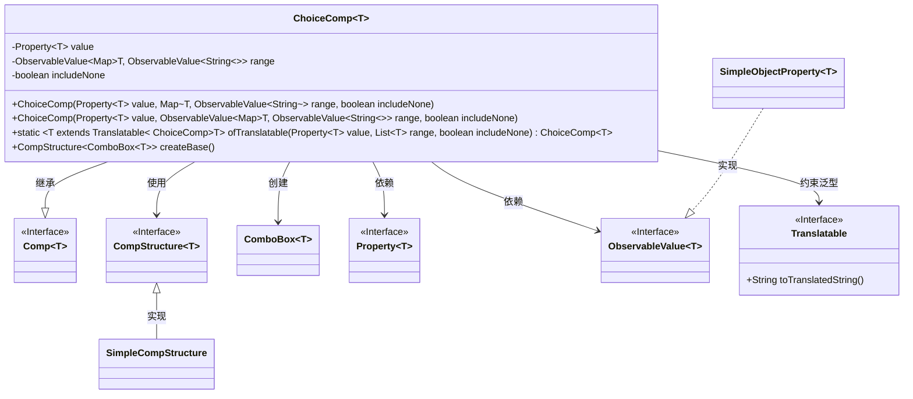
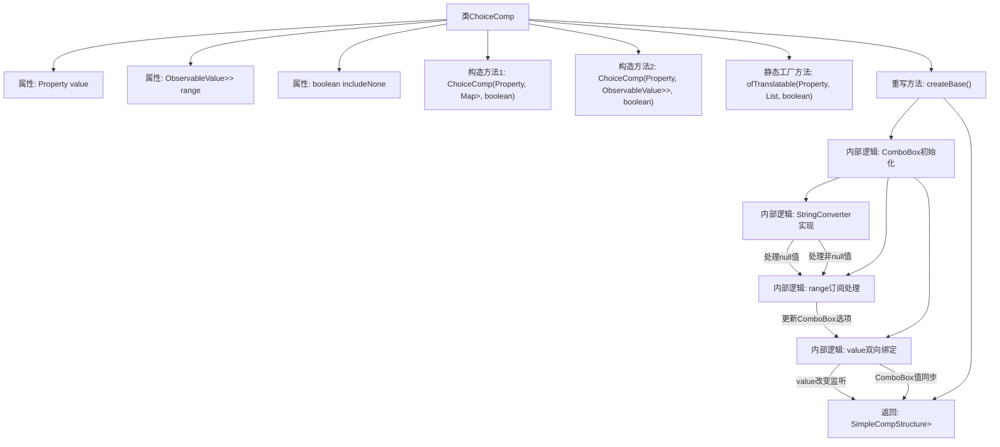

# 基础信息

|      |      |
|------|------|
| 名称 | ChoiceComp |
| 编码语言 | .java |
| 代码路径 | xpipe/app/src/main/java/io/xpipe/app/comp/base/ChoiceComp.java |
| 包名 | io.xpipe.app.comp.base |
| 依赖项 | ['io.xpipe.app.comp.Comp', 'io.xpipe.app.comp.CompStructure', 'io.xpipe.app.comp.SimpleCompStructure', 'io.xpipe.app.core.AppI18n', 'io.xpipe.app.util.PlatformThread', 'io.xpipe.app.util.Translatable', 'javafx.beans.property.Property', 'javafx.beans.property.SimpleObjectProperty', 'javafx.beans.value.ObservableValue', 'javafx.collections.FXCollections', 'javafx.scene.control.ComboBox', 'javafx.util.StringConverter', 'lombok.AccessLevel', 'lombok.experimental.FieldDefaults', 'java.util.LinkedHashMap', 'java.util.List', 'java.util.Map', 'java.util.stream.Collectors'] |
| 概述说明 | ChoiceComp类：泛型下拉框组件，支持属性绑定、动态范围更新和国际化。 |

# 说明

这是一个名为ChoiceComp的泛型类，继承自Comp类，用于创建下拉选择框组件。类中包含三个主要属性：value用于存储当前选择的值，range提供可选范围，includeNone决定是否包含空选项。构造函数支持直接传入Map或ObservableValue格式的选项数据，并提供静态方法ofTranslatable处理可翻译对象列表。createBase方法构建ComboBox组件，设置值转换器、选项列表同步、双向数据绑定，并添加CSS样式类。组件支持空值显示为"app.none"的国际化文本。

# 类列表 Class Summary

| 名称   | 类型  | 说明 |
|-------|------|-------------|
| ChoiceComp | class | ChoiceComp是泛型组件，基于ComboBox实现选项选择功能，支持动态数据绑定和国际化。 |

## 类 ChoiceComp

|      |      |
|------|------|
| 访问范围 | @FieldDefaults(makeFinal = true, level = AccessLevel.PRIVATE);public |
| 类型 | class |
| 名称 | ChoiceComp |
| 说明 | ChoiceComp是泛型组件，基于ComboBox实现选项选择功能，支持动态数据绑定和国际化。 |

### UML类图

类图描述：ChoiceComp是一个泛型组件类，继承自Comp接口，用于创建可选择的组合框组件。它包含值属性、可选范围数据和是否包含空选项的配置，提供两种构造函数和静态工厂方法。该类通过ComboBox实现UI，使用Property和ObservableValue进行数据绑定，支持Translatable类型的泛型约束，并通过CompStructure返回组件结构。

### 内部方法调用关系图

这段代码实现了一个通用的选择组件ChoiceComp，继承自Comp基类，主要用于封装JavaFX的ComboBox控件。流程图展示了类结构、两个构造函数、一个静态工厂方法以及核心的createBase()方法实现。createBase()方法中完成了ComboBox的初始化、值转换器配置、数据范围订阅和双向值绑定等关键逻辑，最终返回包含ComboBox的组件结构。特别注意处理了null值情况、多语言支持和线程安全等细节，通过属性绑定实现了UI控件与数据模型的自动同步。

### 字段列表 Field List

| 名称  | 类型  | 说明 |
|-------|-------|------|
| value | Property<T> | 声明泛型属性value，类型为Property<T>。 |
| range | ObservableValue<Map<T, ObservableValue<String>>> | 可观察值映射，键为泛型T，值为可观察字符串值。 |
| includeNone | boolean | 布尔值参数，表示是否包含空值。 |

### 方法列表 Method List

| 名称  | 类型  | 说明 |
|-------|-------|------|
| ofTranslatable | ChoiceComp<T> | 创建可翻译选项组件，传入属性值、选项列表及是否包含空值。 |
| createBase | CompStructure<ComboBox<T>> | 创建ComboBox组件，设置转换器、值监听和样式，返回结构体。 |

