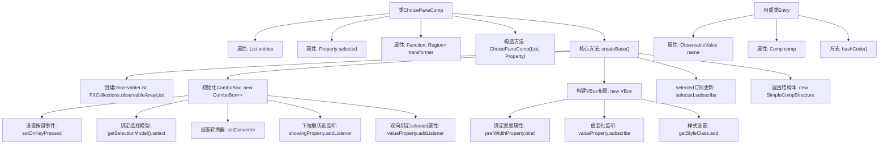

# 基础信息

|      |      |
|------|------|
| 名称 | ChoicePaneComp |
| 编码语言 | .java |
| 代码路径 | xpipe/app/src/main/java/io/xpipe/app/comp/base/ChoicePaneComp.java |
| 包名 | io.xpipe.app.comp.base |
| 依赖项 | ['io.xpipe.app.comp.Comp', 'io.xpipe.app.comp.CompStructure', 'io.xpipe.app.comp.SimpleCompStructure', 'io.xpipe.app.util.PlatformThread', 'javafx.beans.property.Property', 'javafx.beans.value.ObservableValue', 'javafx.collections.FXCollections', 'javafx.scene.control.ComboBox', 'javafx.scene.input.KeyCode', 'javafx.scene.layout.Region', 'javafx.scene.layout.VBox', 'javafx.util.StringConverter', 'lombok.Setter', 'java.util.List', 'java.util.function.Function'] |
| 概述说明 | JavaFX组件类，管理下拉选择框及动态内容显示。 |

# 说明

这是一个名为ChoicePaneComp的Java类，继承自Comp类，用于创建包含下拉选择框和动态内容区域的UI组件。该类包含一个Entry记录类型，用于存储选项名称和关联组件。主要功能包括：初始化下拉框并绑定数据源，设置选项转换器，处理键盘事件，动态更新内容区域，以及管理选择状态同步。组件使用VBox布局，支持自定义下拉框样式，并确保焦点管理和样式类设置。

# 类列表 Class Summary

| 名称   | 类型  | 说明 |
|-------|------|-------------|
| ChoicePaneComp | class | ChoicePaneComp类：基于VBox的下拉选择组件，支持条目转换和动态内容更新。 |


## 类 ChoicePaneComp

|      |      |
|------|------|
| 访问范围 | public |
| 类型 | class |
| 名称 | ChoicePaneComp |
| 说明 | ChoicePaneComp类：基于VBox的下拉选择组件，支持条目转换和动态内容更新。 |


### UML类图

```mermaid
classDiagram
    class ChoicePaneComp~CompStructure~VBox~~ {
        -List~Entry~ entries
        -Property~Entry~ selected
        -Function~ComboBox~Entry~, Region~ transformer
        +ChoicePaneComp(List~Entry~ entries, Property~Entry~ selected)
        +CompStructure~VBox~ createBase()
    }

    class Entry {
        <<record>>
        +ObservableValue~String~ name
        +Comp~?~ comp
        +int hashCode()
    }

    class Comp~T~ {
        <<Interface>>
        +CompStructure~T~ createBase()
    }

    class CompStructure~T~ {
        <<Interface>>
    }

    class SimpleCompStructure~T~ {
        +SimpleCompStructure(T root)
    }

    ChoicePaneComp --> Entry : 包含
    ChoicePaneComp --> Comp : 实现
    SimpleCompStructure ..|> CompStructure : 实现
    Entry --> Comp : 关联
```

这段代码描述了一个可选择的UI组件`ChoicePaneComp`，它继承自泛型类`Comp`，用于管理一组`Entry`选项。核心功能是通过组合框(ComboBox)显示选项列表，并动态更新选中项对应的UI区域。代码使用了JavaFX的属性和绑定机制，实现了选项选择、UI更新和双向数据绑定功能。`Entry`记录类型封装了选项名称和对应的组件，而`SimpleCompStructure`是`CompStructure`接口的简单实现。整体设计体现了观察者模式和组合模式的思想。


### 内部方法调用关系图



流程图描述：该流程图展示了ChoicePaneComp类的完整结构，从属性定义到核心方法createBase()的实现细节。createBase()方法构建了一个包含ComboBox的VBox布局，处理了数据绑定、事件监听和UI更新逻辑。特别值得注意的是双向数据绑定机制（selected属性与ComboBox的同步）、动态内容更新（根据选择项动态添加组件）以及焦点控制等关键交互设计。内部类Entry定义了选项的数据结构，包含名称和关联组件。整个设计体现了响应式编程思想，通过属性绑定和监听器实现UI与数据的自动同步。

### 字段列表 Field List

| 名称  | 类型  | 说明 |
|-------|-------|------|
| selected | Property<Entry> | 私有属性selected，类型为Property<Entry>。 |
| entries | List<Entry> | 私有条目列表 |
| transformer = c -> c | Function<ComboBox<Entry>, Region> | Setter定义transformer函数，默认返回输入参数。 |

### 方法列表 Method List

| 名称  | 类型  | 说明 |
|-------|-------|------|
| createBase | CompStructure<VBox> | JavaFX创建组合框组件，绑定选择事件与动态UI更新。 |


