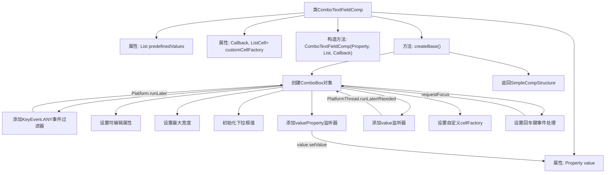

# 基础信息

|      |      |
|------|------|
| 名称 | ComboTextFieldComp |
| 编码语言 | .java |
| 代码路径 | xpipe/app/src/main/java/io/xpipe/app/comp/base/ComboTextFieldComp.java |
| 包名 | io.xpipe.app.comp.base |
| 依赖项 | ['io.xpipe.app.comp.Comp', 'io.xpipe.app.comp.CompStructure', 'io.xpipe.app.comp.SimpleCompStructure', 'io.xpipe.app.util.PlatformThread', 'javafx.application.Platform', 'javafx.beans.property.Property', 'javafx.collections.FXCollections', 'javafx.scene.control.ComboBox', 'javafx.scene.control.ListCell', 'javafx.scene.control.ListView', 'javafx.scene.input.KeyCode', 'javafx.scene.input.KeyEvent', 'javafx.util.Callback', 'java.util.List', 'java.util.Objects'] |
| 概述说明 | 组合文本框组件，支持预定义值和自定义单元格，绑定属性值并处理键盘事件。 |

# 说明

ComboTextFieldComp是一个自定义组件类，继承自Comp基类，用于创建可编辑的组合框控件。该类包含三个主要属性：value属性用于存储当前值，predefinedValues列表存储预定义选项，customCellFactory用于自定义单元格渲染。组件创建时会初始化组合框控件，设置可编辑属性、最大宽度和初始值，并添加值变更监听器实现双向数据绑定。控件支持回车键失焦功能，并允许通过自定义单元格工厂修改显示样式。该组件实现了响应式数据绑定，确保界面与数据模型同步更新。

# 类列表 Class Summary

| 名称   | 类型  | 说明 |
|-------|------|-------------|
| ComboTextFieldComp | class | 组合框文本组件，支持自定义值和单元格工厂，双向绑定值属性。 |


## 类 ComboTextFieldComp

|      |      |
|------|------|
| 访问范围 | public |
| 类型 | class |
| 名称 | ComboTextFieldComp |
| 说明 | 组合框文本组件，支持自定义值和单元格工厂，双向绑定值属性。 |


### UML类图

```mermaid
classDiagram
    class ComboTextFieldComp {
        -Property~String~ value
        -List~String~ predefinedValues
        -Callback~ListView~String~,ListCell~String~~ customCellFactory
        +ComboTextFieldComp(Property~String~ value, List~String~ predefinedValues, Callback~ListView~String~,ListCell~String~~ customCellFactory)
        +CompStructure~ComboBox~String~~ createBase()
    }

    class Property~T~ {
        <<Interface>>
        +T getValue()
        +void setValue(T value)
        +void addListener(ChangeListener~? super T~ listener)
    }

    class Callback~P,R~ {
        <<Interface>>
        +R call(P param)
    }

    class Comp~T~ {
        <<Interface>>
        +T createBase()
    }

    class CompStructure~T~ {
        <<Interface>>
    }

    class SimpleCompStructure~T~ {
        +SimpleCompStructure(T root)
    }

    ComboTextFieldComp --> Property~String~ : 使用
    ComboTextFieldComp --> Callback~ListView~String~,ListCell~String~~ : 使用
    ComboTextFieldComp ..|> Comp~CompStructure~ComboBox~String~~~ : 实现
    SimpleCompStructure ..|> CompStructure~T~ : 实现
```

这段代码定义了一个`ComboTextFieldComp`类，它实现了`Comp`接口，用于创建可编辑的组合框组件。该类包含三个主要属性：一个`Property<String>`类型的值属性，一个预定义字符串列表，以及一个自定义单元格工厂回调。`createBase()`方法构建了一个`ComboBox`组件，设置了各种事件处理器和值绑定逻辑，包括键盘事件处理、值提交和双向数据绑定。该类通过泛型与多个接口协作，实现了灵活的组合框组件构建功能，支持自定义单元格渲染和实时值同步。


### 内部方法调用关系图



这段代码描述了一个JavaFX自定义组件ComboTextFieldComp，它继承自Comp类，主要功能是创建一个可编辑的组合框控件。流程图展示了从类定义到最终创建组件结构的完整过程，包括属性声明、构造方法、核心createBase()方法的内部实现细节，以及各种事件监听器和UI属性的设置。该组件支持预定义值列表、自定义单元格渲染、双向数据绑定和特殊按键处理等功能，最终返回一个包含组合框控件的SimpleCompStructure对象。

### 字段列表 Field List

| 名称  | 类型  | 说明 |
|-------|-------|------|
| customCellFactory | Callback<ListView<String>, ListCell<String>> | 私有回调函数，用于自定义ListView的单元格生成。 |
| predefinedValues | List<String> | 私有不可变字符串列表。 |
| value | Property<String> | 私有字符串属性value |

### 方法列表 Method List

| 名称  | 类型  | 说明 |
|-------|-------|------|
| createBase | CompStructure<ComboBox<String>> | 创建可编辑组合框，支持预定义值、事件处理和值同步。 |


