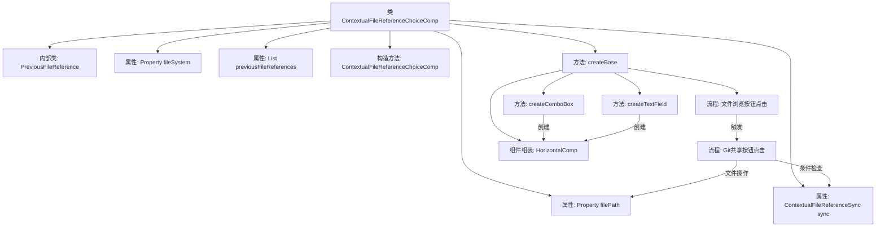

# 基础信息

|      |      |
|------|------|
| 名称 | ContextualFileReferenceChoiceComp |
| 编码语言 | .java |
| 代码路径 | xpipe/app/src/main/java/io/xpipe/app/comp/base/ContextualFileReferenceChoiceComp.java |
| 包名 | io.xpipe.app.comp.base |
| 依赖项 | ['io.xpipe.app.browser.BrowserFileChooserSessionComp', 'io.xpipe.app.comp.Comp', 'io.xpipe.app.comp.CompStructure', 'io.xpipe.app.comp.SimpleCompStructure', 'io.xpipe.app.core.AppLayoutModel', 'io.xpipe.app.core.window.AppWindowHelper', 'io.xpipe.app.issue.ErrorEvent', 'io.xpipe.app.prefs.AppPrefs', 'io.xpipe.app.storage.ContextualFileReference', 'io.xpipe.app.storage.DataStorageSyncHandler', 'io.xpipe.app.storage.DataStoreEntryRef', 'io.xpipe.app.util.PlatformThread', 'io.xpipe.core.store.FilePath', 'io.xpipe.core.store.FileSystemStore', 'javafx.application.Platform', 'javafx.beans.binding.Bindings', 'javafx.beans.property.Property', 'javafx.beans.property.SimpleObjectProperty', 'javafx.beans.property.SimpleStringProperty', 'javafx.scene.control.ListCell', 'javafx.scene.layout.HBox', 'javafx.scene.layout.Priority', 'atlantafx.base.theme.Styles', 'lombok.Value', 'org.kordamp.ikonli.javafx.FontIcon', 'java.nio.file.Files', 'java.nio.file.Path', 'java.util.ArrayList', 'java.util.List'] |
| 概述说明 | 文件引用选择组件，支持浏览、同步和Git共享功能。 |

# 说明

ContextualFileReferenceChoiceComp是一个基于HBox布局的组件，用于管理文件系统引用选择。它包含文件路径输入框或下拉框、文件浏览按钮和可选的Git共享按钮。组件通过属性绑定处理文件系统和路径的同步更新，支持历史文件引用显示，并提供本地文件浏览功能。Git共享按钮允许将文件同步到Git仓库，包含路径验证、用户确认及错误处理逻辑。组件根据是否有历史记录动态切换输入方式，并确保UI元素样式和交互行为一致。

# 类列表 Class Summary

| 名称   | 类型  | 说明 |
|-------|------|-------------|
| ContextualFileReferenceChoiceComp | class | Java组件类，用于文件引用选择，包含路径选择、同步和Git共享功能。 |

## 类 ContextualFileReferenceChoiceComp

|      |      |
|------|------|
| 访问范围 | public |
| 类型 | class |
| 名称 | ContextualFileReferenceChoiceComp |
| 说明 | Java组件类，用于文件引用选择，包含路径选择、同步和Git共享功能。 |

### UML类图

```mermaid
classDiagram
    class ContextualFileReferenceChoiceComp~CompStructure~ {
        -Property~DataStoreEntryRef~ fileSystem
        -Property~FilePath~ filePath
        -ContextualFileReferenceSync sync
        -List~PreviousFileReference~ previousFileReferences
        +ContextualFileReferenceChoiceComp(Property~DataStoreEntryRef~T~~ fileSystem, Property~FilePath~ filePath, ContextualFileReferenceSync sync, List~PreviousFileReference~ previousFileReferences)
        +CompStructure~HBox~ createBase()
        -Comp~?~ createComboBox()
        -Comp~?~ createTextField()
    }

    class PreviousFileReference {
        +String displayName
        +Path path
    }

    class ButtonComp {
        +ButtonComp(String text, FontIcon icon, Runnable action)
    }

    class ComboTextFieldComp {
        +ComboTextFieldComp(SimpleStringProperty prop, List~String~ items, Function~String, ListCell~String~~ cellFactory)
    }

    class TextFieldComp {
        +TextFieldComp(SimpleStringProperty prop)
    }

    class HorizontalComp {
        +HorizontalComp(List~Comp~?~~ children)
    }

    class SimpleCompStructure~HBox~ {
        +SimpleCompStructure(HBox root)
    }

    class ContextualFileReferenceSync {
        <<Interface>>
    }

    ContextualFileReferenceChoiceComp --> PreviousFileReference : 包含
    ContextualFileReferenceChoiceComp --> ButtonComp : 使用
    ContextualFileReferenceChoiceComp --> ComboTextFieldComp : 使用
    ContextualFileReferenceChoiceComp --> TextFieldComp : 使用
    ContextualFileReferenceChoiceComp --> HorizontalComp : 使用
    ContextualFileReferenceChoiceComp --> SimpleCompStructure : 返回
    ContextualFileReferenceChoiceComp ..> ContextualFileReferenceSync : 依赖
```

这段代码实现了一个文件引用选择组件，主要功能包括：通过文本框或下拉框显示文件路径、提供文件浏览按钮、支持Git共享功能。组件核心是ContextualFileReferenceChoiceComp类，它继承自泛型Comp类，管理文件系统引用和路径属性，根据是否有历史记录决定创建文本框或下拉框。通过ButtonComp实现文件浏览和Git共享功能，使用HorizontalComp进行水平布局，最终返回SimpleCompStructure结构。该组件具有复杂的属性绑定和事件处理逻辑，能适应不同文件选择场景。

### 内部方法调用关系图

该流程图展示了ContextualFileReferenceChoiceComp类的核心结构和交互逻辑。类通过构造方法初始化文件系统相关属性，createBase()作为主入口创建UI组件，根据条件选择创建文本框或组合框。文件浏览按钮触发文件选择器，Git共享按钮执行复杂的文件同步逻辑，最终所有组件通过HorizontalComp进行横向布局。流程中特别突出了属性监听、条件分支和异步操作等关键交互点。

### 字段列表 Field List

| 名称  | 类型  | 说明 |
|-------|-------|------|
| sync | ContextualFileReferenceSync | 私有文件同步引用对象。 |
| filePath | Property<FilePath> | 私有属性FilePath类型filePath |
| previousFileReferences | List<PreviousFileReference> | 私有最终列表，存储PreviousFileReference对象。 |
| fileSystem | Property<DataStoreEntryRef<? extends FileSystemStore>> | 私有属性fileSystem，类型为Property<DataStoreEntryRef<? extends FileSystemStore>>。 |

### 方法列表 Method List

| 名称  | 类型  | 说明 |
|-------|-------|------|
| createBase | CompStructure<HBox> | 创建HBox布局，包含路径选择、文件浏览和Git共享按钮，支持文件系统操作和同步功能。 |
| createComboBox | Comp<?> | 创建组合框，绑定文件路径，显示文件名。 |
| createTextField | Comp<?> | 创建文本框组件，绑定文件路径属性，双向更新，支持样式和布局调整。 |

