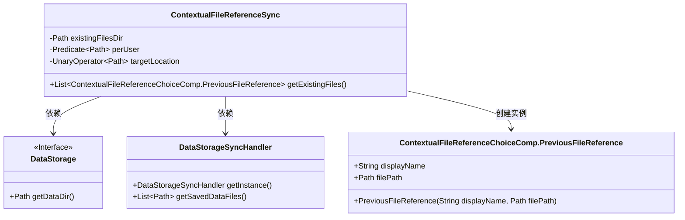
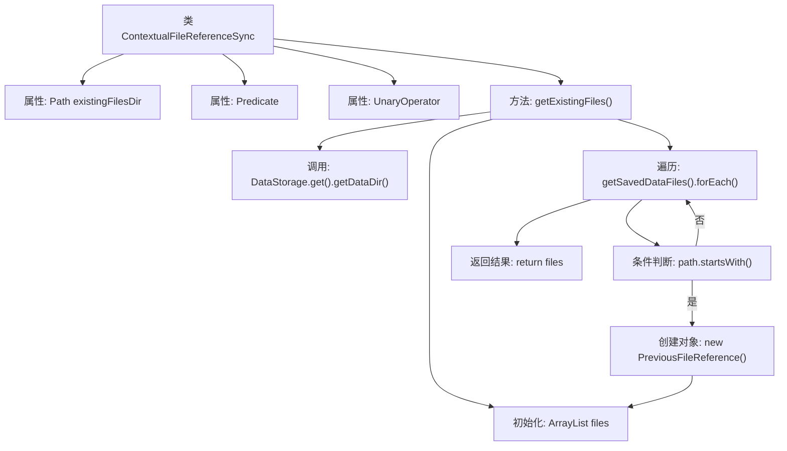

# 基础信息

|      |      |
|------|------|
| 名称 | ContextualFileReferenceSync |
| 编码语言 | .java |
| 代码路径 | xpipe/app/src/main/java/io/xpipe/app/comp/base/ContextualFileReferenceSync.java |
| 包名 | io.xpipe.app.comp.base |
| 依赖项 | ['io.xpipe.app.storage.DataStorage', 'io.xpipe.app.storage.DataStorageSyncHandler', 'lombok.Value', 'java.nio.file.Path', 'java.util.ArrayList', 'java.util.List', 'java.util.function.Predicate', 'java.util.function.UnaryOperator'] |
| 概述说明 | 类ContextualFileReferenceSync用于同步文件引用，包含路径、用户过滤和目标位置处理，提供获取现有文件列表方法。 |

# 说明

这是一个名为ContextualFileReferenceSync的公开类，主要用于处理文件引用同步。类包含三个成员变量：existingFilesDir表示现有文件目录路径，perUser是路径判断条件，targetLocation是路径转换操作。核心方法getExistingFiles用于获取已存在文件列表，它会从数据存储中筛选出指定目录下的文件，并封装为PreviousFileReference对象返回。该方法会跳过非目标目录的文件，并将文件名附加"(Git)"标记。整个过程涉及数据存储访问和路径处理操作。

# 类列表 Class Summary

| 名称   | 类型  | 说明 |
|-------|------|-------------|
| ContextualFileReferenceSync | class | 类ContextualFileReferenceSync用于同步文件引用，包含路径、用户过滤和目标位置处理功能，返回带Git标记的文件列表。 |

## 类 ContextualFileReferenceSync

|      |      |
|------|------|
| 访问范围 | @Value;public |
| 类型 | class |
| 名称 | ContextualFileReferenceSync |
| 说明 | 类ContextualFileReferenceSync用于同步文件引用，包含路径、用户过滤和目标位置处理功能，返回带Git标记的文件列表。 |

### UML类图

该类图展示了ContextualFileReferenceSync类及其依赖关系。该类通过DataStorage获取数据目录路径，使用DataStorageSyncHandler获取保存的数据文件列表，并筛选出特定目录下的文件后，将其封装为PreviousFileReference对象返回。图中包含4个类，清晰地呈现了核心数据结构与调用关系，其中DataStorage为接口，PreviousFileReference是用于封装文件引用信息的嵌套类。

### 内部方法调用关系图

这段代码流程图展示了ContextualFileReferenceSync类的工作流程。该类通过getExistingFiles方法获取数据存储目录下的文件列表，筛选出符合路径条件的文件，并封装为PreviousFileReference对象集合返回。核心流程包括获取数据目录、初始化集合、遍历文件列表、路径匹配判断和对象创建，最终返回符合条件的文件引用集合。

### 字段列表 Field List

| 名称  | 类型  | 说明 |
|-------|-------|------|
| perUser | Predicate<Path> | 每用户路径谓词 |
| existingFilesDir | Path | 路径指向现有文件目录。 |
| targetLocation | UnaryOperator<Path> | 目标路径的单目运算符。 |

### 方法列表 Method List

| 名称  | 类型  | 说明 |
|-------|-------|------|
| getExistingFiles | List<ContextualFileReferenceChoiceComp.PreviousFileReference> | 获取数据目录下非指定路径的文件列表，返回带Git标记的文件名和路径。 |

