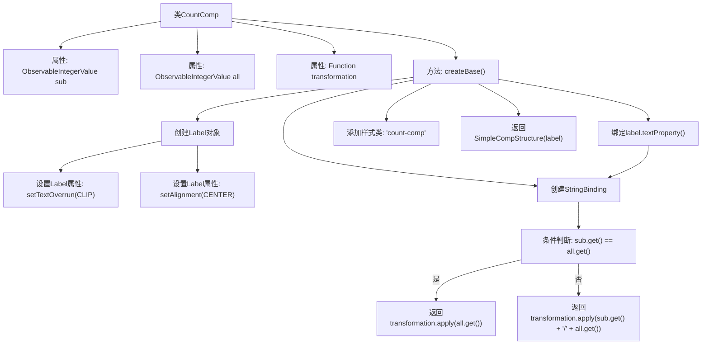

# 基础信息

|      |      |
|------|------|
| 名称 | CountComp |
| 编码语言 | .java |
| 代码路径 | xpipe/app/src/main/java/io/xpipe/app/comp/base/CountComp.java |
| 包名 | io.xpipe.app.comp.base |
| 依赖项 | ['io.xpipe.app.comp.Comp', 'io.xpipe.app.comp.CompStructure', 'io.xpipe.app.comp.SimpleCompStructure', 'io.xpipe.app.util.PlatformThread', 'javafx.beans.binding.Bindings', 'javafx.beans.value.ObservableIntegerValue', 'javafx.geometry.Pos', 'javafx.scene.control.Label', 'javafx.scene.control.OverrunStyle', 'lombok.AllArgsConstructor', 'java.util.function.Function'] |
| 概述说明 | CountComp类继承Comp，使用ObservableIntegerValue和Function创建带绑定的Label组件。 |

# 说明

这是一个名为CountComp的Java类，继承自Comp<CompStructure<Label>>。它包含三个私有成员：sub和all都是可观察的整数值，transformation是一个字符串转换函数。该类重写了createBase方法，创建了一个Label组件，设置其文本溢出样式为CLIP，对齐方式为居中。根据sub和all的值动态生成文本绑定：当两者相等时显示转换后的all值，否则显示转换后的sub/all格式。文本绑定通过PlatformThread同步更新，并添加了count-comp样式类。最终返回一个包含该Label的SimpleCompStructure实例。

# 类列表 Class Summary

| 名称   | 类型  | 说明 |
|-------|------|-------------|
| CountComp | class | CountComp类继承Comp，使用sub和all值生成带格式的标签文本。 |


## 类 CountComp

|      |      |
|------|------|
| 访问范围 | @AllArgsConstructor;public |
| 类型 | class |
| 名称 | CountComp |
| 说明 | CountComp类继承Comp，使用sub和all值生成带格式的标签文本。 |


### UML类图

```mermaid
classDiagram
    class CountComp {
        -ObservableIntegerValue sub
        -ObservableIntegerValue all
        -Function~String, String~ transformation
        +CountComp(ObservableIntegerValue sub, ObservableIntegerValue all, Function~String, String~ transformation)
        +CompStructure~Label~ createBase()
    }
    class Comp~T~ {
        <<Interface>>
        +T createBase()
    }
    class CompStructure~T~ {
        <<Interface>>
    }
    class SimpleCompStructure~T~ {
        +SimpleCompStructure(T element)
    }
    class Label {
        +setTextOverrun(OverrunStyle style)
        +setAlignment(Pos alignment)
        +textProperty() : StringProperty
        +getStyleClass() : ObservableList~String~
    }

    CountComp --> Comp~CompStructure~Label~~ : 实现
    SimpleCompStructure~Label~ --> CompStructure~Label~ : 实现
    CountComp --> Label : 创建实例
    CountComp --> SimpleCompStructure : 返回实例
```

这段代码展示了一个名为CountComp的组件类，它实现了泛型接口Comp<CompStructure<Label>>。该类通过构造函数接收两个可观察的整数值和一个字符串转换函数，在createBase()方法中创建并配置了一个Label控件，根据sub和all值的比较结果动态生成显示文本。该设计实现了数据绑定和界面更新的解耦，通过SimpleCompStructure包装Label控件返回，体现了观察者模式和函数式编程的结合应用。


### 内部方法调用关系图



这段代码描述了一个名为CountComp的类，继承自Comp<CompStructure<Label>>，用于创建带有计数功能的UI组件。主要流程包括：创建Label对象并设置其属性，根据sub和all值的比较结果生成不同的文本格式，通过数据绑定动态更新Label的文本内容，最后返回封装好的SimpleCompStructure。该组件实现了当sub等于all时显示单个数值，否则显示分数形式的功能，并支持文本转换和样式控制。

### 字段列表 Field List

| 名称  | 类型  | 说明 |
|-------|-------|------|
| sub | ObservableIntegerValue | 私有整型可观察值sub |
| all | ObservableIntegerValue | 私有整型可观察值all |
| transformation | Function<String, String> | 私有最终字符串转换函数。 |

### 方法列表 Method List

| 名称  | 类型  | 说明 |
|-------|-------|------|
| createBase | CompStructure<Label> | 创建Label组件，设置文本溢出和居中，绑定动态文本显示逻辑，并添加样式类。 |


