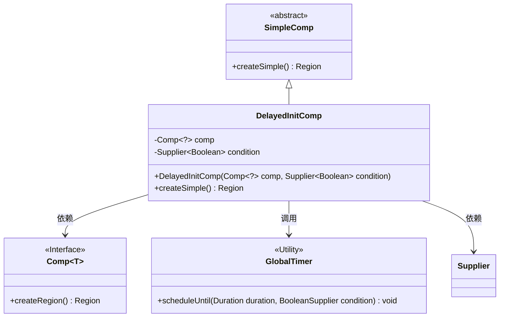
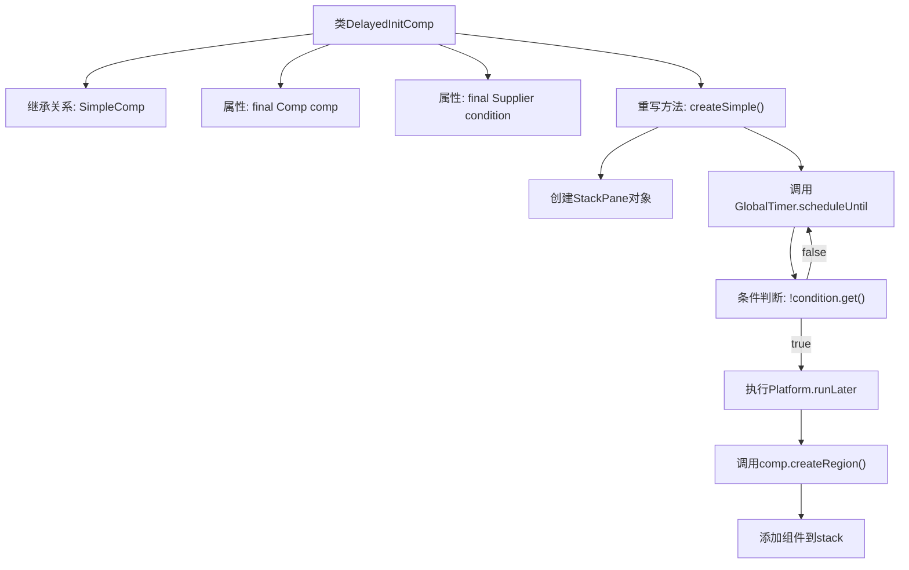

# 基础信息

|      |      |
|------|------|
| 名称 | DelayedInitComp |
| 编码语言 | .java |
| 代码路径 | xpipe/app/src/main/java/io/xpipe/app/comp/base/DelayedInitComp.java |
| 包名 | io.xpipe.app.comp.base |
| 依赖项 | ['io.xpipe.app.comp.Comp', 'io.xpipe.app.comp.SimpleComp', 'io.xpipe.app.util.GlobalTimer', 'javafx.application.Platform', 'javafx.scene.layout.Region', 'javafx.scene.layout.StackPane', 'lombok.AllArgsConstructor', 'java.time.Duration', 'java.util.function.Supplier'] |
| 概述说明 | 延迟初始化组件，条件满足时加载子组件到堆栈面板。 |

# 说明

这是一个名为DelayedInitComp的Java类，继承自SimpleComp。该类包含两个私有final字段：一个泛型Comp对象和一个返回Boolean的Supplier条件。重写了createSimple方法，创建StackPane区域，使用GlobalTimer设置10毫秒延迟，检查条件是否满足。若满足，则通过Platform.runLater在JavaFX线程中添加comp创建的Region到stack中。整个过程实现了条件满足时的延迟初始化组件功能。

# 类列表 Class Summary

| 名称   | 类型  | 说明 |
|-------|------|-------------|
| DelayedInitComp | class | 延迟初始化组件，条件满足时加载子组件到堆栈面板。 |

## 类 DelayedInitComp

|      |      |
|------|------|
| 访问范围 | @AllArgsConstructor;public |
| 类型 | class |
| 名称 | DelayedInitComp |
| 说明 | 延迟初始化组件，条件满足时加载子组件到堆栈面板。 |

### UML类图

这段类图展示了DelayedInitComp继承自抽象类SimpleComp，并实现了延迟初始化组件的功能。DelayedInitComp通过组合方式持有一个Comp接口实例和一个条件判断Supplier，利用GlobalTimer工具类实现定时检查条件，满足时通过Platform.runLater在JavaFX线程中创建并添加组件区域。整体设计体现了组合优于继承的原则，通过函数式接口和定时机制实现了延迟初始化的异步控制流程。

### 内部方法调用关系图

这段代码流程图展示了DelayedInitComp类的核心逻辑。该类继承自SimpleComp，通过定时器检查条件满足后，在JavaFX线程中动态创建并添加UI组件。流程从createSimple()方法开始，先创建空容器，然后启动定时轮询条件，条件满足时异步执行UI更新，最终返回包含动态组件的容器。整个过程实现了延迟初始化的UI组件加载机制。

### 字段列表 Field List

| 名称  | 类型  | 说明 |
|-------|-------|------|
| condition | Supplier<Boolean> | 私有布尔条件供应器 |
| comp | Comp<?> | 私有组件comp |

### 方法列表 Method List

| 名称  | 类型  | 说明 |
|-------|-------|------|
| createSimple | Region | 重写方法创建StackPane，定时检查条件并添加组件区域。 |

