# 基础信息

|      |      |
|------|------|
| 名称 | DialogComp |
| 编码语言 | .java |
| 代码路径 | xpipe/app/src/main/java/io/xpipe/app/comp/base/DialogComp.java |
| 包名 | io.xpipe.app.comp.base |
| 依赖项 | ['io.xpipe.app.comp.Comp', 'io.xpipe.app.comp.CompStructure', 'io.xpipe.app.comp.SimpleCompStructure', 'io.xpipe.app.core.AppI18n', 'javafx.beans.property.SimpleBooleanProperty', 'javafx.beans.value.ObservableValue', 'javafx.geometry.Pos', 'javafx.scene.control.ScrollPane', 'javafx.scene.layout.HBox', 'javafx.scene.layout.Priority', 'javafx.scene.layout.Region', 'javafx.scene.layout.VBox', 'atlantafx.base.theme.Styles', 'java.util.List'] |
| 概述说明 | 抽象类DialogComp扩展Comp，实现对话框布局，含导航按钮和内容区域。 |

# 说明

该内容描述了一个名为DialogComp的抽象类，继承自Comp类，用于构建对话框组件。主要功能包括创建导航区域、完成按钮、自定义按钮以及内容布局。导航区域包含自定义按钮、间隔区域和完成按钮，布局采用HBox水平排列。完成按钮默认设置为强调样式，并触发finish方法。内容区域使用ScrollPane实现滚动，并自动填充宽度。抽象方法finish和discard需由子类实现，用于处理完成和取消操作。整体布局采用VBox垂直排列，包含内容区域和导航区域。

# 类列表 Class Summary

| 名称   | 类型  | 说明 |
|-------|------|-------------|
| DialogComp | class | 抽象类DialogComp实现对话框组件，包含导航按钮、内容区域和完成功能。 |


## 类 DialogComp

|      |      |
|------|------|
| 访问范围 | public abstract |
| 类型 | class |
| 名称 | DialogComp |
| 说明 | 抽象类DialogComp实现对话框组件，包含导航按钮、内容区域和完成功能。 |


### UML类图

```mermaid
classDiagram
    class Comp~T~ {
        <<Abstract>>
        +CompStructure~T~ createBase()
    }
    class CompStructure~T~ {
        <<Abstract>>
    }
    class SimpleCompStructure~T~ {
        +SimpleCompStructure(T root)
    }
    class DialogComp {
        <<Abstract>>
        -Region createNavigation()
        -Comp~?~ finishButton()
        -String finishKey()
        -List~Comp~?~~ customButtons()
        +CompStructure~Region~ createBase()
        -ObservableValue~Boolean~ busy()
        <<Abstract>> -void finish()
        <<Abstract>> -void discard()
        <<Abstract>> +Comp~?~ content()
        -Comp~?~ pane(Comp~?~ content)
        +Comp~?~ bottom()
    }
    class ButtonComp {
        +ButtonComp(ObservableValue~String~ text, Runnable action)
    }
    class AppI18n {
        +static ObservableValue~String~ observable(String key)
    }
    class Styles {
        +static String ACCENT
    }

    DialogComp --|> Comp~CompStructure~Region~~
    SimpleCompStructure --|> CompStructure
    DialogComp --> ButtonComp : 创建
    DialogComp --> AppI18n : 使用
    DialogComp --> Styles : 使用
```

这段代码描述了一个抽象对话框组件`DialogComp`的类结构，它继承自泛型类`Comp<CompStructure<Region>>`。该组件主要负责创建具有导航按钮区域和内容区域的对话框布局，包含创建完成按钮、自定义按钮、内容区域等方法。通过`createBase()`方法构建基础结构，使用`VBox`和`ScrollPane`进行布局，并支持国际化文本和样式控制。抽象方法`finish()`和`discard()`需要子类实现特定逻辑。


### 内部方法调用关系图

```mermaid
graph TD
    A["抽象类DialogComp"]
    B["方法: protected Region createNavigation()"]
    C["方法: protected Comp<?> finishButton()"]
    D["方法: protected String finishKey()"]
    E["方法: protected List<Comp<?>> customButtons()"]
    F["方法: public CompStructure<Region> createBase()"]
    G["方法: protected ObservableValue<Boolean> busy()"]
    H["抽象方法: protected abstract void finish()"]
    I["抽象方法: protected abstract void discard()"]
    J["抽象方法: public abstract Comp<?> content()"]
    K["方法: protected Comp<?> pane(Comp<?> content)"]
    L["方法: public Comp<?> bottom()"]

    A --> B
    A --> C
    A --> D
    A --> E
    A --> F
    A --> G
    A --> H
    A --> I
    A --> J
    A --> K
    A --> L

    B --> M["创建HBox容器buttons"]
    B --> N["调用bottom()获取customButton"]
    B --> O["添加customButton到buttons"]
    B --> P["添加spacer到buttons"]
    B --> Q["添加customButtons生成的按钮"]
    B --> R["添加finishButton生成的按钮"]
    B --> S["返回buttons区域"]

    C --> T["创建ButtonComp实例"]
    C --> U["设置默认按钮属性"]
    C --> V["添加样式类"]

    F --> W["调用content()创建内容区域"]
    F --> X["调用createNavigation()创建导航栏"]
    F --> Y["组合内容和导航到VBox"]
    F --> Z["返回CompStructure实例"]
```



该流程图展示了DialogComp抽象类的完整结构，重点描述了createNavigation()和createBase()这两个核心方法的内部调用流程。createNavigation()负责构建底部按钮栏，通过组合bottom()、customButtons()和finishButton()的返回结果；createBase()则整合内容区域和导航栏形成完整对话框布局。图中清晰呈现了12个主要方法及其调用关系，包括3个抽象方法和9个具体实现方法，反映了该组件将可变部分（如按钮逻辑）与固定布局分离的设计思想。

### 字段列表 Field List

| 名称  | 类型  | 说明 |
|-------|-------|------|

### 方法列表 Method List

| 名称  | 类型  | 说明 |
|-------|-------|------|
| finish | void | 抽象方法finish，需子类实现。 |
| busy | ObservableValue<Boolean> | 定义一个受保护的布尔可观察属性，初始值为false。 |
| content | Comp<?> | 抽象方法content()返回泛型Comp对象。 |
| customButtons | List<Comp<?>> | 自定义按钮方法返回空列表 |
| createBase | CompStructure<Region> | 重写createBase方法，创建包含内容和导航的VBox布局，设置样式并返回结构。 |
| finishKey | String | 方法返回字符串"finishStep"。 |
| discard | void | 抽象方法：丢弃操作，需子类实现。 |
| finishButton | Comp<?> | 保护方法finishButton创建默认按钮，设置样式类ACCENT和next。 |
| createNavigation | Region | 创建导航区域，包含自定义按钮、间隔和完成按钮，右对齐布局。 |
| pane | Comp<?> | 保护方法创建带滚动面板的组件，内容自适应宽度。 |
| bottom | Comp<?> | 方法bottom返回空值，类型为Comp<?>。 |


