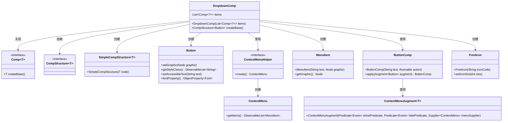
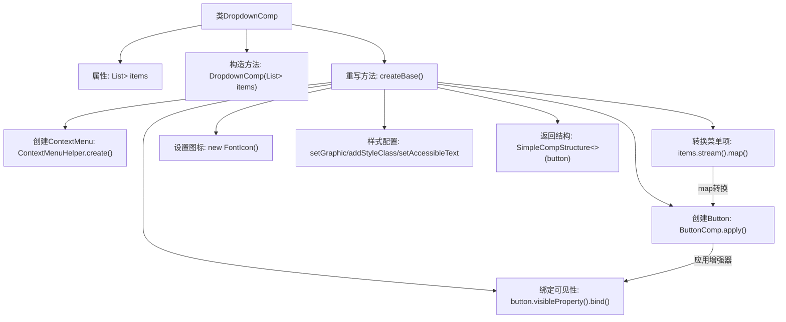

# 基础信息

|      |      |
|------|------|
| 名称 | DropdownComp |
| 编码语言 | .java |
| 代码路径 | xpipe/app/src/main/java/io/xpipe/app/comp/base/DropdownComp.java |
| 包名 | io.xpipe.app.comp.base |
| 依赖项 | ['io.xpipe.app.comp.Comp', 'io.xpipe.app.comp.CompStructure', 'io.xpipe.app.comp.SimpleCompStructure', 'io.xpipe.app.comp.augment.ContextMenuAugment', 'io.xpipe.app.util.ContextMenuHelper', 'javafx.beans.binding.Bindings', 'javafx.beans.value.ObservableValue', 'javafx.css.Size', 'javafx.css.SizeUnits', 'javafx.scene.control.Button', 'javafx.scene.control.MenuItem', 'org.kordamp.ikonli.javafx.FontIcon', 'java.util.List'] |
| 概述说明 | 下拉菜单组件类，包含按钮和菜单项列表，绑定可见性并设置图标样式。 |

# 说明

DropdownComp是一个继承自Comp的组件类，用于创建下拉菜单。它接收一个Comp类型的列表作为菜单项。在createBase方法中，通过ContextMenuHelper创建上下文菜单，并将每个菜单项转换为MenuItem。主按钮由ButtonComp构建，并应用了ContextMenuAugment以关联上下文菜单。按钮的可见性绑定到菜单项的可视状态，确保至少一项可见时按钮才显示。按钮使用FontIcon作为图形，并动态调整图标大小以匹配字体尺寸。按钮添加了样式类和辅助文本，最终返回包含该按钮的SimpleCompStructure实例。

# 类列表 Class Summary

| 名称   | 类型  | 说明 |
|-------|------|-------------|
| DropdownComp | class | 下拉菜单组件类，继承Comp，包含菜单项列表，创建带图标的按钮，绑定可见性，支持上下文菜单。 |

## 类 DropdownComp

|      |      |
|------|------|
| 访问范围 | public |
| 类型 | class |
| 名称 | DropdownComp |
| 说明 | 下拉菜单组件类，继承Comp，包含菜单项列表，创建带图标的按钮，绑定可见性，支持上下文菜单。 |

### UML类图

类图描述：该图展示了一个下拉菜单组件DropdownComp的类结构，它实现了泛型接口Comp，并依赖多个UI组件类。DropdownComp通过ContextMenuHelper创建上下文菜单，使用ButtonComp作为基础按钮，并应用ContextMenuAugment来添加菜单功能。同时使用FontIcon作为按钮图标，最终返回包含按钮的SimpleCompStructure结构。整个设计体现了组合式UI组件的构建模式。

### 内部方法调用关系图

流程图描述：该流程图展示了DropdownComp类的核心逻辑，从初始化items集合开始，通过createBase方法构建下拉菜单组件。流程包括创建上下文菜单、转换菜单项数据、绑定按钮可见性属性、设置字体图标和样式配置，最终返回包含按钮的组件结构。特别注意ContextMenu的动态生成和属性绑定机制，体现了UI组件与数据状态的联动关系。

### 字段列表 Field List

| 名称  | 类型  | 说明 |
|-------|-------|------|
| items | List<Comp<?>> | 私有组件列表items |

### 方法列表 Method List

| 名称  | 类型  | 说明 |
|-------|-------|------|
| createBase | CompStructure<Button> | 创建带上下文菜单的下拉按钮，绑定可见性并设置图标。 |

