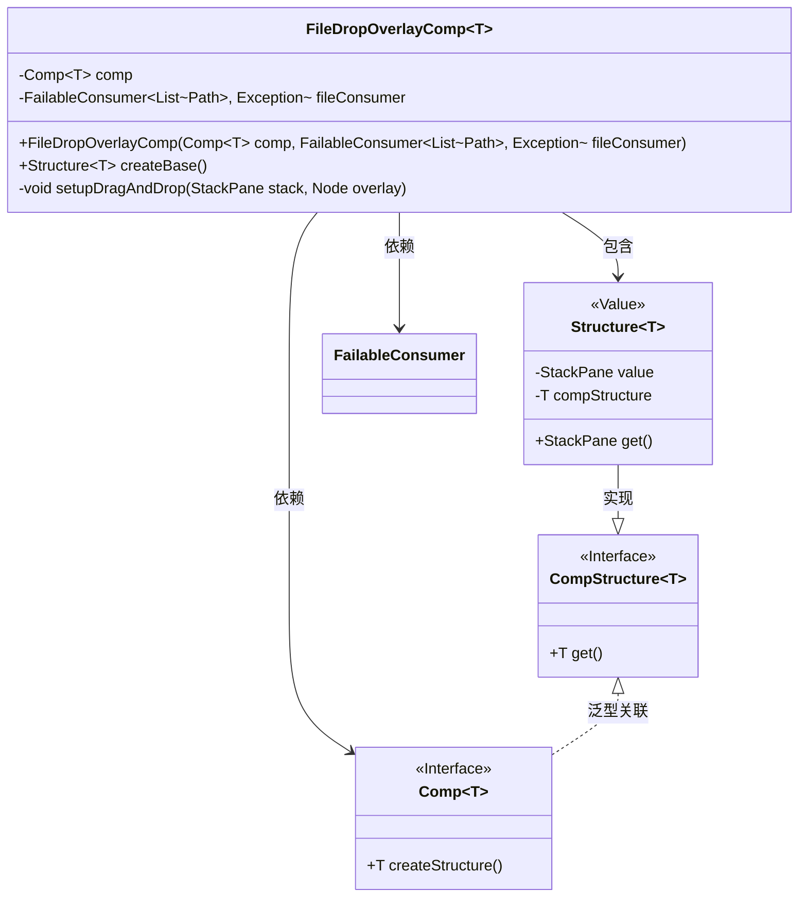
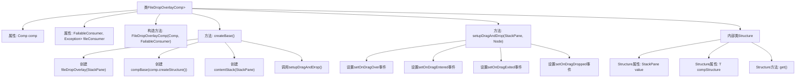

# 基础信息

|      |      |
|------|------|
| 名称 | FileDropOverlayComp |
| 编码语言 | .java |
| 代码路径 | xpipe/app/src/main/java/io/xpipe/app/comp/base/FileDropOverlayComp.java |
| 包名 | io.xpipe.app.comp.base |
| 依赖项 | ['io.xpipe.app.comp.Comp', 'io.xpipe.app.comp.CompStructure', 'io.xpipe.app.issue.ErrorEvent', 'io.xpipe.core.util.FailableConsumer', 'javafx.geometry.Pos', 'javafx.scene.Node', 'javafx.scene.input.Dragboard', 'javafx.scene.input.TransferMode', 'javafx.scene.layout.StackPane', 'lombok.Builder', 'lombok.Value', 'org.kordamp.ikonli.javafx.FontIcon', 'java.io.File', 'java.nio.file.Path', 'java.util.List'] |
| 概述说明 | 文件拖放覆盖组件，支持文件拖拽处理与回调。 |

# 说明

FileDropOverlayComp是一个泛型组件类，用于实现文件拖放功能。它包含一个基础组件comp和文件处理回调fileConsumer。createBase方法创建包含基础组件和半透明覆盖层的堆栈面板，覆盖层默认隐藏。setupDragAndDrop方法处理拖放事件：拖入时显示覆盖层，拖出时隐藏，释放时调用回调处理文件路径列表。内部类Structure封装堆栈面板和基础组件的结构。

# 类列表 Class Summary

| 名称   | 类型  | 说明 |
|-------|------|-------------|
| FileDropOverlayComp | class | 文件拖放覆盖组件，支持文件拖拽处理。 |

## 类 FileDropOverlayComp

|      |      |
|------|------|
| 访问范围 | public |
| 类型 | class |
| 名称 | FileDropOverlayComp |
| 说明 | 文件拖放覆盖组件，支持文件拖拽处理。 |

### UML类图

这段代码定义了一个支持文件拖放功能的覆盖层组件`FileDropOverlayComp`，它继承自泛型类`Comp`并包含内部值对象`Structure`。主要功能是通过`setupDragAndDrop`方法实现拖放事件处理，当文件拖入时显示覆盖层图标，拖放完成后调用`fileConsumer`处理文件路径列表。类图中清晰地展示了泛型参数传递关系、接口实现关系以及组件间的依赖关系，体现了JavaFX组件组合的设计模式。

### 内部方法调用关系图

该流程图展示了FileDropOverlayComp类的完整结构，包括两个主要属性(comp和fileConsumer)、构造方法、核心方法createBase()和setupDragAndDrop()，以及内部类Structure的组成。createBase方法负责初始化UI组件并设置拖放功能，而setupDragAndDrop方法实现了完整的拖放事件处理链，包括拖入检测、悬停效果显示/隐藏以及最终文件处理。内部类Structure封装了UI组件和子组件结构，整个类实现了支持文件拖放功能的复合组件模式。

### 字段列表 Field List

| 名称  | 类型  | 说明 |
|-------|-------|------|
| fileConsumer | FailableConsumer<List<Path>, Exception> | 私有终态文件消费者，处理路径列表，可能抛出异常。 |
| comp | Comp<T> | 私有成员comp，类型为Comp<T>。 |

### 方法列表 Method List

| 名称  | 类型  | 说明 |
|-------|-------|------|
| createBase | Structure<T> | 重写方法创建带文件拖放功能的界面组件，包含基础组件和覆盖层。 |
| setupDragAndDrop | void | JavaFX拖放功能实现：监听拖拽事件，处理文件传输与显示覆盖层。 |

