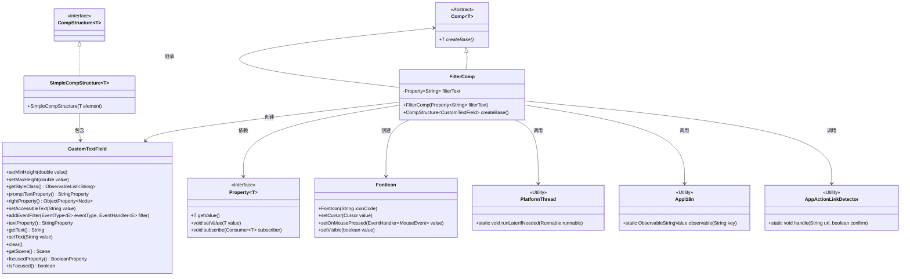
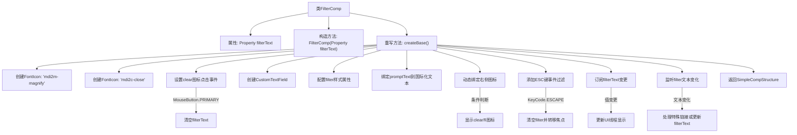

# 基础信息

|      |      |
|------|------|
| 名称 | FilterComp |
| 编码语言 | .java |
| 代码路径 | xpipe/app/src/main/java/io/xpipe/app/comp/base/FilterComp.java |
| 包名 | io.xpipe.app.comp.base |
| 依赖项 | ['io.xpipe.app.comp.Comp', 'io.xpipe.app.comp.CompStructure', 'io.xpipe.app.comp.SimpleCompStructure', 'io.xpipe.app.core.AppActionLinkDetector', 'io.xpipe.app.core.AppI18n', 'io.xpipe.app.util.PlatformThread', 'javafx.beans.binding.Bindings', 'javafx.beans.property.Property', 'javafx.scene.Cursor', 'javafx.scene.input.KeyCode', 'javafx.scene.input.KeyCodeCombination', 'javafx.scene.input.KeyEvent', 'javafx.scene.input.MouseButton', 'atlantafx.base.controls.CustomTextField', 'org.kordamp.ikonli.javafx.FontIcon', 'java.util.Objects'] |
| 概述说明 | FilterComp组件，绑定文本属性，实现搜索框功能，含清除和图标切换逻辑。 |

# 说明

FilterComp是一个继承自Comp的组件类，用于创建带过滤功能的文本框。它接收一个Property<String>类型的filterText属性作为构造参数。组件包含一个搜索图标和一个清除图标，点击清除图标会清空filterText值。文本框支持ESC键清空内容并转移焦点，同时会实时同步filterText与文本框内容。当输入以xpipe://开头的链接时会触发特殊处理。组件还包含国际化提示文本、样式类绑定以及线程安全的内容更新机制。最终返回一个包含自定义文本框的SimpleCompStructure实例。

# 类列表 Class Summary

| 名称   | 类型  | 说明 |
|-------|------|-------------|
| FilterComp | class | FilterComp组件，绑定文本属性，含搜索框、清除按钮，支持快捷键和URL处理。 |

## 类 FilterComp

|      |      |
|------|------|
| 访问范围 | public |
| 类型 | class |
| 名称 | FilterComp |
| 说明 | FilterComp组件，绑定文本属性，含搜索框、清除按钮，支持快捷键和URL处理。 |

### UML类图

这段代码实现了一个可过滤文本的UI组件`FilterComp`，继承自泛型抽象类`Comp`，主要功能包括：1) 创建带有搜索图标和清除按钮的输入框；2) 处理文本输入、粘贴和ESC键清除操作；3) 与外部属性`filterText`双向绑定；4) 特殊处理xpipe协议链接。该组件通过`CustomTextField`实现核心输入功能，使用`FontIcon`显示图标，并通过属性订阅机制实现数据同步。类图展示了组件与JavaFX控件、工具类之间的复杂交互关系。

### 内部方法调用关系图

该流程图展示了FilterComp类的完整工作流程。该类主要实现了一个带过滤功能的文本框组件，包含图标显示、文本绑定、事件处理等核心功能。当用户输入时，会实时更新过滤文本；点击清除图标或按ESC键会重置状态；特殊格式的链接会被拦截处理。整个过程通过属性绑定和事件监听实现响应式更新，最终返回一个封装好的UI组件结构。

### 字段列表 Field List

| 名称  | 类型  | 说明 |
|-------|-------|------|
| filterText | Property<String> | 私有字符串属性filterText |

### 方法列表 Method List

| 名称  | 类型  | 说明 |
|-------|-------|------|
| createBase | CompStructure<CustomTextField> | 创建搜索文本框组件，包含清除按钮、图标绑定、快捷键处理和文本监听功能。 |

