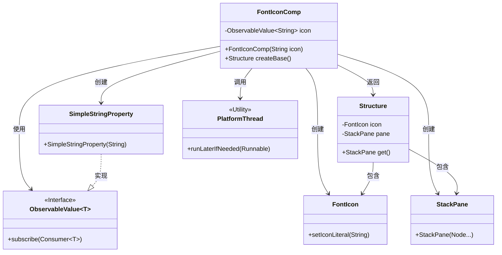
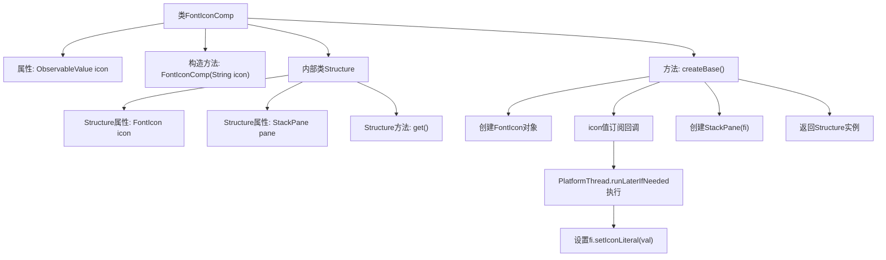

# 基础信息

|      |      |
|------|------|
| 名称 | FontIconComp |
| 编码语言 | .java |
| 代码路径 | xpipe/app/src/main/java/io/xpipe/app/comp/base/FontIconComp.java |
| 包名 | io.xpipe.app.comp.base |
| 依赖项 | ['io.xpipe.app.comp.Comp', 'io.xpipe.app.comp.CompStructure', 'io.xpipe.app.util.PlatformThread', 'javafx.beans.property.SimpleStringProperty', 'javafx.beans.value.ObservableValue', 'javafx.scene.layout.StackPane', 'lombok.AllArgsConstructor', 'lombok.Value', 'org.kordamp.ikonli.javafx.FontIcon'] |
| 概述说明 | FontIconComp类：使用FontIcon和StackPane创建UI组件，支持动态更新图标。 |

# 说明

这是一个名为FontIconComp的Java类，继承自Comp泛型类。该类用于创建字体图标组件，包含一个可观察的字符串属性icon。构造函数接收图标字符串并转换为属性。createBase方法创建FontIcon实例和StackPane容器，通过订阅icon属性更新图标显示。内部类Structure封装图标和面板，提供面板访问方法。整个类实现了响应式图标更新功能。

# 类列表 Class Summary

| 名称   | 类型  | 说明 |
|-------|------|-------------|
| FontIconComp | class | FontIconComp类，使用FontIcon显示图标，基于ObservableValue动态更新。 |

## 类 FontIconComp

|      |      |
|------|------|
| 访问范围 | @AllArgsConstructor;public |
| 类型 | class |
| 名称 | FontIconComp |
| 说明 | FontIconComp类，使用FontIcon显示图标，基于ObservableValue动态更新。 |

### UML类图

这段代码描述了一个字体图标组件`FontIconComp`，它继承自泛型类`Comp`，核心功能是通过`ObservableValue`动态更新图标。类结构包含内部值对象`Structure`（持有`FontIcon`和`StackPane`）、依赖的JavaFX控件类（`FontIcon`/`StackPane`）和线程工具类`PlatformThread`。组件通过观察者模式实现图标值的响应式更新，所有UI操作都通过`PlatformThread`确保线程安全。整体设计体现了复合组件模式，将图标逻辑与容器布局分离，同时支持动态数据绑定。

### 内部方法调用关系图

这段代码描述了一个FontIconComp组件类，它继承自泛型Comp类并包含内部结构类Structure。主要流程包括：通过构造器初始化图标属性，在createBase()方法中创建FontIcon对象并订阅图标值变化，使用平台线程安全更新图标文字，最终返回包含图标和布局面板的Structure实例。流程图清晰展示了类结构关系和方法调用链，特别是异步值更新和UI线程安全处理的逻辑路径。

### 字段列表 Field List

| 名称  | 类型  | 说明 |
|-------|-------|------|
| icon | ObservableValue<String> | 私有不可变字符串图标观察值 |

### 方法列表 Method List

| 名称  | 类型  | 说明 |
|-------|-------|------|
| createBase | FontIconComp.Structure | 重写方法创建FontIcon组件，监听图标变化并更新UI，返回包含图标和面板的结构体。 |

