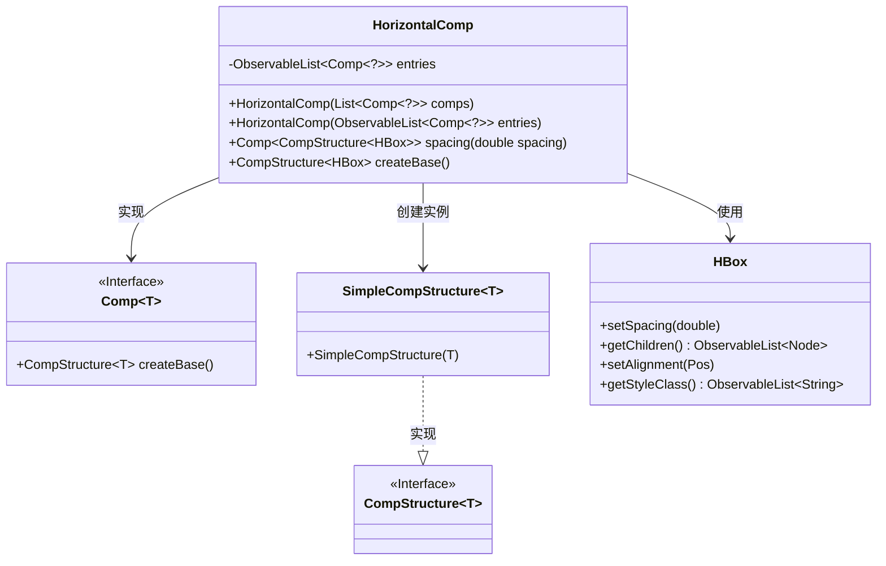
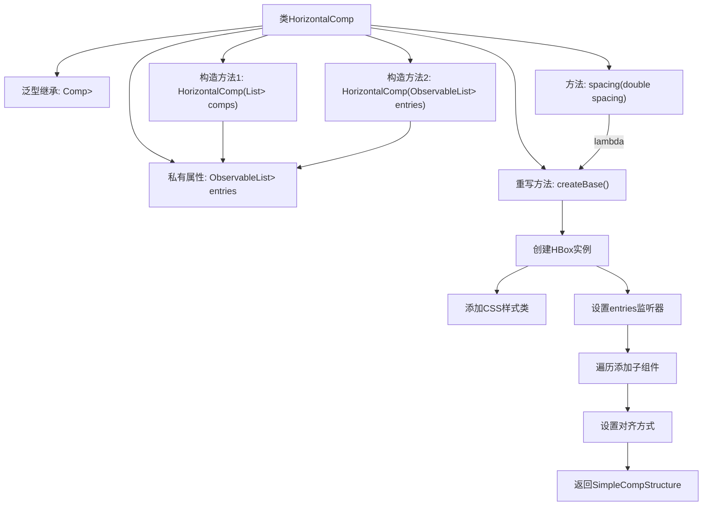

# 基础信息

|      |      |
|------|------|
| 名称 | HorizontalComp |
| 编码语言 | .java |
| 代码路径 | xpipe/app/src/main/java/io/xpipe/app/comp/base/HorizontalComp.java |
| 包名 | io.xpipe.app.comp.base |
| 依赖项 | ['io.xpipe.app.comp.Comp', 'io.xpipe.app.comp.CompStructure', 'io.xpipe.app.comp.SimpleCompStructure', 'io.xpipe.app.util.PlatformThread', 'javafx.collections.FXCollections', 'javafx.collections.ListChangeListener', 'javafx.collections.ObservableList', 'javafx.geometry.Pos', 'javafx.scene.layout.HBox', 'java.util.List'] |
| 概述说明 | 水平布局组件类，支持动态条目更新和间距设置。 |

# 说明

这是一个名为HorizontalComp的JavaFX组件类，继承自Comp类，用于创建水平布局容器。该类包含一个可观察的组件列表entries，提供两种构造方式：通过普通列表或可观察列表初始化。主要功能包括设置组件间距的spacing方法，以及重写createBase方法创建HBox布局容器。容器会自动同步entries列表变化，将所有子组件转换为区域并水平排列，默认居中对齐，并添加horizontal-comp样式类。

# 类列表 Class Summary

| 名称   | 类型  | 说明 |
|-------|------|-------------|
| HorizontalComp | class | 水平布局组件类，支持动态子组件列表和间距设置，自动同步UI更新。 |

## 类 HorizontalComp

|      |      |
|------|------|
| 访问范围 | public |
| 类型 | class |
| 名称 | HorizontalComp |
| 说明 | 水平布局组件类，支持动态子组件列表和间距设置，自动同步UI更新。 |

### UML类图

类图描述：HorizontalComp是一个实现了Comp接口的泛型类，专门用于处理HBox类型的布局组件。它包含一个可观察的Comp列表entries，提供两种构造方法和间距设置功能。通过createBase()方法创建并维护HBox布局，使用SimpleCompStructure作为CompStructure接口的实现。该类与JavaFX的HBox紧密交互，负责动态更新子组件布局和样式。

### 内部方法调用关系图

这段代码定义了一个水平布局组件HorizontalComp，继承自泛型类Comp<CompStructure<HBox>>。主要功能包括：1) 通过两种构造方法初始化可观察的组件列表entries；2) 提供spacing方法设置子组件间距；3) 重写createBase方法创建HBox布局容器，添加样式类并设置动态监听器，当entries变化时自动更新子组件，最后返回包装后的布局结构。流程图清晰展示了类结构、构造方法调用链和createBase方法的详细实现步骤。

### 字段列表 Field List

| 名称  | 类型  | 说明 |
|-------|-------|------|
| entries | ObservableList<Comp<?>> | 私有可观察列表，存储Comp泛型对象条目。 |

### 方法列表 Method List

| 名称  | 类型  | 说明 |
|-------|-------|------|
| createBase | CompStructure<HBox> | 重写createBase方法，创建水平布局组件，动态更新子组件并居中显示。 |
| spacing | Comp<CompStructure<HBox>> | 设置HBox组件间距的方法，参数为间距值。 |

