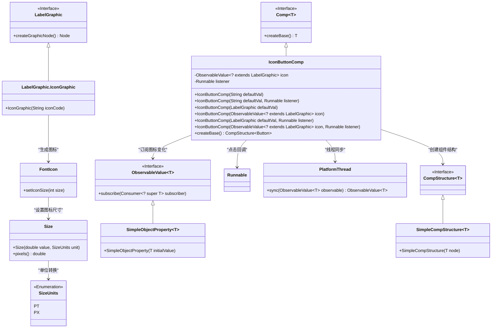
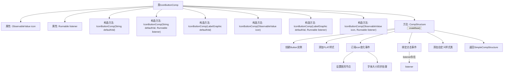

# 基础信息

|      |      |
|------|------|
| 名称 | IconButtonComp |
| 编码语言 | .java |
| 代码路径 | xpipe/app/src/main/java/io/xpipe/app/comp/base/IconButtonComp.java |
| 包名 | io.xpipe.app.comp.base |
| 依赖项 | ['io.xpipe.app.comp.Comp', 'io.xpipe.app.comp.CompStructure', 'io.xpipe.app.comp.SimpleCompStructure', 'io.xpipe.app.util.LabelGraphic', 'io.xpipe.app.util.PlatformThread', 'javafx.beans.property.SimpleObjectProperty', 'javafx.beans.value.ObservableValue', 'javafx.css.Size', 'javafx.css.SizeUnits', 'javafx.scene.control.Button', 'atlantafx.base.theme.Styles', 'org.kordamp.ikonli.javafx.FontIcon'] |
| 概述说明 | 图标按钮组件类，支持动态图标和点击事件。 |

# 说明

这是一个名为IconButtonComp的组件类，继承自Comp类，用于创建带图标的按钮。类中包含两个主要成员变量：icon表示图标，类型为ObservableValue；listener表示点击事件的回调函数。提供了多个构造函数，支持通过字符串、LabelGraphic对象或ObservableValue来初始化图标，并可选择是否设置点击监听器。在createBase方法中，创建了一个扁平样式的按钮，动态设置图标并处理图标大小随字体变化的情况。如果设置了监听器，按钮点击时会触发回调并阻止事件冒泡。最后为按钮添加了icon-button-comp样式类。

# 类列表 Class Summary

| 名称   | 类型  | 说明 |
|-------|------|-------------|
| IconButtonComp | class | 图标按钮组件类，支持动态图标和点击事件。 |

## 类 IconButtonComp

|      |      |
|------|------|
| 访问范围 | public |
| 类型 | class |
| 名称 | IconButtonComp |
| 说明 | 图标按钮组件类，支持动态图标和点击事件。 |

### UML类图

这段代码展示了一个图标按钮组件`IconButtonComp`的实现，它继承自泛型组件接口`Comp`，通过`ObservableValue`动态监听图标变化，支持点击事件回调。类图清晰地呈现了组件与图标渲染系统、尺寸计算模块之间的协作关系，以及通过`PlatformThread`实现的线程安全机制。该设计实现了图标按钮的可定制化渲染和交互功能，同时保持与JavaFX图形系统的兼容性。

### 内部方法调用关系图

这段代码展示了一个IconButtonComp类，继承自Comp泛型类，主要用于创建带有图标的按钮组件。类包含6个重载构造函数，支持通过字符串、LabelGraphic对象或ObservableValue来初始化图标，并可选择性地添加点击监听器。核心方法createBase()创建Button实例，设置扁平化样式，动态响应图标和字体变化，并处理点击事件。通过订阅机制实现图标与字体大小的同步更新，最终返回包含配置好的按钮的SimpleCompStructure对象。

### 字段列表 Field List

| 名称  | 类型  | 说明 |
|-------|-------|------|
| listener | Runnable | 私有Runnable监听器 |
| icon | ObservableValue<? extends LabelGraphic> | 私有不可变图标标签图形可观察值。 |

### 方法列表 Method List

| 名称  | 类型  | 说明 |
|-------|-------|------|
| createBase | CompStructure<Button> | 创建扁平化按钮，设置图标和字体大小，支持点击事件。 |

