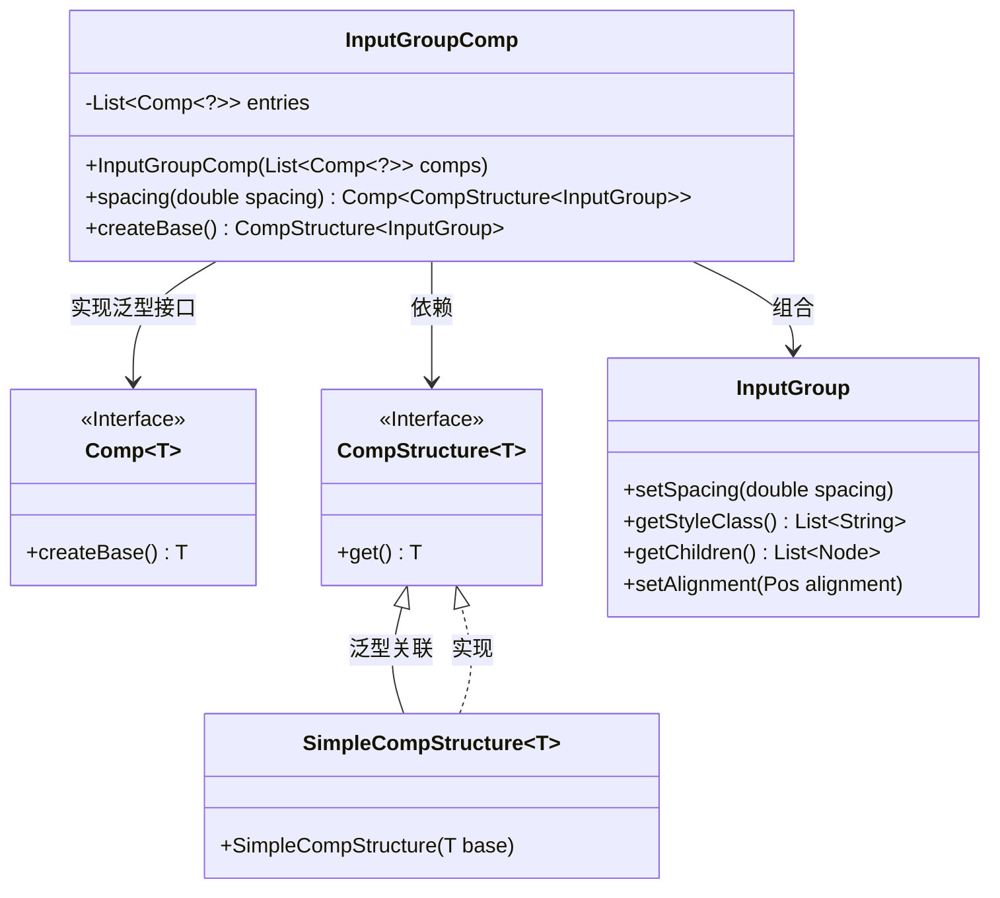
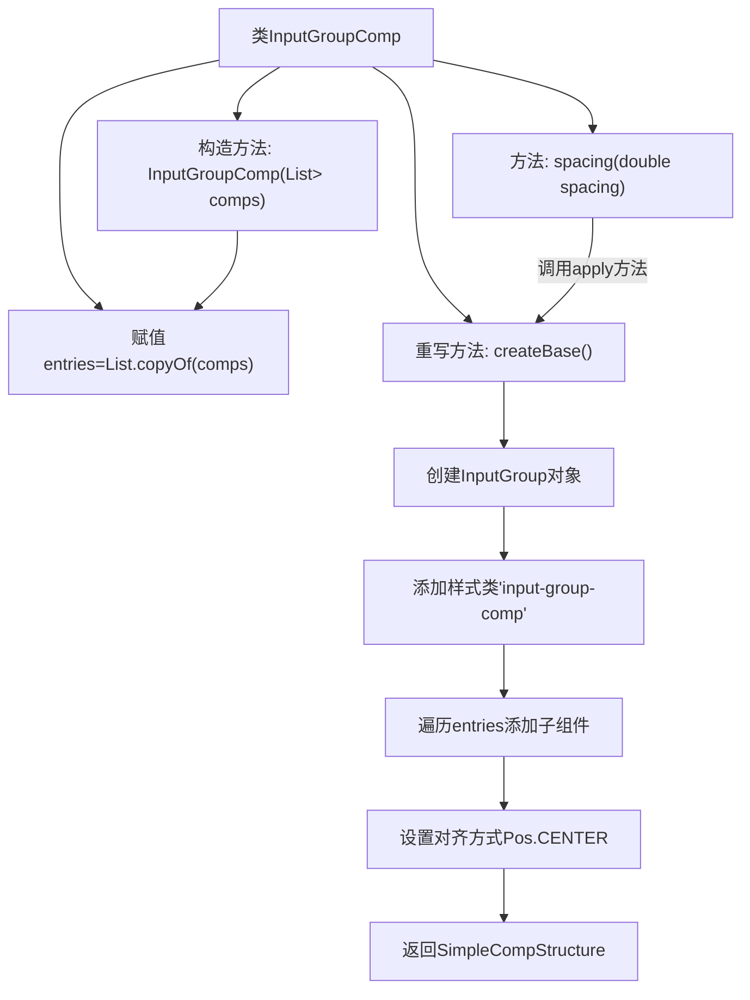

# 基础信息

|      |      |
|------|------|
| 名称 | InputGroupComp |
| 编码语言 | .java |
| 代码路径 | xpipe/app/src/main/java/io/xpipe/app/comp/base/InputGroupComp.java |
| 包名 | io.xpipe.app.comp.base |
| 依赖项 | ['io.xpipe.app.comp.Comp', 'io.xpipe.app.comp.CompStructure', 'io.xpipe.app.comp.SimpleCompStructure', 'javafx.geometry.Pos', 'atlantafx.base.layout.InputGroup', 'java.util.List'] |
| 概述说明 | 输入组件组类，包含条目列表，支持间距设置和居中布局。 |

# 说明

这是一个名为InputGroupComp的Java类，继承自Comp类，用于创建输入组件的容器。该类包含一个不可修改的组件列表entries，通过构造函数初始化。提供了spacing方法用于设置组件间距，重写了createBase方法以创建基础结构。createBase方法会创建一个InputGroup实例，添加样式类，将所有子组件转换为区域并加入容器，最后设置居中对齐并返回封装好的结构对象。

# 类列表 Class Summary

| 名称   | 类型  | 说明 |
|-------|------|-------------|
| InputGroupComp | class | 输入组件组类，含条目列表和间距设置方法，创建基础布局并居中。 |

## 类 InputGroupComp

|      |      |
|------|------|
| 访问范围 | public |
| 类型 | class |
| 名称 | InputGroupComp |
| 说明 | 输入组件组类，含条目列表和间距设置方法，创建基础布局并居中。 |

### UML类图

这段类图展示了InputGroupComp类的结构及其与其他组件的关系。InputGroupComp是一个泛型类，实现了Comp接口并操作CompStructure和InputGroup对象。它包含一个Comp对象列表作为私有成员，提供间距设置方法，并通过createBase()方法创建并配置InputGroup实例。SimpleCompStructure是CompStructure接口的具体实现，用于包装InputGroup对象。整体设计体现了组合模式的思想，InputGroupComp作为容器管理多个子组件。

### 内部方法调用关系图

该流程图展示了InputGroupComp类的结构和主要方法调用关系。类包含entries列表属性和构造方法初始化，核心逻辑在createBase()方法中：创建InputGroup对象后添加CSS样式，遍历entries集合添加子组件区域，设置居中对齐后返回包装结构。spacing()方法通过apply函数式调用修改间距参数，体现了组合式UI组件的构建模式。

### 字段列表 Field List

| 名称  | 类型  | 说明 |
|-------|-------|------|
| entries | List<Comp<?>> | 私有成员变量，存储Comp泛型对象的列表。 |

### 方法列表 Method List

| 名称  | 类型  | 说明 |
|-------|-------|------|
| spacing | Comp<CompStructure<InputGroup>> | 设置输入组间距的方法，返回调整后的组件结构。 |
| createBase | CompStructure<InputGroup> | 重写方法创建输入组组件，添加样式和子项，居中对齐后返回结构。 |

