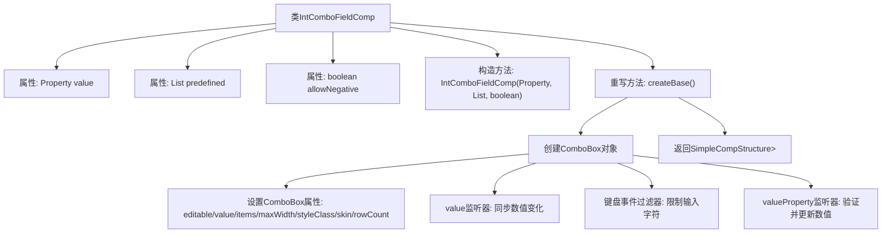

# 基础信息

|      |      |
|------|------|
| 名称 | IntComboFieldComp |
| 编码语言 | .java |
| 代码路径 | xpipe/app/src/main/java/io/xpipe/app/comp/base/IntComboFieldComp.java |
| 包名 | io.xpipe.app.comp.base |
| 依赖项 | ['io.xpipe.app.comp.Comp', 'io.xpipe.app.comp.CompStructure', 'io.xpipe.app.comp.SimpleCompStructure', 'io.xpipe.app.util.PlatformThread', 'javafx.beans.property.Property', 'javafx.beans.value.ChangeListener', 'javafx.collections.FXCollections', 'javafx.scene.control.ComboBox', 'javafx.scene.control.skin.ComboBoxListViewSkin', 'javafx.scene.input.KeyEvent', 'lombok.AccessLevel', 'lombok.experimental.FieldDefaults', 'java.util.List'] |
| 概述说明 | 整数组合框组件，支持预定义值和负数输入。 |

# 说明

IntComboFieldComp是一个JavaFX组件类，继承自Comp类，用于创建可编辑的组合框。该类包含三个主要属性：value用于存储整数值，predefined定义预置选项列表，allowNegative控制是否允许负值输入。组件创建时会初始化组合框，设置可编辑性、默认值、预置选项和样式。通过监听器实现双向数据绑定：当value属性变化时更新组合框显示值；当用户输入时验证字符（仅允许数字或负号），并解析输入值更新value属性。组件还限制了可见行数（最多10行）和最大宽度。

# 类列表 Class Summary

| 名称   | 类型  | 说明 |
|-------|------|-------------|
| IntComboFieldComp | class | JavaFX整数组合框组件，支持预定义值和负数输入。 |


## 类 IntComboFieldComp

|      |      |
|------|------|
| 访问范围 | @FieldDefaults(makeFinal = true, level = AccessLevel.PRIVATE);public |
| 类型 | class |
| 名称 | IntComboFieldComp |
| 说明 | JavaFX整数组合框组件，支持预定义值和负数输入。 |


### UML类图

```mermaid
classDiagram
    class IntComboFieldComp {
        -Property~Integer~ value
        -List~Integer~ predefined
        -boolean allowNegative
        +IntComboFieldComp(Property~Integer~ value, List~Integer~ predefined, boolean allowNegative)
        +CompStructure~ComboBox~String~~ createBase()
    }

    class Property~T~ {
        <<Interface>>
        +T getValue()
        +void setValue(T value)
        +void addListener(ChangeListener~? super T~ listener)
    }

    class Comp~T~ {
        <<Interface>>
        +T createBase()
    }

    class CompStructure~T~ {
        <<Interface>>
    }

    class SimpleCompStructure~T~ {
        +SimpleCompStructure(T root)
    }

    class ComboBox~T~ {
        +void setEditable(boolean value)
        +void setValue(T value)
        +void setItems(ObservableList~T~ items)
        +void setMaxWidth(double value)
        +void getStyleClass()
        +void setSkin(Skin~?~ skin)
        +void setVisibleRowCount(int value)
        +Property~T~ valueProperty()
        +void addEventFilter(EventType~KeyEvent~ type, EventHandler~? super KeyEvent~ filter)
    }

    IntComboFieldComp --> Property~Integer~ : 使用
    IntComboFieldComp --> Comp~CompStructure~ComboBox~String~~ : 实现
    IntComboFieldComp --> ComboBox~String~ : 创建
    IntComboFieldComp --> SimpleCompStructure~ComboBox~String~~ : 返回
    CompStructure~T~ <|-- SimpleCompStructure~T~
    Comp~T~ <|-- IntComboFieldComp
```

这段代码定义了一个`IntComboFieldComp`类，用于创建可编辑的组合框组件，主要用于处理整数输入。该类实现了`Comp`接口，通过`createBase`方法构建包含`ComboBox<String>`的UI组件结构。组件支持预定义值列表、负数输入控制，并通过属性绑定实现双向数据流。类图中展示了与JavaFX组件（如`ComboBox`）、属性监听接口（`Property`）以及自定义结构接口（`CompStructure`）的关系，体现了组件化设计思想。


### 内部方法调用关系图



这段代码实现了一个可编辑的组合框组件IntComboFieldComp，继承自Comp类。主要功能包括：1) 通过ComboBox显示预定义整数值列表；2) 支持手动输入数值并验证格式；3) 通过属性绑定实现双向数据同步；4) 可配置是否允许负值输入。流程图展示了从类结构到核心方法createBase()的实现细节，包括UI初始化、事件监听和数据验证等关键步骤，最终返回包含组合框的组件结构。

### 字段列表 Field List

| 名称  | 类型  | 说明 |
|-------|-------|------|
| predefined | List<Integer> | 预定义整数列表。 |
| value | Property<Integer> | 整数类型属性值 |
| allowNegative | boolean | 布尔型变量allowNegative，表示是否允许负值。 |

### 方法列表 Method List

| 名称  | 类型  | 说明 |
|-------|-------|------|
| createBase | CompStructure<ComboBox<String>> | 创建可编辑组合框，支持数字输入与验证，绑定数值变化监听。 |


