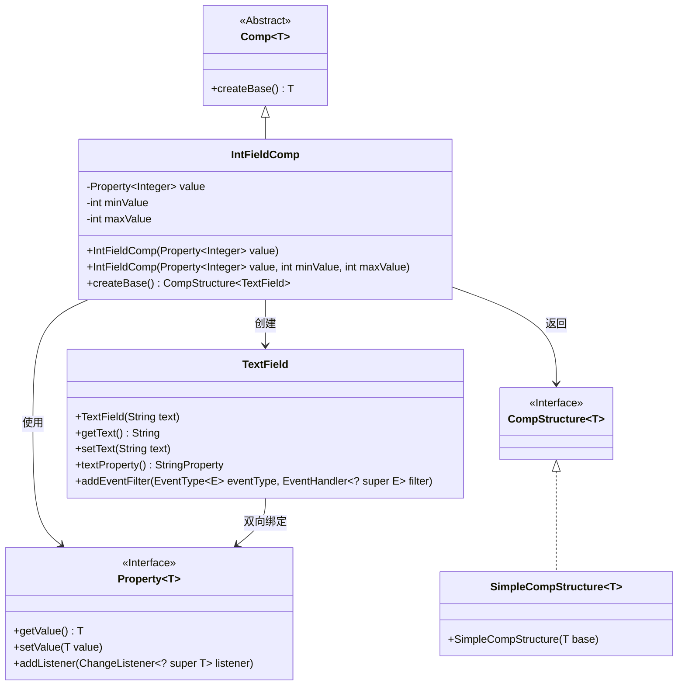
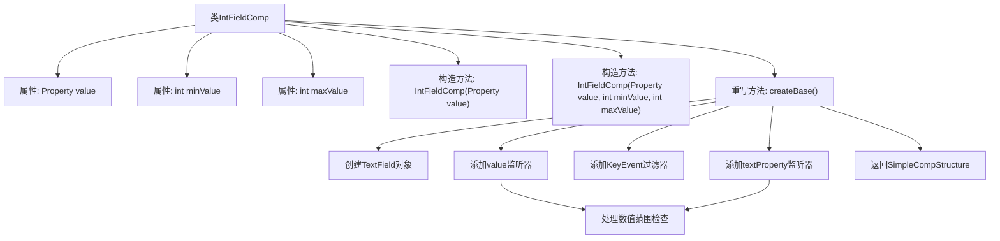
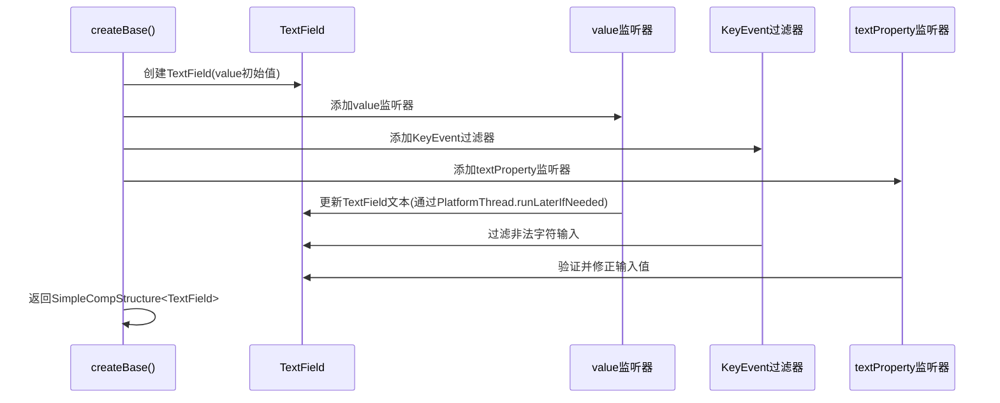

# 基础信息

|      |      |
|------|------|
| 名称 | IntFieldComp |
| 编码语言 | .java |
| 代码路径 | xpipe/app/src/main/java/io/xpipe/app/comp/base/IntFieldComp.java |
| 包名 | io.xpipe.app.comp.base |
| 依赖项 | ['io.xpipe.app.comp.Comp', 'io.xpipe.app.comp.CompStructure', 'io.xpipe.app.comp.SimpleCompStructure', 'io.xpipe.app.util.PlatformThread', 'javafx.application.Platform', 'javafx.beans.property.Property', 'javafx.beans.value.ChangeListener', 'javafx.scene.control.TextField', 'javafx.scene.input.KeyEvent', 'lombok.AccessLevel', 'lombok.experimental.FieldDefaults', 'java.util.Objects'] |
| 概述说明 | 整型输入框组件，支持属性绑定、范围限制和输入验证。 |

# 说明

这是一个名为IntFieldComp的Java类，继承自Comp类，用于创建带验证的整数输入框组件。该类包含三个主要属性：value用于存储整数值，minValue和maxValue定义输入范围。构造函数支持设置默认值和范围限制。createBase方法创建TextField控件，并实现以下功能：1)双向数据绑定，确保UI与数据同步；2)输入验证，限制只能输入数字和负号；3)范围检查，自动修正超出范围的输入；4)空值处理。通过监听器实现实时验证和数据同步，确保输入始终符合要求。

# 类列表 Class Summary

| 名称   | 类型  | 说明 |
|-------|------|-------------|
| IntFieldComp | class | IntFieldComp类，用于整数输入框，支持最小最大值限制和输入验证。 |

## 类 IntFieldComp

|      |      |
|------|------|
| 访问范围 | @FieldDefaults(makeFinal = true, level = AccessLevel.PRIVATE);public |
| 类型 | class |
| 名称 | IntFieldComp |
| 说明 | IntFieldComp类，用于整数输入框，支持最小最大值限制和输入验证。 |

### UML类图

这段代码实现了一个整数输入框组件(IntFieldComp)，继承自泛型Comp类，核心功能是通过JavaFX的TextField实现数值输入控制。类结构包含4个主要部分：1)抽象组件基类Comp；2)组件结构接口CompStructure及其实现类SimpleCompStructure；3)属性监听体系Property；4)JavaFX的TextField控件。IntFieldComp通过事件过滤器和属性监听器实现了输入验证、数值范围限制和双向数据绑定功能，确保输入值始终在[minValue,maxValue]范围内。

### 内部方法调用关系图

这段代码实现了一个整数输入组件IntFieldComp，继承自Comp类，主要用于创建和管理带有范围验证的文本输入框。流程图展示了类结构和主要方法调用关系，时序图则详细描述了createBase()方法执行时各组件间的交互过程。该组件通过三重验证机制(监听器、事件过滤器和属性绑定)确保输入值始终在[minValue,maxValue]范围内，并处理了空值、边界值和非法字符等多种边缘情况。

### 字段列表 Field List

| 名称  | 类型  | 说明 |
|-------|-------|------|
| value | Property<Integer> | 整数类型属性值 |
| minValue | int | 声明整型变量minValue |
| maxValue | int | 声明整型变量maxValue |

### 方法列表 Method List

| 名称  | 类型  | 说明 |
|-------|-------|------|
| createBase | CompStructure<TextField> | 创建文本框组件，监听数值变化并验证输入范围，确保数值在minValue和maxValue之间，处理空值和非法字符输入。 |

