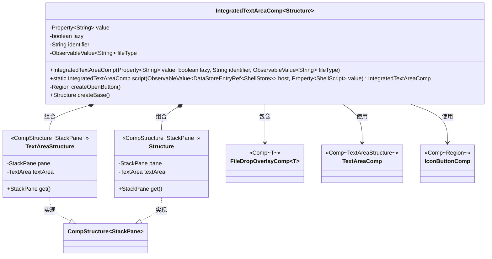
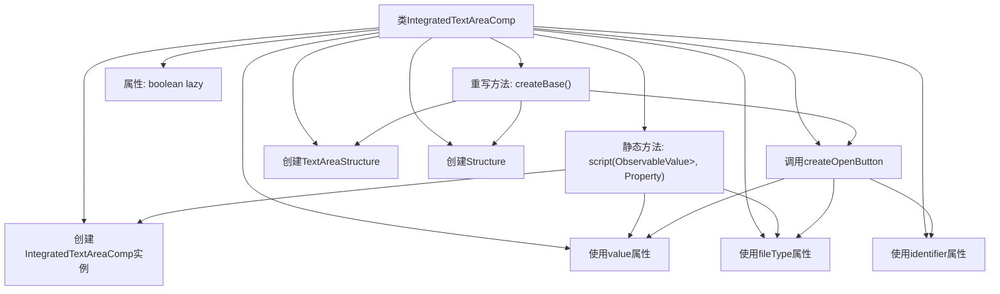
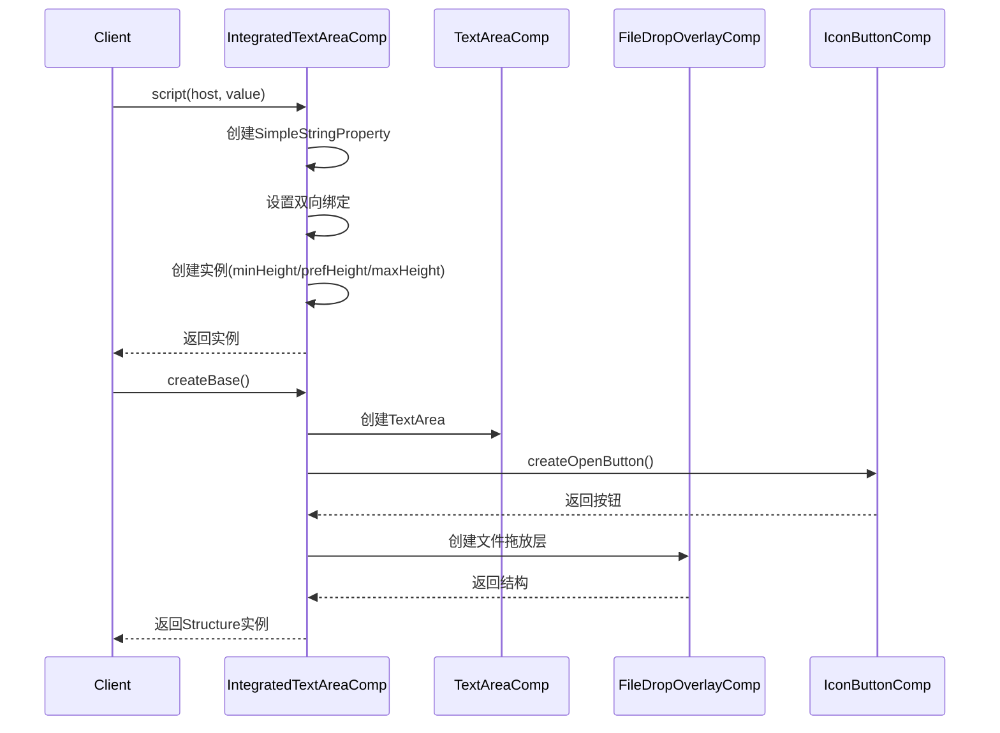

# 基础信息

|      |      |
|------|------|
| 名称 | IntegratedTextAreaComp |
| 编码语言 | .java |
| 代码路径 | xpipe/app/src/main/java/io/xpipe/app/comp/base/IntegratedTextAreaComp.java |
| 包名 | io.xpipe.app.comp.base |
| 依赖项 | ['io.xpipe.app.comp.Comp', 'io.xpipe.app.comp.CompStructure', 'io.xpipe.app.ext.ShellStore', 'io.xpipe.app.storage.DataStoreEntryRef', 'io.xpipe.app.util.FileOpener', 'io.xpipe.core.process.ShellScript', 'io.xpipe.core.process.ShellStoreState', 'io.xpipe.core.store.StatefulDataStore', 'javafx.application.Platform', 'javafx.beans.binding.Bindings', 'javafx.beans.property.Property', 'javafx.beans.property.SimpleStringProperty', 'javafx.beans.value.ObservableValue', 'javafx.scene.control.TextArea', 'javafx.scene.layout.AnchorPane', 'javafx.scene.layout.Region', 'javafx.scene.layout.StackPane', 'atlantafx.base.theme.Styles', 'lombok.Builder', 'lombok.Value', 'java.nio.file.Files'] |
| 概述说明 | 集成文本区域组件，支持脚本编辑、文件拖放和外部编辑器打开。 |

# 说明

IntegratedTextAreaComp是一个自定义组件，用于创建集成的文本区域，支持脚本编辑和文件拖放功能。组件通过Property<String>管理文本值，可设置懒加载标识符和文件类型。包含一个编辑按钮，用于在外部编辑器中打开文本内容。文件拖放功能允许读取小于1MB的文件内容到文本区域。组件结构包含StackPane和TextArea，支持样式定制和布局调整。通过工厂方法script()创建实例时，自动绑定ShellScript值变化并设置默认高度为60像素。

# 类列表 Class Summary

| 名称   | 类型  | 说明 |
|-------|------|-------------|
| IntegratedTextAreaComp | class | 集成文本区域组件，支持脚本编辑、文件拖放和外部编辑器打开。 |

## 类 IntegratedTextAreaComp

|      |      |
|------|------|
| 访问范围 | public |
| 类型 | class |
| 名称 | IntegratedTextAreaComp |
| 说明 | 集成文本区域组件，支持脚本编辑、文件拖放和外部编辑器打开。 |

### UML类图

这段代码描述了一个可集成文本区域组件`IntegratedTextAreaComp`，它继承自泛型类`Comp`，包含文本编辑、文件拖放和脚本处理功能。主要结构包括：1) 核心类通过`FileDropOverlayComp`实现文件拖放功能；2) 使用`TextAreaComp`作为基础文本编辑区域；3) 通过`IconButtonComp`创建编辑按钮；4) 定义了两个内部结构类`TextAreaStructure`和`Structure`来实现组件布局。该组件特别处理了Shell脚本的编辑场景，包含文件类型检测、大文件过滤等边界情况处理。

### 内部方法调用关系图

这段代码实现了一个带文件拖放功能的文本编辑器组件。核心类IntegratedTextAreaComp通过script工厂方法创建实例，支持脚本内容双向绑定和文件类型动态判断。createBase方法构建了包含编辑按钮和文件拖放功能的复合UI结构，其中文件拖放功能通过FileDropOverlayComp实现，编辑按钮通过IconButtonComp创建。组件内部维护了文本内容、懒加载标志、标识符和文件类型等状态，并通过嵌套的TextAreaStructure和Structure类组织UI层次。

### 字段列表 Field List

| 名称  | 类型  | 说明 |
|-------|-------|------|
| identifier | String | 私有字符串标识符 |
| lazy | boolean | 私有布尔变量lazy |
| fileType | ObservableValue<String> | 私有不可变字符串可观察值fileType |
| value | Property<String> | 私有字符串属性value。 |

### 方法列表 Method List

| 名称  | 类型  | 说明 |
|-------|-------|------|
| script | IntegratedTextAreaComp | 创建可绑定的脚本文本区域组件，监听脚本变化并设置默认文件扩展名。 |
| createOpenButton | Region | 创建编辑按钮，点击打开文件编辑器，支持内容修改与更新。 |
| createBase | Structure | 重写createBase方法，创建带文件拖放功能的文本区域结构。 |

