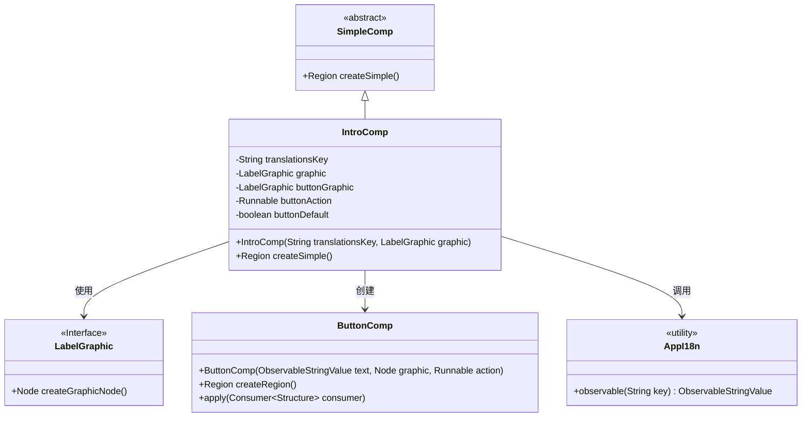
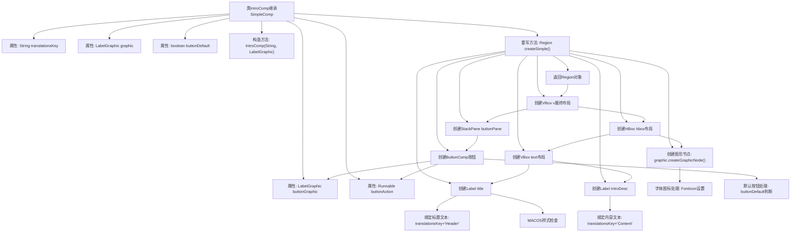

# 基础信息

|      |      |
|------|------|
| 名称 | IntroComp |
| 编码语言 | .java |
| 代码路径 | xpipe/app/src/main/java/io/xpipe/app/comp/base/IntroComp.java |
| 包名 | io.xpipe.app.comp.base |
| 依赖项 | ['io.xpipe.app.comp.SimpleComp', 'io.xpipe.app.core.AppFontSizes', 'io.xpipe.app.core.AppI18n', 'io.xpipe.app.util.LabelGraphic', 'io.xpipe.core.process.OsType', 'javafx.geometry.Pos', 'javafx.scene.control.Label', 'javafx.scene.layout.HBox', 'javafx.scene.layout.Region', 'javafx.scene.layout.StackPane', 'javafx.scene.layout.VBox', 'atlantafx.base.theme.Styles', 'lombok.Setter', 'org.kordamp.ikonli.javafx.FontIcon'] |
| 概述说明 | IntroComp类：带标题、描述、图标和按钮的UI组件。 |

# 说明

IntroComp是一个继承自SimpleComp的组件类，用于创建包含标题、描述、图标和按钮的界面。它通过translationsKey获取国际化文本，使用LabelGraphic显示图标。可设置按钮图标、点击动作和默认状态。创建界面时，标题和描述文本绑定国际化资源，图标大小可调整，布局采用HBox和VBox组合，按钮支持默认样式设置。整体界面风格简洁，元素间距合理，适配不同操作系统。

# 类列表 Class Summary

| 名称   | 类型  | 说明 |
|-------|------|-------------|
| IntroComp | class | Java类IntroComp继承SimpleComp，用于创建带标题、图标、描述和按钮的界面组件。 |

## 类 IntroComp

|      |      |
|------|------|
| 访问范围 | public |
| 类型 | class |
| 名称 | IntroComp |
| 说明 | Java类IntroComp继承SimpleComp，用于创建带标题、图标、描述和按钮的界面组件。 |

### UML类图

这段代码展示了一个介绍性UI组件(IntroComp)的实现，继承自SimpleComp抽象类。主要功能是创建一个包含标题、描述文本、图标和按钮的组合界面，支持国际化文本绑定和样式控制。类图显示了IntroComp与LabelGraphic接口、ButtonComp类以及工具类AppI18n之间的关系，其中IntroComp通过组合方式使用这些类来构建完整的UI界面，同时继承了SimpleComp的基本结构。

### 内部方法调用关系图

这段代码是IntroComp类的实现，继承自SimpleComp，主要用于创建包含标题、描述、图标和按钮的复合UI组件。流程图展示了从属性定义到最终布局生成的完整过程，包括文本绑定、样式处理、图形节点创建、布局组合等关键步骤，最终返回一个包含所有元素的Region对象。特别处理了MACOS平台样式差异和按钮默认状态等细节。

### 字段列表 Field List

| 名称  | 类型  | 说明 |
|-------|-------|------|
| graphic | LabelGraphic | 私有标签图形对象。 |
| buttonDefault | boolean | 设置私有布尔变量buttonDefault的setter方法。 |
| translationsKey | String | 私有字符串变量translationsKey |
| buttonGraphic | LabelGraphic | 设置私有按钮图形标签变量。 |
| buttonAction | Runnable | 设置私有按钮动作方法。 |

### 方法列表 Method List

| 名称  | 类型  | 说明 |
|-------|-------|------|
| createSimple | Region | 创建带标题、描述、图标和按钮的垂直布局界面组件。 |

