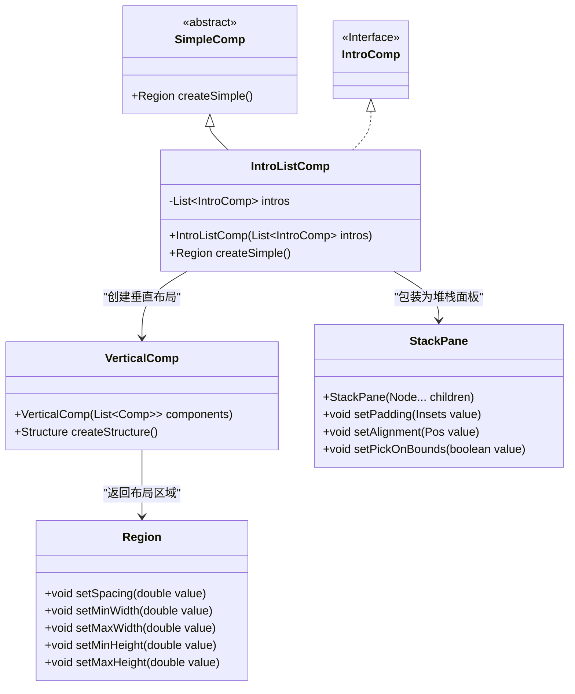
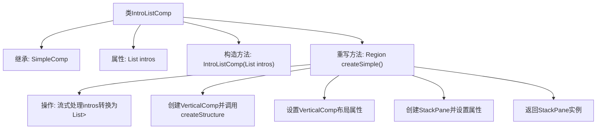

# 基础信息

|      |      |
|------|------|
| 名称 | IntroListComp |
| 编码语言 | .java |
| 代码路径 | xpipe/app/src/main/java/io/xpipe/app/comp/base/IntroListComp.java |
| 包名 | io.xpipe.app.comp.base |
| 依赖项 | ['io.xpipe.app.comp.Comp', 'io.xpipe.app.comp.SimpleComp', 'javafx.geometry.Insets', 'javafx.geometry.Pos', 'javafx.scene.layout.Region', 'javafx.scene.layout.StackPane', 'java.util.List', 'java.util.stream.Collectors'] |
| 概述说明 | IntroListComp类继承SimpleComp，接收IntroComp列表并创建垂直布局组件，设置间距、尺寸和边距后返回。 |

# 说明

IntroListComp是一个继承自SimpleComp的类，用于管理IntroComp列表的布局。构造函数接收IntroComp列表作为参数。createSimple方法将列表转换为垂直布局，设置间距为80，宽度和高度使用首选尺寸。最终将垂直布局放入StackPane，设置内边距为顶部40，居中对齐，并禁用边界拾取。返回StackPane作为结果。

# 类列表 Class Summary

| 名称   | 类型  | 说明 |
|-------|------|-------------|
| IntroListComp | class | IntroListComp类继承SimpleComp，构造接收IntroComp列表，创建垂直布局组件并设置样式。 |

## 类 IntroListComp

|      |      |
|------|------|
| 访问范围 | public |
| 类型 | class |
| 名称 | IntroListComp |
| 说明 | IntroListComp类继承SimpleComp，构造接收IntroComp列表，创建垂直布局组件并设置样式。 |

### UML类图

这段类图展示了IntroListComp继承自抽象类SimpleComp，并实现了IntroComp接口。IntroListComp通过VerticalComp创建垂直布局结构，再使用StackPane进行包装。VerticalComp依赖于Region类来设置布局属性，StackPane则负责最终的UI呈现。整个结构体现了JavaFX中组件组合和布局管理的典型模式，其中Region和StackPane是JavaFX的核心UI组件类。

### 内部方法调用关系图

这段代码描述了一个继承自SimpleComp的IntroListComp类，主要用于创建垂直排列的组件列表。流程图展示了从类结构到核心方法createSimple()的执行过程：首先转换输入列表类型，然后创建垂直布局容器并设置间距、尺寸约束，最后包装在具有特定边距和对齐方式的StackPane中返回。整个过程体现了GUI组件的组合式构建模式，通过流式操作和链式调用实现高效布局配置。

### 字段列表 Field List

| 名称  | 类型  | 说明 |
|-------|-------|------|
| intros | List<IntroComp> | 私有IntroComp列表intros |

### 方法列表 Method List

| 名称  | 类型  | 说明 |
|-------|-------|------|
| createSimple | Region | 创建垂直布局组件，设置间距、尺寸属性，并返回带内边距的居中堆栈面板。 |

