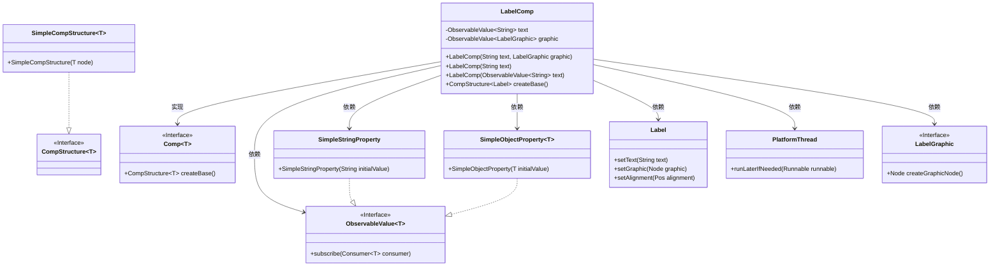
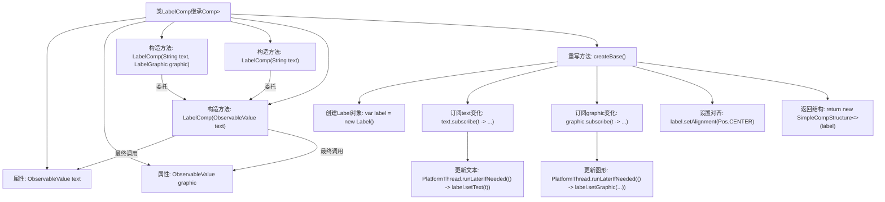

# 基础信息

|      |      |
|------|------|
| 名称 | LabelComp |
| 编码语言 | .java |
| 代码路径 | xpipe/app/src/main/java/io/xpipe/app/comp/base/LabelComp.java |
| 包名 | io.xpipe.app.comp.base |
| 依赖项 | ['io.xpipe.app.comp.Comp', 'io.xpipe.app.comp.CompStructure', 'io.xpipe.app.comp.SimpleCompStructure', 'io.xpipe.app.util.LabelGraphic', 'io.xpipe.app.util.PlatformThread', 'javafx.beans.property.SimpleObjectProperty', 'javafx.beans.property.SimpleStringProperty', 'javafx.beans.value.ObservableValue', 'javafx.geometry.Pos', 'javafx.scene.control.Label', 'lombok.AllArgsConstructor'] |
| 概述说明 | LabelComp类继承Comp，封装Label组件，支持动态文本和图形更新。 |

# 说明

LabelComp是一个继承自Comp的组件类，用于创建包含文本和图形的标签控件。该类通过构造器支持多种初始化方式：可直接传入字符串文本或图形对象，也可传入可观察值对象。核心功能在createBase方法中实现，该方法创建Label控件并设置双向绑定：文本内容变化时自动更新标签文本，图形对象变化时自动更新标签图形。所有UI更新操作均通过PlatformThread确保线程安全，标签默认居中对齐。

# 类列表 Class Summary

| 名称   | 类型  | 说明 |
|-------|------|-------------|
| LabelComp | class | LabelComp类，用于创建带文本和图形的标签组件，支持属性绑定和线程安全更新。 |

## 类 LabelComp

|      |      |
|------|------|
| 访问范围 | @AllArgsConstructor;public |
| 类型 | class |
| 名称 | LabelComp |
| 说明 | LabelComp类，用于创建带文本和图形的标签组件，支持属性绑定和线程安全更新。 |

### UML类图

类图描述：LabelComp是一个实现了Comp接口的组件类，用于创建和管理Label控件。它包含两个可观察属性：text和graphic，分别控制Label的文本和图形内容。通过构造函数重载提供多种初始化方式，createBase()方法负责创建并配置Label控件，使用PlatformThread确保UI更新在正确线程执行。类图中展示了与ObservableValue、SimpleStringProperty、SimpleObjectProperty等辅助类的依赖关系，以及Label和LabelGraphic的核心交互。

### 内部方法调用关系图

这段代码展示了一个LabelComp类，它继承自泛型类Comp，用于创建和管理Label组件的结构和行为。类中包含两个主要属性：text和graphic，分别用于存储文本和图形内容。通过多个构造函数提供不同的初始化方式，最终都会调用全参数构造函数。核心方法createBase()创建Label对象，并设置文本和图形的动态绑定，确保在UI线程中更新。流程图清晰地展示了属性、构造方法之间的委托关系，以及createBase()方法内部的处理流程，包括Label创建、属性订阅和UI更新等关键步骤。

### 字段列表 Field List

| 名称  | 类型  | 说明 |
|-------|-------|------|
| text | ObservableValue<String> | 私有不可变字符串可观察值 |
| graphic | ObservableValue<LabelGraphic> | 私有不可变标签图形观察值。 |

### 方法列表 Method List

| 名称  | 类型  | 说明 |
|-------|-------|------|
| createBase | CompStructure<Label> | 重写createBase方法，创建Label并订阅text和graphic更新，居中显示后返回SimpleCompStructure。 |

