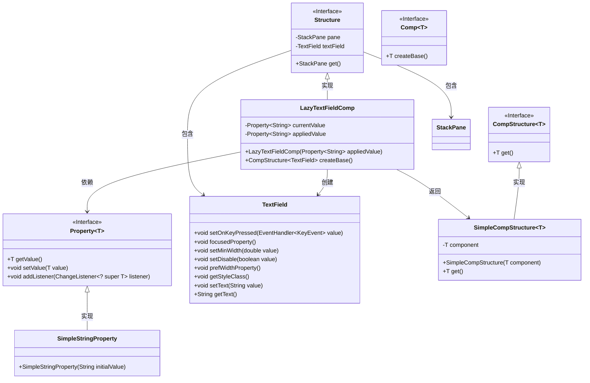
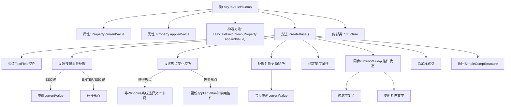

# 基础信息

|      |      |
|------|------|
| 名称 | LazyTextFieldComp |
| 编码语言 | .java |
| 代码路径 | xpipe/app/src/main/java/io/xpipe/app/comp/base/LazyTextFieldComp.java |
| 包名 | io.xpipe.app.comp.base |
| 依赖项 | ['io.xpipe.app.comp.Comp', 'io.xpipe.app.comp.CompStructure', 'io.xpipe.app.comp.SimpleCompStructure', 'io.xpipe.app.util.PlatformThread', 'io.xpipe.core.process.OsType', 'javafx.application.Platform', 'javafx.beans.property.Property', 'javafx.beans.property.SimpleStringProperty', 'javafx.scene.control.TextField', 'javafx.scene.input.KeyCode', 'javafx.scene.layout.StackPane', 'lombok.Builder', 'lombok.Value', 'java.util.Objects'] |
| 概述说明 | 懒加载文本框组件，支持回车确认、ESC取消、失焦保存，绑定属性值同步更新。 |

# 说明

LazyTextFieldComp是一个自定义组件，继承自Comp类，用于管理文本输入框的行为。它包含两个属性：currentValue和appliedValue，分别表示当前输入值和最终应用值。组件在创建时初始化文本输入框，并设置键盘事件处理逻辑，如ESC键恢复原值，ENTER或ESC键转移焦点。焦点变化时，非Windows系统会自动选中文本末尾，失去焦点时更新应用值并禁用输入框。组件还监听外部值更新，确保同步显示。输入框宽度自适应，样式类为lazy-text-field-comp。内部Structure类用于包装StackPane和TextField的布局结构。

# 类列表 Class Summary

| 名称   | 类型  | 说明 |
|-------|------|-------------|
| LazyTextFieldComp | class | 懒加载文本框组件，支持值绑定、焦点处理及键盘事件响应。 |

## 类 LazyTextFieldComp

|      |      |
|------|------|
| 访问范围 | public |
| 类型 | class |
| 名称 | LazyTextFieldComp |
| 说明 | 懒加载文本框组件，支持值绑定、焦点处理及键盘事件响应。 |

### UML类图

这段代码描述了一个延迟更新的文本输入框组件LazyTextFieldComp，它继承自泛型Comp接口并实现CompStructure接口。该组件通过Property对象管理当前值和已应用值，在焦点变化或按键事件时同步状态。类图展示了核心类之间的关系：LazyTextFieldComp依赖Property和TextField进行数据绑定和UI渲染，使用SimpleCompStructure包装TextField实例，同时内部定义了包含StackPane和TextField的Structure静态类。整个设计实现了响应式数据绑定、键盘事件处理和跨平台焦点控制等功能。

### 内部方法调用关系图

这段代码实现了一个延迟更新的文本输入框组件LazyTextFieldComp，它通过Property对象管理当前值和已应用值，在焦点变化和特定按键事件时同步数据。流程图展示了从类结构到核心方法createBase()的实现细节，包括控件初始化、事件监听绑定、值同步逻辑和样式处理等关键步骤，形成了一个完整的响应式文本输入组件生命周期管理流程。

### 字段列表 Field List

| 名称  | 类型  | 说明 |
|-------|-------|------|
| appliedValue | Property<String> | 私有字符串属性appliedValue |
| currentValue | Property<String> | 私有属性currentValue，类型为Property<String>。 |

### 方法列表 Method List

| 名称  | 类型  | 说明 |
|-------|-------|------|
| createBase | CompStructure<TextField> | 重写文本输入框逻辑，处理按键、焦点及值更新。 |

