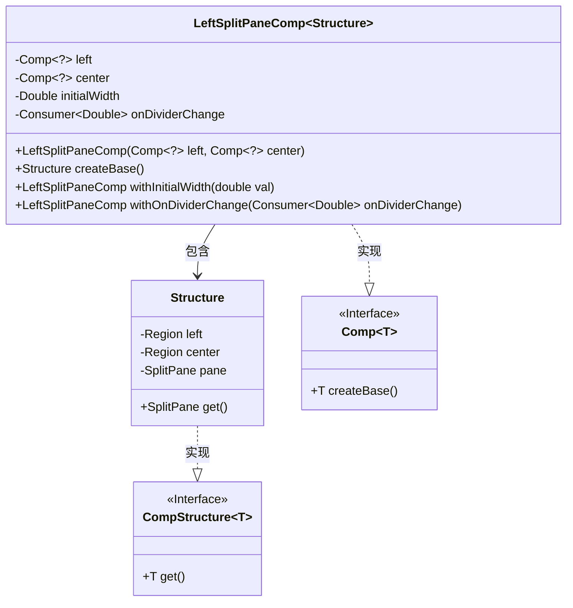
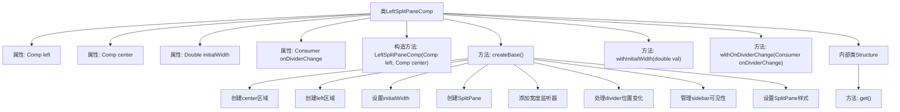
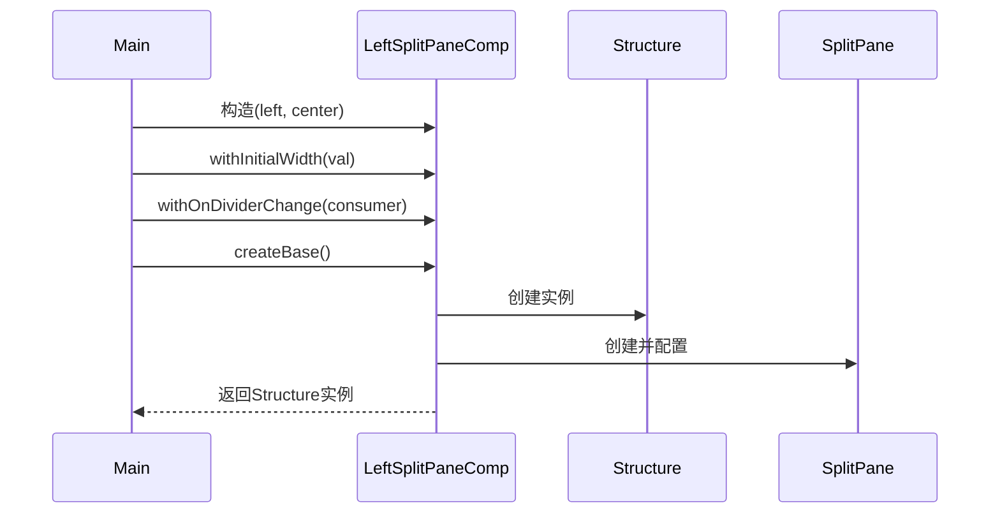

# 基础信息

|      |      |
|------|------|
| 名称 | LeftSplitPaneComp |
| 编码语言 | .java |
| 代码路径 | xpipe/app/src/main/java/io/xpipe/app/comp/base/LeftSplitPaneComp.java |
| 包名 | io.xpipe.app.comp.base |
| 依赖项 | ['io.xpipe.app.comp.Comp', 'io.xpipe.app.comp.CompStructure', 'javafx.beans.property.SimpleDoubleProperty', 'javafx.beans.value.ChangeListener', 'javafx.scene.control.SplitPane', 'javafx.scene.layout.Region', 'lombok.Value', 'java.util.concurrent.atomic.AtomicBoolean', 'java.util.function.Consumer'] |
| 概述说明 | 左分栏面板组件，含左右区域和宽度调整功能。 |

# 说明

LeftSplitPaneComp是一个用于创建左右分栏布局的组件类，包含左侧和中心两个子组件。它支持设置初始宽度和监听分隔条位置变化。通过createBase方法构建布局，使用SplitPane管理区域，并处理宽度变化、分隔条位置监听及子组件可见性切换。提供withInitialWidth和withOnDividerChange方法配置初始宽度和分隔条变化回调。内部类Structure保存布局结构。

# 类列表 Class Summary

| 名称   | 类型  | 说明 |
|-------|------|-------------|
| LeftSplitPaneComp | class | 左分栏面板组件，含左右区域和宽度控制。 |

## 类 LeftSplitPaneComp

|      |      |
|------|------|
| 访问范围 | public |
| 类型 | class |
| 名称 | LeftSplitPaneComp |
| 说明 | 左分栏面板组件，含左右区域和宽度控制。 |

### UML类图

这段代码定义了一个可左右分割的面板组件`LeftSplitPaneComp`，它继承自泛型类`Comp<Structure>`。主要功能是管理左侧和中心两个区域的分割布局，支持初始宽度设置和分割线位置变化的回调。内部类`Structure`实现了`CompStructure`接口，用于保存分割面板的实际UI组件。类图展示了组件之间的继承和组合关系，其中`LeftSplitPaneComp`通过组合方式管理左右区域，同时实现了`Comp`接口并包含`Structure`内部类。

### 内部方法调用关系图

这段代码实现了一个可左右分割的面板组件，包含左侧边栏和中心区域。流程图展示了类的结构关系，时序图描述了对象创建和初始化过程。核心功能包括：动态调整分割条位置、初始宽度设置、分割条位置变化回调，以及边栏的显隐控制。通过属性监听器和回调机制实现实时交互，适用于需要可调节侧边栏的应用场景。

### 字段列表 Field List

| 名称  | 类型  | 说明 |
|-------|-------|------|
| initialWidth | Double | 初始宽度变量，双精度类型。 |
| onDividerChange | Consumer<Double> | 监听分隔条位置变化的回调函数。 |
| left | Comp<?> | 私有不可变Comp类型左值 |
| center | Comp<?> | 私有组件center，类型为Comp<?>。 |

### 方法列表 Method List

| 名称  | 类型  | 说明 |
|-------|-------|------|
| createBase | Structure | 创建带侧边栏的分割面板，支持初始宽度设置和位置监听。 |
| withInitialWidth | LeftSplitPaneComp | 公开方法LeftSplitPaneComp设置初始宽度并返回自身。 |
| withOnDividerChange | LeftSplitPaneComp | 左分栏组件设置分隔线位置变更回调方法。 |

