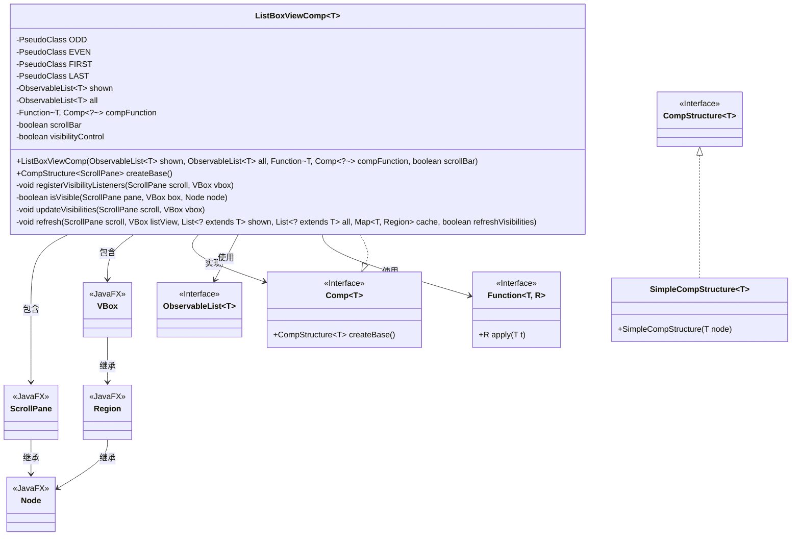

# 基础信息

|      |      |
|------|------|
| 名称 | ListBoxViewComp |
| 编码语言 | .java |
| 代码路径 | xpipe/app/src/main/java/io/xpipe/app/comp/base/ListBoxViewComp.java |
| 包名 | io.xpipe.app.comp.base |
| 依赖项 | ['io.xpipe.app.browser.BrowserFullSessionModel', 'io.xpipe.app.comp.Comp', 'io.xpipe.app.comp.CompStructure', 'io.xpipe.app.comp.SimpleCompStructure', 'io.xpipe.app.comp.store.StoreViewState', 'io.xpipe.app.core.AppLayoutModel', 'io.xpipe.app.util.DerivedObservableList', 'javafx.animation.AnimationTimer', 'javafx.application.Platform', 'javafx.beans.binding.Bindings', 'javafx.beans.property.SimpleBooleanProperty', 'javafx.collections.ListChangeListener', 'javafx.collections.ObservableList', 'javafx.css.PseudoClass', 'javafx.scene.Node', 'javafx.scene.control.ScrollBar', 'javafx.scene.control.ScrollPane', 'javafx.scene.layout.Region', 'javafx.scene.layout.VBox', 'lombok.Setter', 'java.util', 'java.util.concurrent.atomic.AtomicBoolean', 'java.util.function.Function'] |
| 概述说明 | 列表视图组件，支持动态刷新、滚动条控制和可见性管理。 |

# 说明

这是一个名为ListBoxViewComp的JavaFX组件类，用于管理可滚动列表视图。它支持动态内容更新、奇偶行样式标记、首尾行标记，以及可选的滚动条控制。组件通过缓存机制优化性能，并提供了可视性控制功能，可根据滚动位置动态显示或隐藏列表项。核心功能包括监听数据变化自动刷新视图、处理滚动事件、管理组件可见性，以及维护样式状态。该类设计用于处理大量数据，通过延迟渲染和局部更新提高效率。

# 类列表 Class Summary

| 名称   | 类型  | 说明 |
|-------|------|-------------|
| ListBoxViewComp | class | 列表视图组件，支持动态刷新、滚动条控制和可见性管理。 |

## 类 ListBoxViewComp

|      |      |
|------|------|
| 访问范围 | public |
| 类型 | class |
| 名称 | ListBoxViewComp |
| 说明 | 列表视图组件，支持动态刷新、滚动条控制和可见性管理。 |

### UML类图

类图描述：
ListBoxViewComp是一个泛型组件类，用于管理可滚动列表视图，继承自Comp接口并实现其createBase方法。核心功能包括动态刷新列表内容、处理可见性控制、管理样式状态(奇偶行/首尾项)。通过ObservableList跟踪数据，使用Function生成子组件，依赖JavaFX的ScrollPane和VBox实现布局。包含复杂的可见性计算逻辑和异步更新机制，支持滚动条控制和多种场景下的数据同步。

### 内部方法调用关系图

流程图描述：该流程图展示了ListBoxViewComp类的结构和主要方法调用关系。类包含静态常量、属性和构造方法，核心方法是createBase()，它会创建VBox和ScrollPane实例，并调用refresh()初始化内容。registerVisibilityListeners()方法负责设置各种监听器，包括滚动位置、高度变化等，并触发updateVisibilities()更新可见性。refresh()方法会更新列表内容并应用样式类。整个流程实现了可滚动列表的动态更新和可见性控制功能。

时序图描述：该时序图描述了ListBoxViewComp从创建到初始化的完整过程。首先创建实例并调用createBase()，初始化VBox和ScrollPane，首次刷新内容。随后设置scene监听器和列表数据监听器，当数据变化时通过Platform.runLater异步刷新。最后设置滚动条策略和可见性监听器，返回包含ScrollPane的组件结构。整个过程体现了JavaFX组件的异步更新机制和事件驱动特性。

### 字段列表 Field List

| 名称  | 类型  | 说明 |
|-------|-------|------|
| shown | ObservableList<T> | 私有可观察列表shown，类型为T。 |
| scrollBar | boolean | 私有布尔型滚动条变量。 |
| FIRST = PseudoClass.getPseudoClass("first") | PseudoClass | 定义常量FIRST表示伪类"first"。 |
| LAST = PseudoClass.getPseudoClass("last") | PseudoClass | 私有静态常量LAST定义为伪类"last"。 |
| visibilityControl = false | boolean | 私有布尔变量visibilityControl默认false |
| compFunction | Function<T, Comp<?>> | 私有函数compFunction，输入T类型，返回Comp<?>类型。 |
| ODD = PseudoClass.getPseudoClass("odd") | PseudoClass | 定义静态常量ODD，表示伪类"odd"。 |
| EVEN = PseudoClass.getPseudoClass("even") | PseudoClass | 定义静态常量EVEN表示伪类"even"。 |
| all | ObservableList<T> | 私有不可变列表all，类型为ObservableList<T>。 |

### 方法列表 Method List

| 名称  | 类型  | 说明 |
|-------|-------|------|
| registerVisibilityListeners | void | 注册滚动和布局监听器，动态更新可视状态。 |
| createBase | CompStructure<ScrollPane> | 创建滚动面板组件，包含动态刷新、场景监听和滚动条控制功能。 |
| refresh | void | 刷新UI列表，同步缓存并更新可见性。 |
| updateVisibilities | void | 检查线程后更新VBox子节点可见性，计数可见项，超10不处理。 |
| isVisible | boolean | 检查节点在滚动面板中是否可见，考虑场景、边界和高度条件。 |

