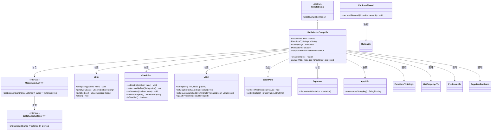
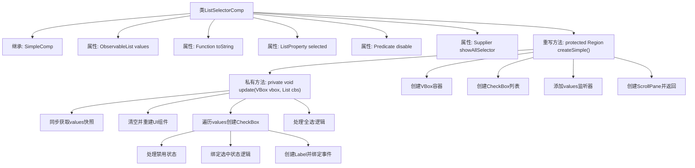

# 基础信息

|      |      |
|------|------|
| 名称 | ListSelectorComp |
| 编码语言 | .java |
| 代码路径 | xpipe/app/src/main/java/io/xpipe/app/comp/base/ListSelectorComp.java |
| 包名 | io.xpipe.app.comp.base |
| 依赖项 | ['io.xpipe.app.comp.SimpleComp', 'io.xpipe.app.core.AppI18n', 'io.xpipe.app.util.PlatformThread', 'javafx.beans.property.ListProperty', 'javafx.collections.ListChangeListener', 'javafx.collections.ObservableList', 'javafx.geometry.Orientation', 'javafx.scene.control.CheckBox', 'javafx.scene.control.Label', 'javafx.scene.control.ScrollPane', 'javafx.scene.control.Separator', 'javafx.scene.layout.Region', 'javafx.scene.layout.VBox', 'lombok.EqualsAndHashCode', 'lombok.Value', 'java.util.ArrayList', 'java.util.List', 'java.util.function.Function', 'java.util.function.Predicate', 'java.util.function.Supplier'] |
| 概述说明 | 列表选择组件，支持多选、禁用项和全选功能，基于JavaFX实现。 |

# 说明

该代码定义了一个名为ListSelectorComp的泛型类，继承自SimpleComp，用于创建可选择的列表组件。主要功能包括：通过CheckBox实现多选，支持禁用特定项，可显示全选选项，并实时响应数据变化。组件使用VBox布局，包含带标签的复选框，点击标签可切换选择状态。当数据源values变化时，自动更新UI。若启用showAllSelector，底部会添加全选功能，同步控制所有非禁用项的选择状态。组件样式通过CSS类名定制，支持滚动显示。

# 类列表 Class Summary

| 名称   | 类型  | 说明 |
|-------|------|-------------|
| ListSelectorComp | class | 列表选择组件，支持多选、禁用项和全选功能，基于JavaFX实现。 |

## 类 ListSelectorComp

|      |      |
|------|------|
| 访问范围 | @Value;@EqualsAndHashCode(callSuper = true);public |
| 类型 | class |
| 名称 | ListSelectorComp |
| 说明 | 列表选择组件，支持多选、禁用项和全选功能，基于JavaFX实现。 |

### UML类图

该代码实现了一个泛型列表选择组件`ListSelectorComp<T>`，继承自`SimpleComp`基类。核心功能是通过复选框实现多选操作，支持动态数据更新、禁用项处理和全选功能。组件使用JavaFX控件构建界面，包含`VBox`、`CheckBox`、`Label`和`ScrollPane`等元素，通过观察者模式监听数据变化，并提供了国际化支持。类图展示了15个相关类/接口的继承、组合和依赖关系，体现了GUI组件与数据模型的交互逻辑。

### 内部方法调用关系图

这段代码实现了一个通用的列表选择器组件，继承自SimpleComp基类。核心功能包括：1) 创建可滚动的复选框列表界面；2) 实时响应数据源变化；3) 支持单项/全选功能；4) 处理禁用状态。流程图展示了从组件初始化到UI构建的全过程，重点呈现了createSimple()主流程和update()更新逻辑的分层调用关系，包括数据同步、UI组件创建和事件绑定等关键步骤。组件采用观察者模式监听数据变化，并通过PlatformThread保证线程安全更新。

### 字段列表 Field List

| 名称  | 类型  | 说明 |
|-------|-------|------|
| toString | Function<T, String> | 函数接口：将类型T转为字符串。 |
| values | ObservableList<T> | 可观察列表values，存储类型T的元素。 |
| selected | ListProperty<T> | 选中的列表属性 |
| disable | Predicate<T> | 禁用谓词条件判断 |
| showAllSelector | Supplier<Boolean> | 显示所有选择器的布尔值供应商 |

### 方法列表 Method List

| 名称  | 类型  | 说明 |
|-------|-------|------|
| createSimple | Region | 创建带复选框的垂直滚动列表组件。 |
| update | void | 更新VBox和复选框列表，同步数据并处理选择逻辑。 |

