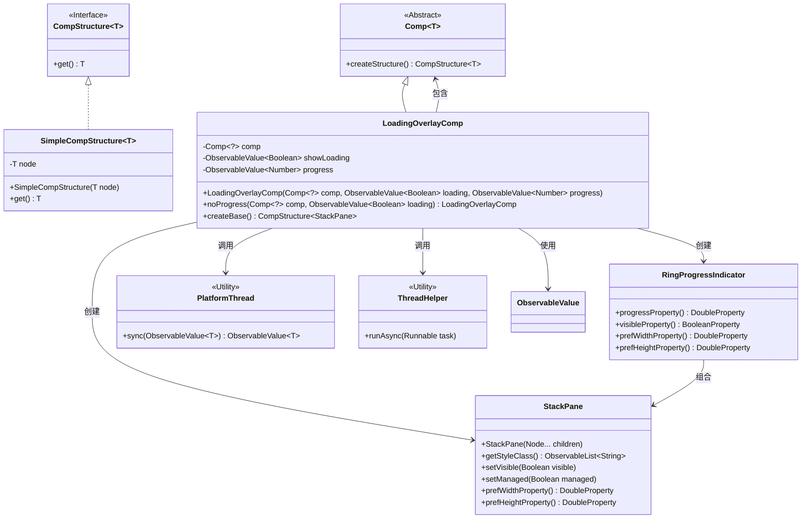
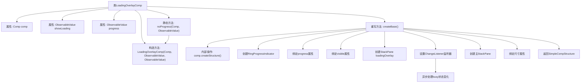

# 基础信息

|      |      |
|------|------|
| 名称 | LoadingOverlayComp |
| 编码语言 | .java |
| 代码路径 | xpipe/app/src/main/java/io/xpipe/app/comp/base/LoadingOverlayComp.java |
| 包名 | io.xpipe.app.comp.base |
| 依赖项 | ['io.xpipe.app.comp.Comp', 'io.xpipe.app.comp.CompStructure', 'io.xpipe.app.comp.SimpleCompStructure', 'io.xpipe.app.prefs.AppPrefs', 'io.xpipe.app.util.PlatformThread', 'io.xpipe.app.util.ThreadHelper', 'javafx.application.Platform', 'javafx.beans.binding.Bindings', 'javafx.beans.property.SimpleDoubleProperty', 'javafx.beans.value.ChangeListener', 'javafx.beans.value.ObservableValue', 'javafx.scene.layout.StackPane', 'atlantafx.base.controls.RingProgressIndicator'] |
| 概述说明 | 加载覆盖组件，绑定进度条和显示状态，支持无进度模式。 |

# 说明

这是一个名为LoadingOverlayComp的组件类，用于在加载时显示覆盖层。它包含一个基础组件comp，以及控制显示加载状态的showLoading和进度值progress。构造函数接收这些参数并同步到平台线程。提供了noProgress静态方法创建无进度条的实例。createBase方法构建界面结构，包含环形进度指示器，其可见性受性能模式设置影响。通过监听showLoading变化，延迟50毫秒后更新覆盖层显示状态以避免闪烁。覆盖层与基础组件通过StackPane叠加，尺寸与基础组件绑定，进度指示器大小根据容器高度动态调整。

# 类列表 Class Summary

| 名称   | 类型  | 说明 |
|-------|------|-------------|
| LoadingOverlayComp | class | 加载覆盖组件，显示进度条，支持无进度模式，优化闪烁问题。 |

## 类 LoadingOverlayComp

|      |      |
|------|------|
| 访问范围 | public |
| 类型 | class |
| 名称 | LoadingOverlayComp |
| 说明 | 加载覆盖组件，显示进度条，支持无进度模式，优化闪烁问题。 |

### UML类图

该代码实现了一个带加载动画的覆盖层组件，主要功能是在异步操作时显示环形进度条。类图展示了LoadingOverlayComp继承自泛型Comp类，包含核心组件comp和两个可观察值showLoading/progress，通过PlatformThread保证线程安全，使用RingProgressIndicator实现进度动画，借助StackPane进行布局管理，并通过ThreadHelper实现异步延迟控制来避免闪烁问题。整体设计采用了观察者模式响应状态变化，并遵循JavaFX的UI组件规范。

### 内部方法调用关系图

这段代码实现了一个带加载动画的覆盖层组件，核心是通过StackPane叠加原始组件和环形进度条。流程图展示了从类结构到具体实现的完整调用链，包括属性定义、构造方法、静态工厂方法和核心的createBase()实现过程，其中特别突出了异步状态监听和尺寸绑定等关键交互逻辑。组件会根据showLoading状态智能显示/隐藏加载层，并自动处理进度显示和性能模式适配。

### 字段列表 Field List

| 名称  | 类型  | 说明 |
|-------|-------|------|
| comp | Comp<?> | 私有组件comp |
| progress | ObservableValue<Number> | 私有不可变数值进度监听对象 |
| showLoading | ObservableValue<Boolean> | 私有可观察布尔值showLoading |

### 方法列表 Method List

| 名称  | 类型  | 说明 |
|-------|-------|------|
| noProgress | LoadingOverlayComp | 静态方法创建无进度条的加载覆盖组件 |
| createBase | CompStructure<StackPane> | 创建带进度指示器的StackPane组件，绑定属性和异步控制显示逻辑。 |

