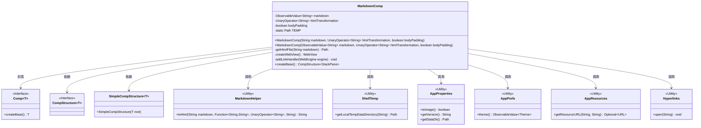
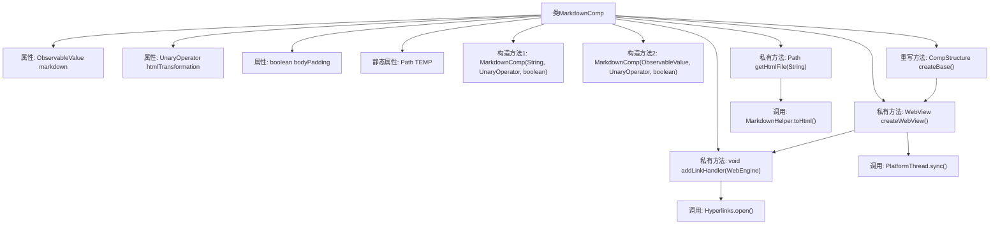

# 基础信息

|      |      |
|------|------|
| 名称 | MarkdownComp |
| 编码语言 | .java |
| 代码路径 | xpipe/app/src/main/java/io/xpipe/app/comp/base/MarkdownComp.java |
| 包名 | io.xpipe.app.comp.base |
| 依赖项 | ['io.xpipe.app.comp.Comp', 'io.xpipe.app.comp.CompStructure', 'io.xpipe.app.comp.SimpleCompStructure', 'io.xpipe.app.core.AppProperties', 'io.xpipe.app.issue.ErrorEvent', 'io.xpipe.app.prefs.AppPrefs', 'io.xpipe.app.resources.AppResources', 'io.xpipe.app.util.Hyperlinks', 'io.xpipe.app.util.MarkdownHelper', 'io.xpipe.app.util.PlatformThread', 'io.xpipe.app.util.ShellTemp', 'javafx.application.Platform', 'javafx.beans.property.SimpleStringProperty', 'javafx.beans.value.ObservableValue', 'javafx.geometry.Insets', 'javafx.scene.layout.Region', 'javafx.scene.layout.StackPane', 'javafx.scene.paint.Color', 'javafx.scene.web.WebEngine', 'javafx.scene.web.WebView', 'lombok.SneakyThrows', 'org.apache.commons.io.FileUtils', 'java.io.IOException', 'java.nio.file.Files', 'java.nio.file.Path', 'java.util.function.UnaryOperator'] |
| 概述说明 | MarkdownComp类：将Markdown转换为HTML并在WebView中显示，支持主题切换和链接处理。 |

# 说明

MarkdownComp是一个用于渲染Markdown内容的组件类，继承自Comp类。它包含三个主要属性：markdown（可观察字符串值）、htmlTransformation（字符串转换操作符）和bodyPadding（布尔值）。类中定义了两种构造函数，分别接受静态字符串和可观察字符串作为输入。核心功能包括通过getHtmlFile方法将Markdown转换为HTML文件并缓存，使用WebView显示内容，并支持主题切换（深色/浅色）。组件还实现了链接点击处理和滚动条样式调整，确保透明背景和禁用JavaScript。最终通过createBase方法返回包含WebView的StackPane结构。

# 类列表 Class Summary

| 名称   | 类型  | 说明 |
|-------|------|-------------|
| MarkdownComp | class | MarkdownComp类：将Markdown转换为HTML并在WebView中显示，支持主题切换和链接处理。 |

## 类 MarkdownComp

|      |      |
|------|------|
| 访问范围 | public |
| 类型 | class |
| 名称 | MarkdownComp |
| 说明 | MarkdownComp类：将Markdown转换为HTML并在WebView中显示，支持主题切换和链接处理。 |

### UML类图

该代码实现了一个Markdown渲染组件MarkdownComp，继承自泛型接口Comp，核心功能是将Markdown文本转换为HTML并在WebView中显示。类图展示了其与工具类（MarkdownHelper、ShellTemp等）的依赖关系，以及通过ObservableValue实现动态内容更新。组件支持主题切换、链接处理、临时文件缓存等特性，通过WebView引擎实现跨平台渲染。

### 内部方法调用关系图

这段代码实现了一个Markdown组件(MarkdownComp)，主要功能是将Markdown文本转换为HTML并在WebView中显示。流程图展示了类结构、属性和方法调用关系，包括两个构造方法、HTML文件生成逻辑(getHtmlFile)、WebView创建(createWebView)、链接处理(addLinkHandler)和基础结构创建(createBase)。该组件支持主题切换、临时文件管理和外部链接处理，通过观察者模式实现动态内容更新。

### 字段列表 Field List

| 名称  | 类型  | 说明 |
|-------|-------|------|
| TEMP | Path | 私有静态路径变量TEMP |
| markdown | ObservableValue<String> | 私有不可变字符串可观察值 |
| bodyPadding | boolean | 私有布尔变量bodyPadding，控制是否启用内边距。 |
| htmlTransformation | UnaryOperator<String> | 私有最终字符串转换函数htmlTransformation |

### 方法列表 Method List

| 名称  | 类型  | 说明 |
|-------|-------|------|
| addLinkHandler | void | Java方法：监听网页引擎加载状态，自动处理HTTP/HTTPS/mailto链接跳转。 |
| createBase | CompStructure<StackPane> | 重写createBase方法，返回带WebView的StackPane结构。 |
| getHtmlFile | Path | 根据输入内容生成HTML文件，处理临时目录和文件更新，返回文件路径或null。 |
| createWebView | WebView | 创建禁用JS的透明WebView，设置主题和用户数据目录，加载HTML并调整滚动条样式。 |

