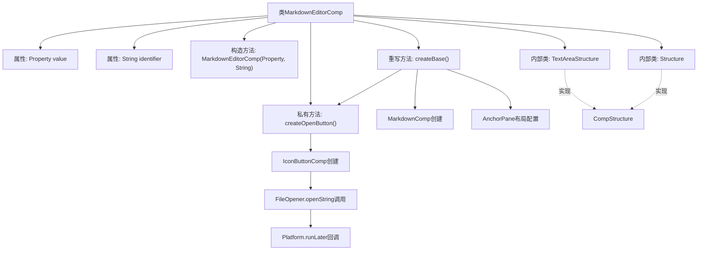

# 基础信息

|      |      |
|------|------|
| 名称 | MarkdownEditorComp |
| 编码语言 | .java |
| 代码路径 | xpipe/app/src/main/java/io/xpipe/app/comp/base/MarkdownEditorComp.java |
| 包名 | io.xpipe.app.comp.base |
| 依赖项 | ['io.xpipe.app.comp.Comp', 'io.xpipe.app.comp.CompStructure', 'io.xpipe.app.util.FileOpener', 'javafx.application.Platform', 'javafx.beans.property.Property', 'javafx.scene.control.Button', 'javafx.scene.control.TextArea', 'javafx.scene.layout.AnchorPane', 'javafx.scene.layout.Region', 'javafx.scene.layout.StackPane', 'atlantafx.base.theme.Styles', 'lombok.Builder', 'lombok.Value'] |
| 概述说明 | Markdown编辑器组件类，包含编辑按钮和显示区域。 |

# 说明

该代码定义了一个Markdown编辑器组件MarkdownEditorComp，继承自Comp类。组件包含一个可编辑的Markdown显示区域和一个编辑按钮。编辑按钮点击后会打开外部编辑器修改内容，修改结果会同步回组件。组件使用AnchorPane布局，Markdown区域自适应容器大小，编辑按钮固定在右上角。内部包含两个嵌套类TextAreaStructure和Structure，分别定义了不同的UI结构。组件通过属性绑定实现数据同步，支持自定义标识符和值属性。

# 类列表 Class Summary

| 名称   | 类型  | 说明 |
|-------|------|-------------|
| MarkdownEditorComp | class | Markdown编辑器组件类，包含编辑按钮和显示区域。 |


## 类 MarkdownEditorComp

|      |      |
|------|------|
| 访问范围 | public |
| 类型 | class |
| 名称 | MarkdownEditorComp |
| 说明 | Markdown编辑器组件类，包含编辑按钮和显示区域。 |


### UML类图

```mermaid
classDiagram
    class MarkdownEditorComp~Structure~ {
        -Property~String~ value
        -String identifier
        +MarkdownEditorComp(Property~String~ value, String identifier)
        -Button createOpenButton()
        +Structure createBase()
    }

    class Structure {
        <<CompStructure~AnchorPane~>>
        -AnchorPane pane
        -Region markdown
        -Button editButton
        +AnchorPane get()
    }
    // Structure 实现 CompStructure 接口
    Structure ..|> CompStructure~AnchorPane~

    class TextAreaStructure {
        <<CompStructure~StackPane~>>
        -StackPane pane
        -TextArea textArea
        +StackPane get()
    }
    // TextAreaStructure 实现 CompStructure 接口
    TextAreaStructure ..|> CompStructure~StackPane~

    class Comp~T~ {
        <<abstract>>
        +T createBase()
    }
    // MarkdownEditorComp 继承自 Comp
    MarkdownEditorComp --|> Comp~Structure~

    class Property~T~ {
        <<Interface>>
        +T getValue()
        +void setValue(T value)
    }
    // MarkdownEditorComp 依赖 Property
    MarkdownEditorComp --> Property~String~ : 依赖

    class IconButtonComp {
        +IconButtonComp(String icon, Runnable action)
    }
    // MarkdownEditorComp 使用 IconButtonComp
    MarkdownEditorComp --> IconButtonComp : 使用

    class FileOpener {
        <<Utility>>
        +openString(String filename, Object owner, String content, Consumer~String~ callback)
    }
    // MarkdownEditorComp 调用 FileOpener
    MarkdownEditorComp --> FileOpener : 调用

    class MarkdownComp {
        +MarkdownComp(Property~String~ value, Function~String, String~ converter, boolean async)
        +Region createRegion()
    }
    // MarkdownEditorComp 使用 MarkdownComp
    MarkdownEditorComp --> MarkdownComp : 使用
```

这段代码展示了一个Markdown编辑器组件(MarkdownEditorComp)的实现，它继承自泛型Comp类并包含内部结构类Structure。主要功能包括：通过Property接口管理文本内容，使用MarkdownComp渲染Markdown，通过IconButtonComp创建编辑按钮，并利用FileOpener实现文件编辑功能。组件采用AnchorPane布局，包含Markdown显示区域和浮动编辑按钮，实现了响应式尺寸绑定。代码结构体现了清晰的职责分离，通过多个辅助类协作完成复杂功能。


### 内部方法调用关系图



流程图描述：该流程图展示了MarkdownEditorComp类的完整结构，包含属性定义、构造方法、核心方法createOpenButton和createBase的调用链。特别注意createOpenButton方法中通过IconButtonComp触发文件操作和异步回调的流程，以及createBase方法中Markdown组件创建与布局配置的关联关系。两个内部类TextAreaStructure和Structure均实现了CompStructure接口，体现了组件的复合结构特征。

### 字段列表 Field List

| 名称  | 类型  | 说明 |
|-------|-------|------|
| value | Property<String> | 私有字符串属性value |
| identifier | String | 私有字符串标识符 |

### 方法列表 Method List

| 名称  | 类型  | 说明 |
|-------|-------|------|
| createOpenButton | Button | 创建编辑按钮，点击打开文件并更新值。 |
| createBase | Structure | 创建基础结构：包含Markdown区域、编辑按钮的面板，设置布局约束并绑定尺寸。 |


