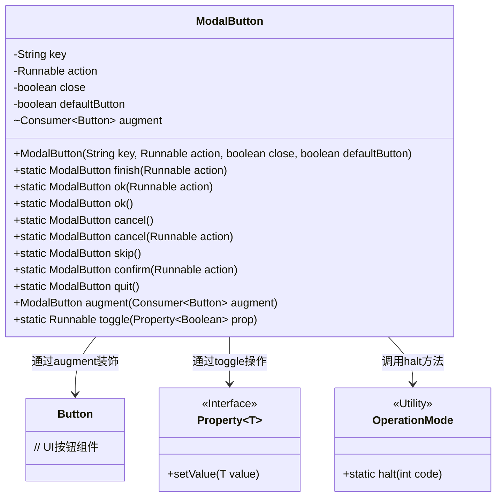

# 基础信息

|      |      |
|------|------|
| 名称 | ModalButton |
| 编码语言 | .java |
| 代码路径 | xpipe/app/src/main/java/io/xpipe/app/comp/base/ModalButton.java |
| 包名 | io.xpipe.app.comp.base |
| 依赖项 | ['io.xpipe.app.core.mode.OperationMode', 'javafx.beans.property.Property', 'javafx.scene.control.Button', 'lombok.Value', 'lombok.experimental.NonFinal', 'java.util.function.Consumer'] |
| 概述说明 | ModalButton类定义模态框按钮，含key、action等属性，提供多种静态方法创建预设按钮。 |

# 说明

ModalButton类是一个用于创建模态对话框按钮的实用工具类。它包含四个核心属性：key表示按钮标识，action是点击后的回调函数，close控制是否关闭对话框，defaultButton标记是否为默认按钮。类提供了多种静态工厂方法，如finish、ok、cancel、skip、confirm和quit，用于快速创建预定义按钮。其中quit按钮会触发系统停机。类还支持通过augment方法对按钮进行额外定制，以及通过toggle方法生成切换布尔属性的动作。所有工厂方法都封装了常用按钮的默认配置，简化了按钮创建过程。

# 类列表 Class Summary

| 名称   | 类型  | 说明 |
|-------|------|-------------|
| ModalButton | class | ModalButton类定义模态框按钮，含key、action、close等属性，提供多种静态方法创建预设按钮。 |

## 类 ModalButton

|      |      |
|------|------|
| 访问范围 | @Value;public |
| 类型 | class |
| 名称 | ModalButton |
| 说明 | ModalButton类定义模态框按钮，含key、action、close等属性，提供多种静态方法创建预设按钮。 |

### UML类图

类图描述：
ModalButton是一个用于创建模态对话框按钮的配置类，包含按钮标识(key)、点击动作(action)、关闭行为(close)和默认状态(defaultButton)等核心属性。通过静态工厂方法提供finish/ok/cancel等预定义按钮，支持通过augment方法装饰Button组件，toggle方法可快速创建布尔属性切换器。OperationMode作为工具类提供程序终止功能，Property接口实现属性绑定。整体设计采用Builder模式，支持链式调用，便于快速构建复杂的对话框按钮逻辑。

### 内部方法调用关系图

```mermaid
graph TD
    A["类ModalButton"]
    B["属性: String key"]
    C["属性: Runnable action"]
    D["属性: boolean close"]
    E["属性: boolean defaultButton"]
    F["构造方法: ModalButton(String key, Runnable action, boolean close, boolean defaultButton)"]
    G["方法: static ModalButton finish(Runnable action)"]
    H["方法: static ModalButton ok(Runnable action)"]
    I["方法: static ModalButton ok()"]
    J["方法: static ModalButton cancel()"]
    K["方法: static ModalButton cancel(Runnable action)"]
    L["方法: static ModalButton skip()"]
    M["方法: static ModalButton confirm(Runnable action)"]
    N["方法: static ModalButton quit()"]
    O["方法: ModalButton augment(Consumer<Button> augment)"]
    P["方法: static Runnable toggle(Property<Boolean> prop)"]
    Q["属性: @NonFinal Consumer<Button> augment"]

    A --> B
    A --> C
    A --> D
    A --> E
    A --> F
    A --> G
    A --> H
    A --> I
    A --> J
    A --> K
    A --> L
    A --> M
    A --> N
    A --> O
    A --> P
    A --> Q
```

该流程图展示了ModalButton类的完整结构，包含4个核心属性（key/action/close/defaultButton）和1个带@NonFinal注解的augment属性。类提供了9个静态工厂方法（如finish/ok/cancel等）用于创建预配置按钮实例，1个实例方法augment用于装饰按钮，以及1个静态工具方法toggle用于创建属性切换逻辑。所有方法都通过构造方法F统一实例化对象，其中quit()方法包含特殊的OperationMode.halt调用逻辑。

### 字段列表 Field List

| 名称  | 类型  | 说明 |
|-------|-------|------|
| augment | Consumer<Button> | 非终态按钮增强消费者接口 |
| close | boolean | 布尔变量close |
| defaultButton | boolean | 布尔型默认按钮变量 |
| key | String | 键值对中的键 |
| action | Runnable | 可执行操作 |

### 方法列表 Method List

| 名称  | 类型  | 说明 |
|-------|-------|------|
| cancel | ModalButton | 静态方法创建可取消模态按钮，执行指定动作。 |
| augment | ModalButton | ModalButton的augment方法接受Consumer参数并返回自身实例。 |
| ok | ModalButton | 创建模态确认按钮，执行指定动作。 |
| quit | ModalButton | 静态方法创建退出按钮，调用OperationMode.halt(1)，参数为真和假。 |
| finish | ModalButton | 创建完成按钮，执行指定动作，支持模态操作。 |
| confirm | ModalButton | 创建确认模态按钮，执行指定动作。 |
| skip | ModalButton | 静态方法创建可跳过模态按钮 |
| cancel | ModalButton | 静态方法返回取消按钮实例。 |
| ok | ModalButton | 创建返回确认按钮的静态方法。 |
| toggle | Runnable | 切换布尔属性的Runnable方法 |

