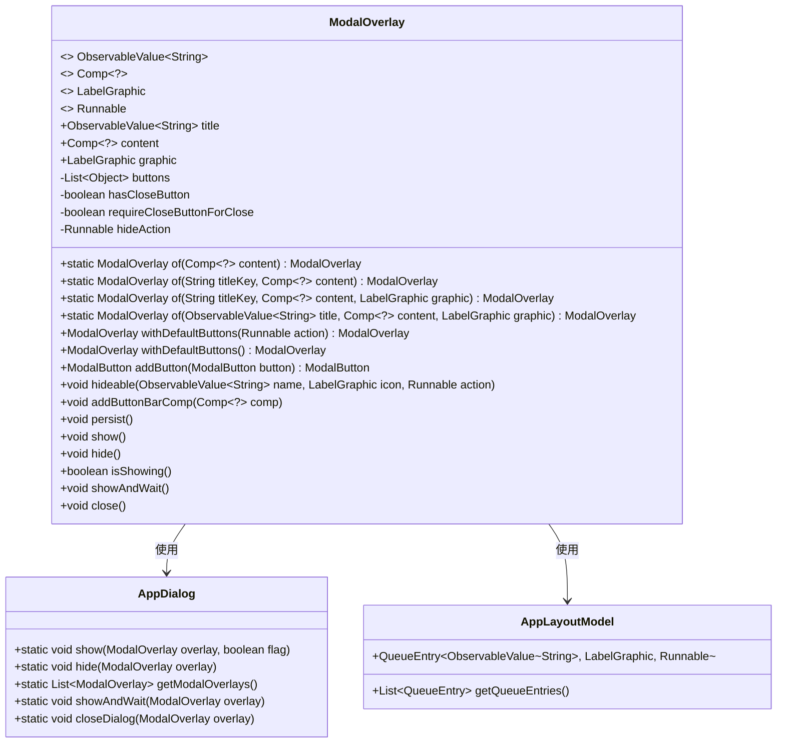

# 基础信息

|      |      |
|------|------|
| 名称 | ModalOverlay |
| 编码语言 | .java |
| 代码路径 | xpipe/app/src/main/java/io/xpipe/app/comp/base/ModalOverlay.java |
| 包名 | io.xpipe.app.comp.base |
| 依赖项 | ['io.xpipe.app.comp.Comp', 'io.xpipe.app.core.AppI18n', 'io.xpipe.app.core.AppLayoutModel', 'io.xpipe.app.core.window.AppDialog', 'io.xpipe.app.util.LabelGraphic', 'javafx.beans.value.ObservableValue', None, 'lombok.experimental.NonFinal', 'java.util.ArrayList', 'java.util.List'] |
| 概述说明 | ModalOverlay类用于创建模态对话框，支持标题、内容、按钮等配置，提供显示、隐藏和关闭功能。 |

# 说明

ModalOverlay类是一个用于创建模态对话框的构建类，支持通过静态工厂方法创建实例。主要属性包括可观察的标题、内容组件、图标、按钮列表等。提供默认按钮配置、关闭按钮控制、隐藏操作设置等功能。支持显示、隐藏、等待关闭等对话框操作，并可配置持久化显示模式。通过AppDialog类实现对话框的实际显示和管理。

# 类列表 Class Summary

| 名称   | 类型  | 说明 |
|-------|------|-------------|
| ModalOverlay | class | ModalOverlay类用于创建模态对话框，支持标题、内容、按钮等配置，提供显示、隐藏和关闭功能。 |

## 类 ModalOverlay

|      |      |
|------|------|
| 访问范围 | @Value;@With;@Builder(toBuilder = true);public |
| 类型 | class |
| 名称 | ModalOverlay |
| 说明 | ModalOverlay类用于创建模态对话框，支持标题、内容、按钮等配置，提供显示、隐藏和关闭功能。 |

### UML类图

类图描述：该图展示了ModalOverlay类的结构及其与AppDialog、AppLayoutModel的交互关系。ModalOverlay是一个弹窗覆盖层组件，包含标题、内容、图形等属性，提供多种静态工厂方法创建实例，支持按钮管理、显示/隐藏控制等功能。通过组合模式集成Comp泛型组件，依赖ObservableValue实现动态数据绑定，与AppDialog协作处理弹窗生命周期，并通过AppLayoutModel管理隐藏动作的队列执行。

### 内部方法调用关系图

```mermaid
graph TD
    A["类ModalOverlay"]
    B["静态方法: of(Comp<?> content)"]
    C["静态方法: of(String titleKey, Comp<?> content)"]
    D["静态方法: of(String titleKey, Comp<?> content, LabelGraphic graphic)"]
    E["静态方法: of(ObservableValue<String> title, Comp<?> content, LabelGraphic graphic)"]
    F["方法: withDefaultButtons(Runnable action)"]
    G["方法: withDefaultButtons()"]
    H["方法: addButton(ModalButton button)"]
    I["方法: hideable(ObservableValue<String> name, LabelGraphic icon, Runnable action)"]
    J["方法: addButtonBarComp(Comp<?> comp)"]
    K["方法: persist()"]
    L["方法: show()"]
    M["方法: hide()"]
    N["方法: isShowing()"]
    O["方法: showAndWait()"]
    P["方法: close()"]
    Q["属性: ObservableValue<String> title"]
    R["属性: Comp<?> content"]
    S["属性: LabelGraphic graphic"]
    T["属性: List<Object> buttons"]
    U["属性: boolean hasCloseButton"]
    V["属性: boolean requireCloseButtonForClose"]
    W["属性: Runnable hideAction"]

    A --> B
    A --> C
    A --> D
    A --> E
    A --> F
    A --> G
    A --> H
    A --> I
    A --> J
    A --> K
    A --> L
    A --> M
    A --> N
    A --> O
    A --> P
    A --> Q
    A --> R
    A --> S
    A --> T
    A --> U
    A --> V
    A --> W
    B --> E
    C --> D
    D --> E
    F --> H
    G --> F
    I --> W
    K --> U
    K --> V
    L --> P
    M --> P
    N --> P
    O --> P
```

这段代码定义了一个ModalOverlay类，用于创建和管理模态对话框。类提供了多种静态工厂方法of()来创建实例，支持不同参数组合。核心功能包括：添加按钮(withDefaultButtons/addButton)、控制对话框显示/隐藏(show/hide/close)、管理关闭行为(persist/hideable)。属性包含标题、内容、图形、按钮列表等配置项，通过Builder模式实现灵活构造。所有对话框操作最终都委托给AppDialog类处理。

### 字段列表 Field List

| 名称  | 类型  | 说明 |
|-------|-------|------|
| requireCloseButtonForClose | boolean | 非final布尔变量，可设置关闭按钮需求。 |
| buttons | List<Object> | 按钮对象列表 |
| title | ObservableValue<String> | 可观察字符串变量title |
| hideAction | Runnable | 非final的Runnable隐藏动作，带Setter注解。 |
| graphic | LabelGraphic | 标签图形对象 |
| hasCloseButton | boolean | 非final布尔变量hasCloseButton，带Setter注解。 |
| content | Comp<?> | 变量声明：Comp类型content |

### 方法列表 Method List

| 名称  | 类型  | 说明 |
|-------|-------|------|
| withDefaultButtons | ModalOverlay | 公开模态覆盖层方法，带默认按钮。 |
| of | ModalOverlay | 静态方法创建带标题和内容的模态框，可选参数为空。 |
| of | ModalOverlay | 静态方法创建带内容的模态覆盖层。 |
| of | ModalOverlay | 创建模态覆盖层，含标题、内容、图形，默认参数。 |
| hideable | void | 方法hideable接收名称、图标和动作，设置隐藏操作时将三者加入队列。 |
| hide | void | 隐藏当前对话框 |
| persist | void | 方法persist关闭按钮设置：禁用显示但关闭需按钮。 |
| withDefaultButtons | ModalOverlay | 公开方法ModalOverlay，默认添加取消和确定按钮，确定按钮执行指定操作。 |
| of | ModalOverlay | 静态方法创建带标题、内容和图标的模态覆盖层。 |
| addButton | ModalButton | 添加按钮到列表并返回该按钮。 |
| show | void | 显示对话框，不阻塞当前界面。 |
| addButtonBarComp | void | 添加按钮组件到按钮栏。 |
| isShowing | boolean | 检查当前对话框是否在模态覆盖层中显示。 |
| showAndWait | void | 显示并等待对话框关闭 |
| close | void | 关闭当前对话框。 |

