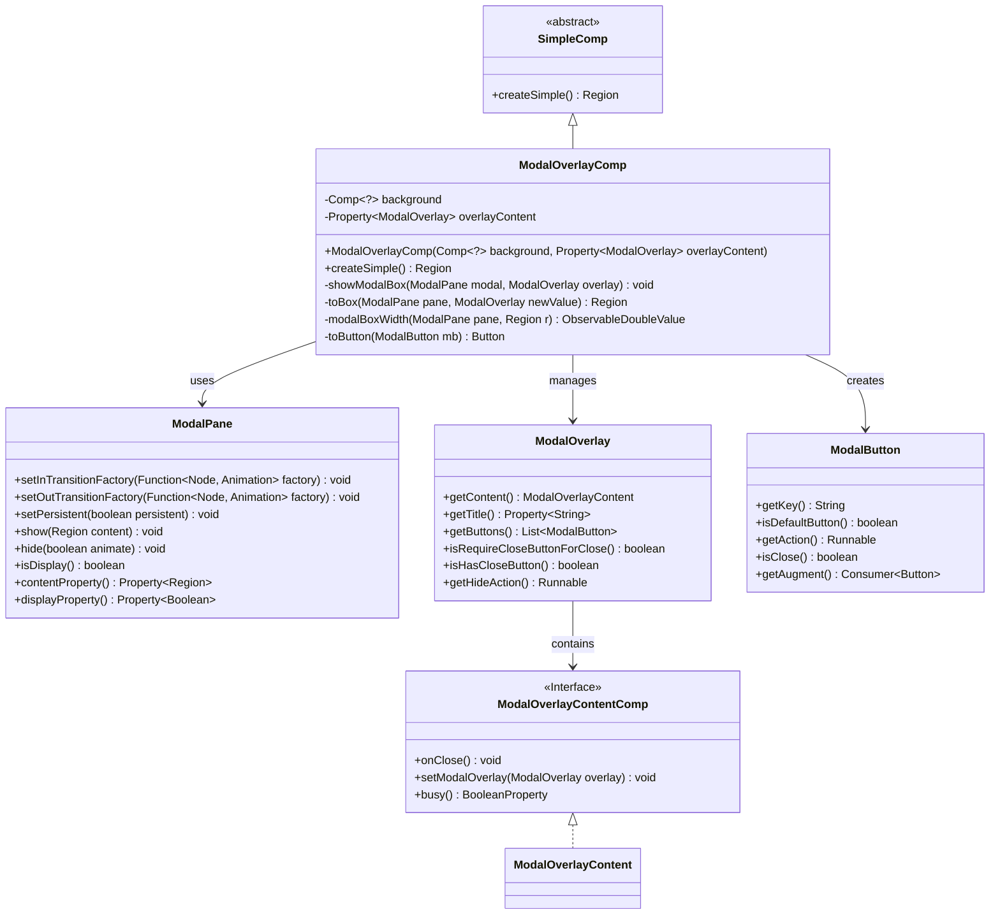
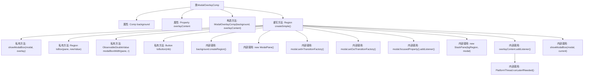

# 基础信息

|      |      |
|------|------|
| 名称 | ModalOverlayComp |
| 编码语言 | .java |
| 代码路径 | xpipe/app/src/main/java/io/xpipe/app/comp/base/ModalOverlayComp.java |
| 包名 | io.xpipe.app.comp.base |
| 依赖项 | ['io.xpipe.app.comp.Comp', 'io.xpipe.app.comp.SimpleComp', 'io.xpipe.app.core.AppFontSizes', 'io.xpipe.app.core.AppI18n', 'io.xpipe.app.core.AppLogs', 'io.xpipe.app.util.PlatformThread', 'io.xpipe.core.process.OsType', 'javafx.animation', 'javafx.application.Platform', 'javafx.beans.binding.Bindings', 'javafx.beans.property.Property', 'javafx.beans.property.SimpleDoubleProperty', 'javafx.beans.value.ObservableDoubleValue', 'javafx.geometry.Pos', 'javafx.scene.control.Button', 'javafx.scene.control.Label', 'javafx.scene.input.KeyCode', 'javafx.scene.input.KeyEvent', 'javafx.scene.layout.HBox', 'javafx.scene.layout.Region', 'javafx.scene.layout.StackPane', 'javafx.scene.layout.VBox', 'javafx.util.Duration', 'atlantafx.base.controls.ModalPane', 'atlantafx.base.layout.ModalBox', 'atlantafx.base.theme.Styles', 'atlantafx.base.util.Animations'] |
| 概述说明 | 模态覆盖组件类，管理背景与弹窗内容，支持动画、焦点控制及按钮交互。 |

# 说明

ModalOverlayComp是一个继承自SimpleComp的组件，用于创建模态叠加层界面。它包含背景组件和可变的叠加层内容属性。组件实现了模态窗体的显示与隐藏逻辑，支持动画过渡效果（除Linux系统外使用淡入淡出动画）。模态窗体可包含标题、内容和自定义按钮，按钮支持默认操作和关闭行为。组件处理了焦点管理、键盘事件（如回车键触发默认按钮）、关闭逻辑和异常处理。模态框宽度自适应容器，支持最小/最大尺寸约束，并提供加载状态指示功能。整体通过StackPane布局管理背景和模态层的叠加显示。

# 类列表 Class Summary

| 名称   | 类型  | 说明 |
|-------|------|-------------|
| ModalOverlayComp | class | ModalOverlayComp类实现模态覆盖层组件，管理背景与内容交互，支持动画、焦点控制及按钮操作。 |

## 类 ModalOverlayComp

|      |      |
|------|------|
| 访问范围 | public |
| 类型 | class |
| 名称 | ModalOverlayComp |
| 说明 | ModalOverlayComp类实现模态覆盖层组件，管理背景与内容交互，支持动画、焦点控制及按钮操作。 |

### UML类图

该代码实现了一个模态叠加层组件，主要包含ModalOverlayComp类（继承自SimpleComp）用于创建带背景和模态内容的界面。核心功能包括：通过ModalPane管理模态框的显示/隐藏动画，处理焦点切换逻辑，响应键盘事件，以及动态构建包含标题、内容和按钮栏的模态框布局。ModalOverlay描述模态内容结构，ModalButton处理按钮行为，ModalOverlayContentComp接口定义内容组件的生命周期方法。组件支持国际化、动态尺寸调整和异步操作状态管理。

### 内部方法调用关系图

该流程图展示了ModalOverlayComp类的核心结构和主要方法调用关系。该类继承自SimpleComp，包含两个主要属性和一个构造方法。核心方法是createSimple()，它创建了一个包含背景区域和模态面板的复合界面，并设置了各种事件监听器和动画效果。该方法内部调用了多个私有方法如showModalBox()和toBox()来处理模态框的显示逻辑和UI构建。流程图清晰地呈现了从属性初始化到界面渲染的完整流程，特别是对模态框状态管理和事件处理的复杂交互过程进行了结构化展示。

### 字段列表 Field List

| 名称  | 类型  | 说明 |
|-------|-------|------|
| overlayContent | Property<ModalOverlay> | 私有属性：ModalOverlay类型的overlayContent。 |
| background | Comp<?> | 私有背景组件对象。 |

### 方法列表 Method List

| 名称  | 类型  | 说明 |
|-------|-------|------|
| createSimple | Region | 创建模态面板，处理焦点切换、动画和内容更新，支持默认按钮和关闭逻辑。 |
| toBox | Region | 创建模态框区域，包含标题、按钮和内容，支持焦点管理和尺寸绑定。 |
| showModalBox | void | 显示模态框，设置关闭按钮可见性。 |
| modalBoxWidth | ObservableDoubleValue | 模态框宽度绑定计算，考虑预置宽度和面板宽度限制。 |
| toButton | Button | 将ModalButton转为Button，设置样式、动作及关闭行为。 |

