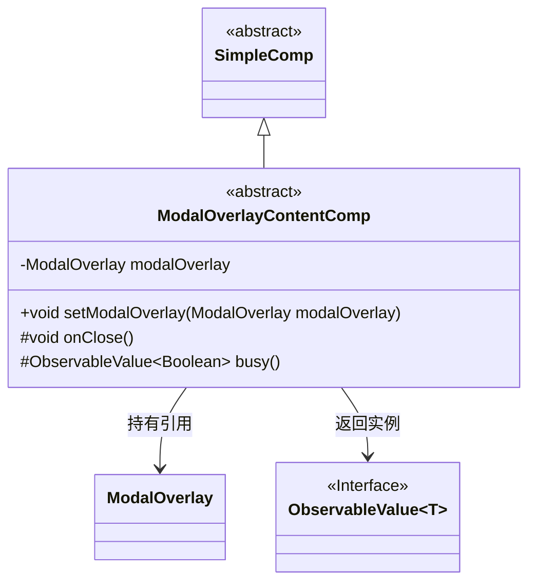
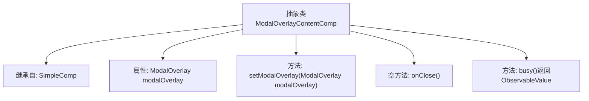

# 基础信息

|      |      |
|------|------|
| 名称 | ModalOverlayContentComp |
| 编码语言 | .java |
| 代码路径 | xpipe/app/src/main/java/io/xpipe/app/comp/base/ModalOverlayContentComp.java |
| 包名 | io.xpipe.app.comp.base |
| 依赖项 | ['io.xpipe.app.comp.SimpleComp', 'javafx.beans.value.ObservableValue', 'lombok.Getter'] |
| 概述说明 | 抽象类ModalOverlayContentComp扩展SimpleComp，含模态覆盖层设置、关闭方法和忙碌状态返回值。 |

# 说明

ModalOverlayContentComp是一个抽象类，继承自SimpleComp。它包含一个ModalOverlay类型的成员变量modalOverlay，通过setModalOverlay方法设置。提供了空的onClose方法供子类实现，以及返回null的busy方法，返回一个ObservableValue<Boolean>类型值。该类主要用于模态叠加层内容组件的基类实现。

# 类列表 Class Summary

| 名称   | 类型  | 说明 |
|-------|------|-------------|
| ModalOverlayContentComp | class | 抽象类ModalOverlayContentComp扩展SimpleComp，含模态覆盖层设置、关闭方法和忙碌状态。 |

## 类 ModalOverlayContentComp

|      |      |
|------|------|
| 访问范围 | @Getter;public abstract |
| 类型 | class |
| 名称 | ModalOverlayContentComp |
| 说明 | 抽象类ModalOverlayContentComp扩展SimpleComp，含模态覆盖层设置、关闭方法和忙碌状态。 |

### UML类图

该类图展示了一个抽象组件ModalOverlayContentComp继承自SimpleComp，包含对ModalOverlay的引用和两个受保护方法。其中busy()方法返回泛型接口ObservableValue<Boolean>，体现了组件与模态窗口的交互能力。类结构清晰展示了抽象基类、具体实现类和接口之间的层级与依赖关系。

### 内部方法调用关系图

该流程图展示了ModalOverlayContentComp抽象类的结构，它继承自SimpleComp类，包含一个ModalOverlay类型的属性modalOverlay，以及三个方法：setModalOverlay用于设置modalOverlay属性，onClose是一个空方法可由子类实现，busy方法返回一个可观察的布尔值。类通过@Getter注解自动生成getter方法，体现了组件与模态窗口的交互逻辑。

### 字段列表 Field List

| 名称  | 类型  | 说明 |
|-------|-------|------|
| modalOverlay | ModalOverlay | 声明受保护的模态覆盖层变量modalOverlay。 |

### 方法列表 Method List

| 名称  | 类型  | 说明 |
|-------|-------|------|
| setModalOverlay | void | 设置模态覆盖层对象。 |
| onClose | void | 方法定义：关闭时执行的操作。 |
| busy | ObservableValue<Boolean> | 保护方法返回空布尔可观察值 |

