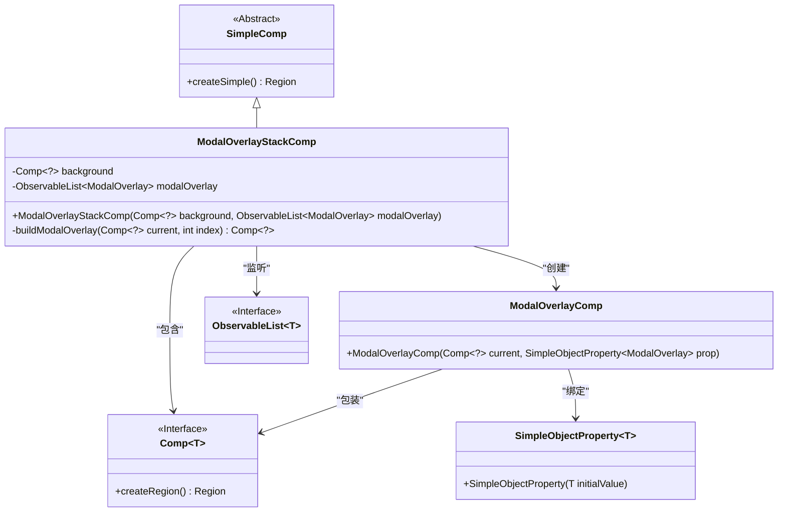
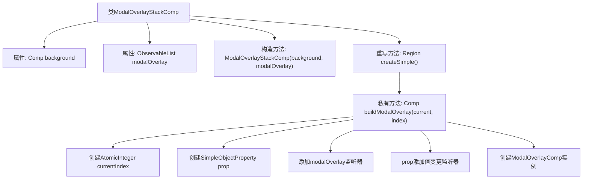

# 基础信息

|      |      |
|------|------|
| 名称 | ModalOverlayStackComp |
| 编码语言 | .java |
| 代码路径 | xpipe/app/src/main/java/io/xpipe/app/comp/base/ModalOverlayStackComp.java |
| 包名 | io.xpipe.app.comp.base |
| 依赖项 | ['io.xpipe.app.comp.Comp', 'io.xpipe.app.comp.SimpleComp', 'javafx.beans.property.SimpleObjectProperty', 'javafx.collections.ListChangeListener', 'javafx.collections.ObservableList', 'javafx.scene.layout.Region', 'java.util.concurrent.atomic.AtomicInteger'] |
| 概述说明 | ModalOverlayStackComp类管理模态覆盖层堆栈，处理背景和覆盖层列表。 |

# 说明

ModalOverlayStackComp是一个继承自SimpleComp的组件类，用于管理模态叠加层堆栈。它包含一个背景组件和一个可观察的模态叠加层列表。构造函数接收这两个参数并初始化。createSimple方法通过循环构建最多5个模态叠加层，每个叠加层基于前一个组件创建。buildModalOverlay方法处理模态叠加层的动态更新，包括索引变化和内容更新，确保叠加层正确响应列表变化。ModalOverlayComp用于创建实际的叠加层组件。

# 类列表 Class Summary

| 名称   | 类型  | 说明 |
|-------|------|-------------|
| ModalOverlayStackComp | class | ModalOverlayStackComp类：管理模态覆盖层堆栈，监听列表变化并动态构建UI。 |

## 类 ModalOverlayStackComp

|      |      |
|------|------|
| 访问范围 | public |
| 类型 | class |
| 名称 | ModalOverlayStackComp |
| 说明 | ModalOverlayStackComp类：管理模态覆盖层堆栈，监听列表变化并动态构建UI。 |

### UML类图

该类图展示了ModalOverlayStackComp继承自SimpleComp，用于管理模态叠加层的堆栈结构。通过组合模式包含背景组件(Comp)和模态层列表(ObservableList)，利用ModalOverlayComp动态构建每层叠加界面。核心在于buildModalOverlay方法实现的双向绑定机制：既监听列表变化更新索引，又通过属性监听器维护列表一致性，形成闭环管理。整体设计实现了动态层叠界面的响应式控制，典型应用于复杂UI的状态管理场景。

### 内部方法调用关系图

这段代码展示了一个模态叠加层堆栈组件的实现。ModalOverlayStackComp继承自SimpleComp，通过background属性和modalOverlay列表管理底层组件和叠加层。核心逻辑在createSimple()方法中循环构建最多5个叠加层，每个叠加层通过buildModalOverlay()方法创建，该方法会设置索引跟踪和属性监听，确保叠加层能正确响应列表变化。整个过程体现了响应式编程思想，通过监听器实现数据与UI的自动同步。

### 字段列表 Field List

| 名称  | 类型  | 说明 |
|-------|-------|------|
| modalOverlay | ObservableList<ModalOverlay> | 私有模态覆盖层列表 |
| background | Comp<?> | 私有终态组件背景变量 |

### 方法列表 Method List

| 名称  | 类型  | 说明 |
|-------|-------|------|
| createSimple | Region | 重写方法创建区域，循环五次构建模态覆盖层后返回区域。 |
| buildModalOverlay | Comp<?> | 构建模态覆盖层组件，监听索引和属性变化，自动更新或移除元素。 |

