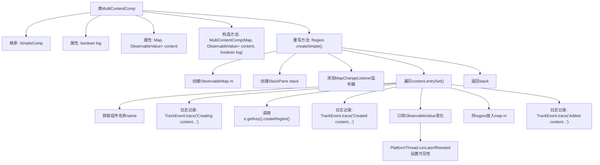

# 基础信息

|      |      |
|------|------|
| 名称 | MultiContentComp |
| 编码语言 | .java |
| 代码路径 | xpipe/app/src/main/java/io/xpipe/app/comp/base/MultiContentComp.java |
| 包名 | io.xpipe.app.comp.base |
| 依赖项 | ['io.xpipe.app.comp.Comp', 'io.xpipe.app.comp.SimpleComp', 'io.xpipe.app.issue.TrackEvent', 'io.xpipe.app.util.PlatformThread', 'javafx.beans.value.ObservableValue', 'javafx.collections.FXCollections', 'javafx.collections.MapChangeListener', 'javafx.collections.ObservableMap', 'javafx.scene.layout.Region', 'javafx.scene.layout.StackPane', 'java.util.Map'] |
| 概述说明 | 多内容组件类，管理动态显示区域，支持日志跟踪和状态订阅。 |

# 说明

MultiContentComp是一个继承自SimpleComp的组件类，用于管理多个动态显示的子组件。它接收一个包含组件及其可见性状态映射的构造参数，并支持日志记录功能。核心逻辑通过createSimple方法实现：创建一个StackPane容器，监听组件映射变化动态添加/移除子组件区域。每个子组件的可见性由ObservableValue控制，通过订阅机制实时更新UI状态。类中还包含一个被注释的简化实现方案备选。

# 类列表 Class Summary

| 名称   | 类型  | 说明 |
|-------|------|-------------|
| MultiContentComp | class | 多内容组件类，管理动态显示区域，支持日志跟踪和可见性控制。 |


## 类 MultiContentComp

|      |      |
|------|------|
| 访问范围 | public |
| 类型 | class |
| 名称 | MultiContentComp |
| 说明 | 多内容组件类，管理动态显示区域，支持日志跟踪和可见性控制。 |


### UML类图

```mermaid
classDiagram
    class SimpleComp {
        <<abstract>>
        +createSimple() Region
    }

    class MultiContentComp {
        -boolean log
        -Map~Comp~?~, ObservableValue~Boolean~~ content
        +MultiContentComp(Map~Comp~?~, ObservableValue~Boolean~~ content, boolean log)
        +createSimple() Region
    }

    class Comp~T~ {
        <<Interface>>
        +createRegion() Region
    }

    class StackPane {
        +getChildren() ObservableList~Node~
    }

    class ObservableValue~T~ {
        <<Interface>>
        +subscribe(Consumer~? super T~)
    }

    class ObservableMap~K, V~ {
        <<Interface>>
        +addListener(MapChangeListener~? super K, ? super V~)
    }

    class TrackEvent {
        <<Utility>>
        +trace(String message)
    }

    class PlatformThread {
        <<Utility>>
        +runLaterIfNeeded(Runnable action)
    }

    MultiContentComp --|> SimpleComp : 继承
    MultiContentComp --> Comp~?~ : 包含
    MultiContentComp --> StackPane : 创建
    MultiContentComp --> ObservableValue~Boolean~ : 订阅
    MultiContentComp --> ObservableMap~Comp~?~, Region~ : 监听
    MultiContentComp --> TrackEvent : 调用
    MultiContentComp --> PlatformThread : 调用
    Comp~?~ <|.. MultiContentComp : 泛型实现
```

类图描述：
MultiContentComp继承自抽象类SimpleComp，实现了动态内容管理功能。它通过ObservableMap管理多个Comp组件及其可见性状态，使用StackPane作为容器，并通过监听器动态更新UI。类中包含日志记录(TrackEvent)和线程调度(PlatformThread)的依赖，整体设计采用观察者模式响应状态变化，泛型接口Comp<T>提供了组件创建的抽象。


### 内部方法调用关系图



这段代码实现了一个多内容组件容器MultiContentComp，它继承自SimpleComp。主要功能是管理多个可动态显示/隐藏的子组件，通过监听布尔值ObservableValue来控制子组件的可见性。代码使用StackPane作为容器，通过ObservableMap监听子组件变化，并提供了详细的日志记录功能。核心流程包括：初始化容器、设置监听器、遍历配置内容、创建子组件区域、订阅可见性变化事件，最终返回组装好的容器。

### 字段列表 Field List

| 名称  | 类型  | 说明 |
|-------|-------|------|
| content | Map<Comp<?>, ObservableValue<Boolean>> | 私有映射：键为Comp<?>，值为ObservableValue<Boolean>。 |
| log | boolean | 私有布尔变量log |

### 方法列表 Method List

| 名称  | 类型  | 说明 |
|-------|-------|------|
| createSimple | Region | 创建可观察区域栈，动态管理组件显示与隐藏。 |


