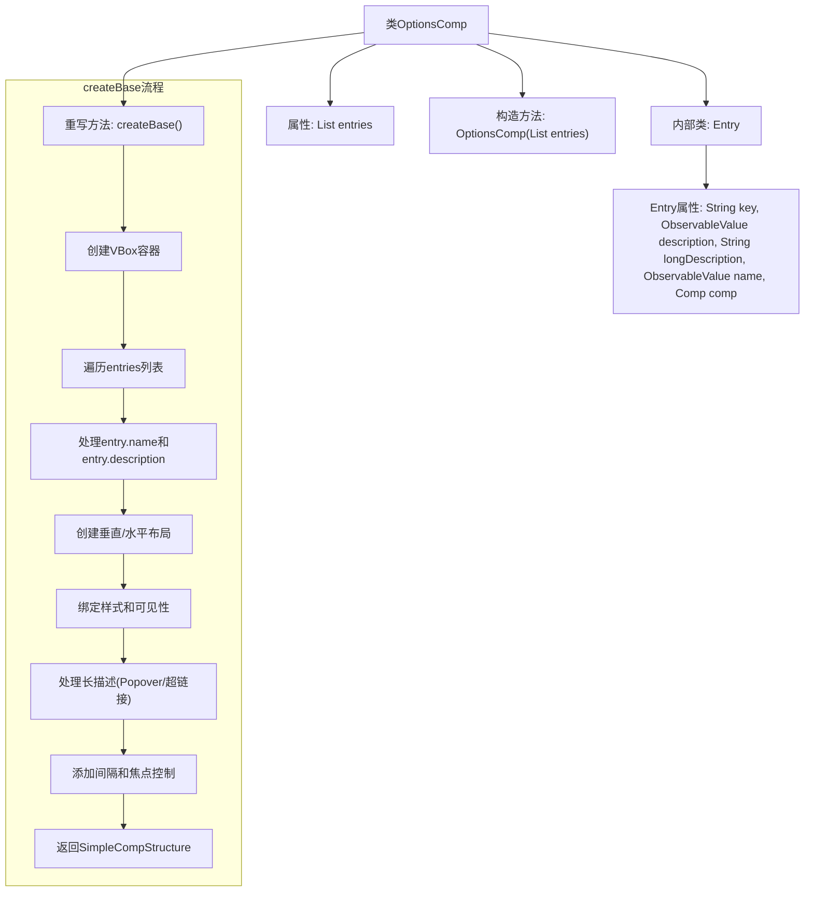

# 基础信息

|      |      |
|------|------|
| 名称 | OptionsComp |
| 编码语言 | .java |
| 代码路径 | xpipe/app/src/main/java/io/xpipe/app/comp/base/OptionsComp.java |
| 包名 | io.xpipe.app.comp.base |
| 依赖项 | ['io.xpipe.app.comp.Comp', 'io.xpipe.app.comp.CompStructure', 'io.xpipe.app.comp.SimpleCompStructure', 'io.xpipe.app.core.AppFontSizes', 'io.xpipe.app.util.Hyperlinks', 'io.xpipe.app.util.PlatformThread', 'javafx.beans.Observable', 'javafx.beans.binding.Bindings', 'javafx.beans.property.SimpleStringProperty', 'javafx.beans.value.ObservableValue', 'javafx.geometry.Insets', 'javafx.geometry.Orientation', 'javafx.geometry.Pos', 'javafx.scene.control.Button', 'javafx.scene.control.Label', 'javafx.scene.control.Tooltip', 'javafx.scene.layout', 'javafx.util.Duration', 'atlantafx.base.controls.Popover', 'atlantafx.base.controls.Spacer', 'atlantafx.base.theme.Styles', 'lombok.Getter', 'java.util.ArrayList', 'java.util.List'] |
| 概述说明 | OptionsComp类用于创建垂直布局面板，管理条目列表，支持名称、描述和组件显示，包含样式和交互逻辑。 |

# 说明

OptionsComp是一个JavaFX组件类，继承自Comp，用于创建垂直布局的选项面板。它接收Entry对象列表作为构造参数，每个Entry包含键、名称、描述、长描述和子组件。类中实现了createBase方法，构建VBox布局，根据Entry属性动态生成标签、描述文本、帮助按钮和子组件区域。支持垂直和水平布局模式，处理组件可见性绑定、辅助功能属性和焦点管理。长描述可显示为弹出式Markdown内容或超链接。组件间自动添加间距，并实现名称标签宽度同步调整。

# 类列表 Class Summary

| 名称   | 类型  | 说明 |
|-------|------|-------------|
| OptionsComp | class | OptionsComp类用于创建垂直布局选项面板，支持名称、描述和组件绑定，包含样式管理和交互功能。 |


## 类 OptionsComp

|      |      |
|------|------|
| 访问范围 | @Getter;public |
| 类型 | class |
| 名称 | OptionsComp |
| 说明 | OptionsComp类用于创建垂直布局选项面板，支持名称、描述和组件绑定，包含样式管理和交互功能。 |


### UML类图

```mermaid
classDiagram
    class OptionsComp {
        -List~Entry~ entries
        +OptionsComp(List~Entry~ entries)
        +CompStructure~VBox~ createBase()
    }

    class Entry {
        +String key
        +ObservableValue~String~ description
        +String longDescription
        +ObservableValue~String~ name
        +Comp~?~ comp
    }

    class Comp~T~ {
        <<Interface>>
        +T createBase()
    }

    class CompStructure~T~ {
        <<Interface>>
    }

    class SimpleCompStructure~T~ {
        +SimpleCompStructure(T node)
    }

    class VBox
    class Region
    class Label
    class Button
    class Popover
    class MarkdownComp
    class Spacer

    OptionsComp --> Entry : 包含
    OptionsComp ..|> Comp~CompStructure~VBox~~ : 实现
    SimpleCompStructure ..|> CompStructure : 实现
    Entry --> Comp : 关联
    OptionsComp --> VBox : 创建
    OptionsComp --> Label : 创建
    OptionsComp --> Button : 创建
    OptionsComp --> Popover : 创建
    OptionsComp --> MarkdownComp : 创建
    OptionsComp --> Spacer : 创建
    OptionsComp --> Region : 使用
```

类图描述：
OptionsComp是一个泛型组件类，实现了Comp接口，用于创建包含多个配置项的垂直布局面板。它内部使用Entry记录类来存储每个配置项的元数据，包括名称、描述和关联组件。类图中展示了OptionsComp与JavaFX控件（VBox、Label等）的创建关系，以及与辅助类（Popover、MarkdownComp等）的交互。该类通过复杂的布局逻辑动态生成用户界面，支持响应式数据绑定和可访问性功能。


### 内部方法调用关系图



这段代码定义了一个名为OptionsComp的JavaFX组件类，继承自Comp<CompStructure<VBox>>。主要功能是动态创建包含多个配置项的垂直布局面板，每个配置项可以包含名称、描述、长描述(支持Markdown或超链接)和自定义组件。流程图展示了从构造方法到createBase()的核心执行路径，包括容器创建、条目遍历、布局构建、样式绑定和交互处理等关键步骤。该类特别处理了多种边缘情况，如单条目优化、名称对齐、可见性同步和焦点控制等。

### 字段列表 Field List

| 名称  | 类型  | 说明 |
|-------|-------|------|
| entries | List<Entry> | 私有条目列表 |

### 方法列表 Method List

| 名称  | 类型  | 说明 |
|-------|-------|------|
| createBase | CompStructure<VBox> | 创建VBox布局，动态添加组件并绑定样式和属性。 |


