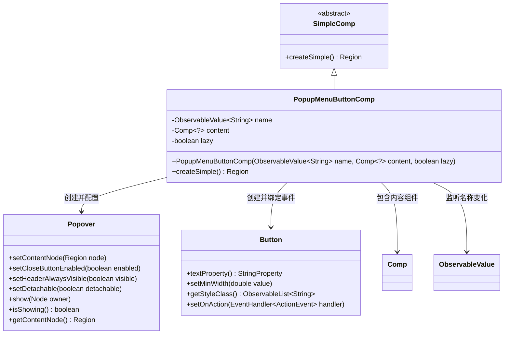
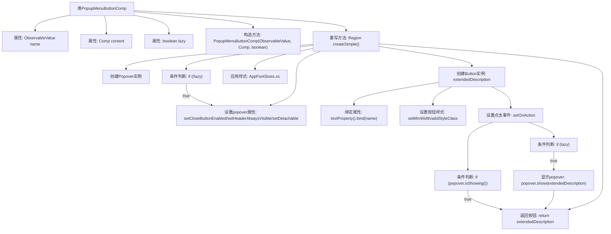

# 基础信息

|      |      |
|------|------|
| 名称 | PopupMenuButtonComp |
| 编码语言 | .java |
| 代码路径 | xpipe/app/src/main/java/io/xpipe/app/comp/base/PopupMenuButtonComp.java |
| 包名 | io.xpipe.app.comp.base |
| 依赖项 | ['io.xpipe.app.comp.Comp', 'io.xpipe.app.comp.SimpleComp', 'io.xpipe.app.core.AppFontSizes', 'javafx.beans.value.ObservableValue', 'javafx.scene.control.Button', 'javafx.scene.layout.Region', 'atlantafx.base.controls.Popover', 'atlantafx.base.theme.Styles'] |
| 概述说明 | 弹出菜单按钮组件，绑定名称和内容，支持懒加载。 |

# 说明

PopupMenuButtonComp是一个继承自SimpleComp的组件类，用于创建带弹出菜单的按钮。它接收三个参数：name（可观察字符串值）、content（组件内容）和lazy（是否延迟加载）。组件核心是一个Button，其文本绑定name值，并具有特定样式类。点击按钮时，会显示Popover弹窗，弹窗内容根据lazy参数决定是否延迟加载content组件。弹窗配置包括关闭按钮禁用、头部不可见、可分离等特性，并应用了xs字体大小。按钮点击逻辑包含防重复打开和延迟加载处理。

# 类列表 Class Summary

| 名称   | 类型  | 说明 |
|-------|------|-------------|
| PopupMenuButtonComp | class | 弹出菜单按钮组件，支持懒加载和动态内容绑定。 |

## 类 PopupMenuButtonComp

|      |      |
|------|------|
| 访问范围 | public |
| 类型 | class |
| 名称 | PopupMenuButtonComp |
| 说明 | 弹出菜单按钮组件，支持懒加载和动态内容绑定。 |

### UML类图

这段代码展示了一个弹出菜单按钮组件(PopupMenuButtonComp)的实现，继承自SimpleComp抽象类。该组件包含三个核心字段：可观察的名称属性、内容组件和懒加载标志。主要功能是通过按钮点击触发弹出菜单(Popover)，根据lazy标志决定是否延迟加载内容区域。类图清晰地展示了与JavaFX控件(Popover/Button)的交互关系，以及对外部组件(Comp)和可观察值(ObservableValue)的依赖，体现了响应式UI组件的典型设计模式。

### 内部方法调用关系图

这段代码描述了一个PopupMenuButtonComp类，继承自SimpleComp，用于创建带弹出菜单的按钮组件。主要流程包括：初始化属性(name/content/lazy)，创建Popover弹窗并配置属性，创建按钮并绑定文本/样式，设置点击事件处理逻辑(包含懒加载判断和弹窗显示控制)，最后返回按钮实例。通过lazy标志控制弹窗内容的延迟加载，优化性能。

### 字段列表 Field List

| 名称  | 类型  | 说明 |
|-------|-------|------|
| name | ObservableValue<String> | 私有不可变字符串可观察值name |
| content | Comp<?> | 私有不可变的Comp类型content变量 |
| lazy | boolean | 私有布尔变量lazy |

### 方法列表 Method List

| 名称  | 类型  | 说明 |
|-------|-------|------|
| createSimple | Region | 创建弹窗按钮，绑定名称，点击显示内容。 |

