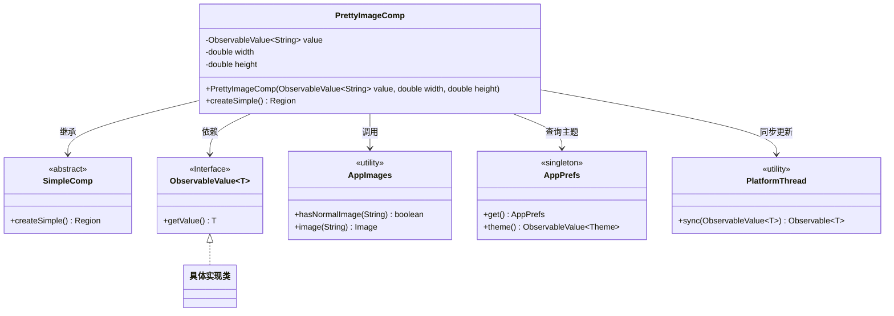
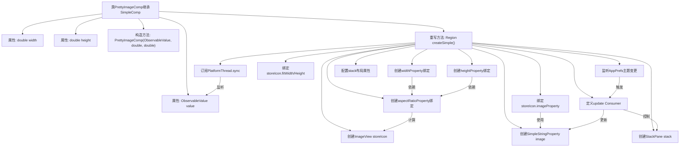

# 基础信息

|      |      |
|------|------|
| 名称 | PrettyImageComp |
| 编码语言 | .java |
| 代码路径 | xpipe/app/src/main/java/io/xpipe/app/comp/base/PrettyImageComp.java |
| 包名 | io.xpipe.app.comp.base |
| 依赖项 | ['io.xpipe.app.comp.SimpleComp', 'io.xpipe.app.issue.TrackEvent', 'io.xpipe.app.prefs.AppPrefs', 'io.xpipe.app.resources.AppImages', 'io.xpipe.app.util.PlatformThread', 'io.xpipe.core.store.FileNames', 'javafx.beans.binding.Bindings', 'javafx.beans.property.SimpleStringProperty', 'javafx.beans.value.ObservableValue', 'javafx.geometry.Pos', 'javafx.scene.image.ImageView', 'javafx.scene.layout.Region', 'javafx.scene.layout.StackPane', 'java.util.function.Consumer'] |
| 概述说明 | PrettyImageComp类：基于ObservableValue创建自适应图片组件，支持暗黑模式切换。 |

# 说明

PrettyImageComp是一个继承自SimpleComp的组件类，用于显示自适应尺寸的图片。它接收一个ObservableValue字符串值作为图片路径，以及宽度和高度参数。组件内部使用ImageView显示图片，并通过绑定计算保持图片宽高比，确保在给定尺寸内完整显示。图片路径会根据当前主题（亮色/暗色）自动调整，支持带"-dark"后缀的暗色版本图片。组件还处理了图片不存在的情况，并记录警告事件。最终返回一个包含图片的StackPane，设置固定尺寸和居中对齐样式。

# 类列表 Class Summary

| 名称   | 类型  | 说明 |
|-------|------|-------------|
| PrettyImageComp | class | PrettyImageComp组件：基于ObservableValue动态显示图片，支持宽高调整和暗黑主题适配。 |

## 类 PrettyImageComp

|      |      |
|------|------|
| 访问范围 | public |
| 类型 | class |
| 名称 | PrettyImageComp |
| 说明 | PrettyImageComp组件：基于ObservableValue动态显示图片，支持宽高调整和暗黑主题适配。 |

### UML类图

类图描述：
PrettyImageComp继承自SimpleComp，是一个用于显示自适应图片的组件类。它通过ObservableValue接收图片路径，结合AppImages加载图片资源，并根据AppPrefs的主题设置自动切换明暗模式。类中维护了width/height属性用于控制显示尺寸，通过PlatformThread实现线程同步更新。流程图展示了该组件与工具类(AppImages/AppPrefs)的协作关系，以及通过ObservableValue实现的动态数据绑定机制。

### 内部方法调用关系图

这段代码实现了一个支持主题切换的自适应图片组件。流程图展示了从类结构到核心方法createSimple()的完整执行流程，包括图片宽高比计算、响应式属性绑定、主题变更监听等关键步骤。组件通过三层绑定体系（图片加载、尺寸计算、主题响应）实现动态调整，最终返回一个包含自适应图片的StackPane布局容器。整个过程体现了观察者模式和响应式编程的典型应用。

### 字段列表 Field List

| 名称  | 类型  | 说明 |
|-------|-------|------|
| value | ObservableValue<String> | 私有不可变字符串可观察值 |
| width | double | 私有双精度宽度变量。 |
| height | double | 私有双精度浮点型变量height |

### 方法列表 Method List

| 名称  | 类型  | 说明 |
|-------|-------|------|
| createSimple | Region | 创建自适应图片区域，绑定宽高比，支持暗黑主题切换。 |

