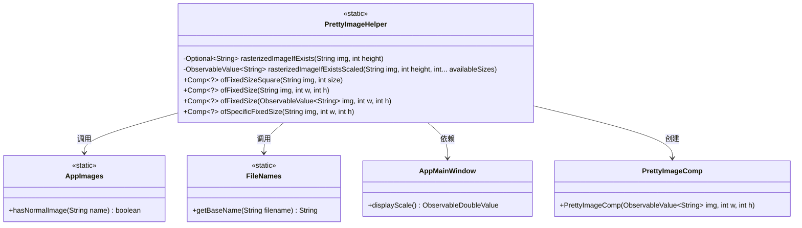
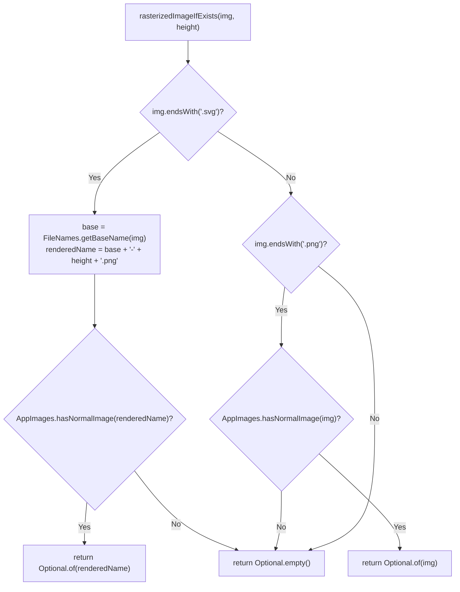
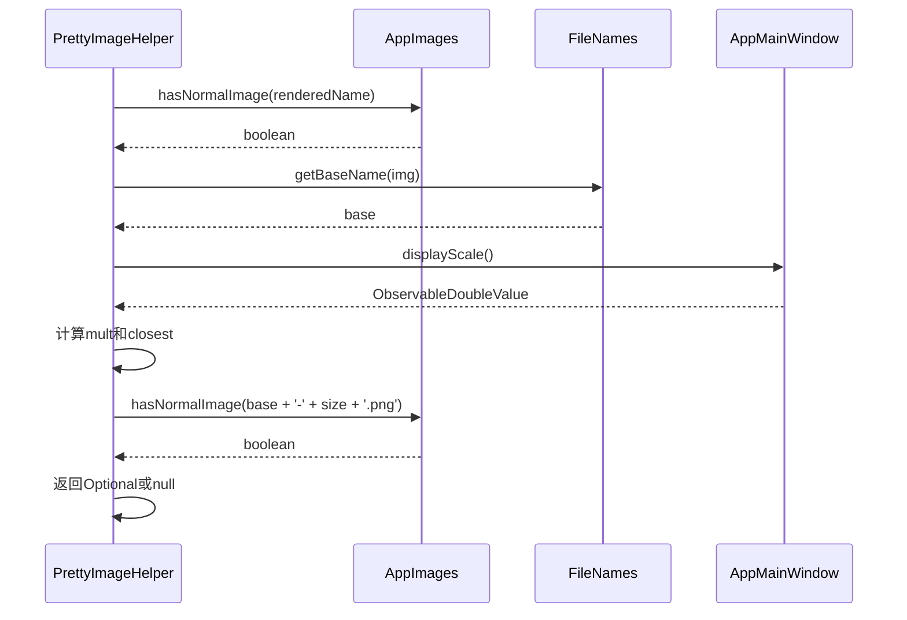
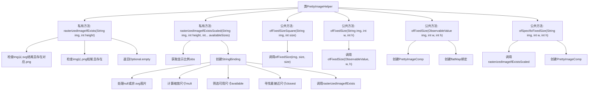

# 基础信息

|      |      |
|------|------|
| 名称 | PrettyImageHelper |
| 编码语言 | .java |
| 代码路径 | xpipe/app/src/main/java/io/xpipe/app/comp/base/PrettyImageHelper.java |
| 包名 | io.xpipe.app.comp.base |
| 依赖项 | ['io.xpipe.app.comp.Comp', 'io.xpipe.app.core.window.AppMainWindow', 'io.xpipe.app.resources.AppImages', 'io.xpipe.app.util.BindingsHelper', 'io.xpipe.core.store.FileNames', 'javafx.beans.binding.Bindings', 'javafx.beans.property.SimpleDoubleProperty', 'javafx.beans.property.SimpleStringProperty', 'javafx.beans.value.ObservableDoubleValue', 'javafx.beans.value.ObservableValue', 'java.util.Optional', 'java.util.stream.IntStream'] |
| 概述说明 | PrettyImageHelper类提供图像处理功能，支持SVG/PNG格式检查、缩放和固定尺寸显示。 |

# 说明

这是一个名为PrettyImageHelper的Java类，主要用于处理图像显示逻辑。它包含多个静态方法，用于根据输入参数生成不同尺寸的图像组件。主要功能包括检查是否存在指定高度的光栅化图像，根据显示比例动态选择合适尺寸的图像，以及创建固定尺寸的图像组件。类中使用了Optional和ObservableValue等Java特性来处理可能为空的图像路径，并支持SVG和PNG格式的图像处理。方法通过绑定和属性监听实现动态响应，适用于图形界面中的图像显示需求。

# 类列表 Class Summary

| 名称   | 类型  | 说明 |
|-------|------|-------------|
| PrettyImageHelper | class | PrettyImageHelper类提供静态方法处理图像渲染与尺寸调整，支持SVG和PNG格式。 |

## 类 PrettyImageHelper

|      |      |
|------|------|
| 访问范围 | public |
| 类型 | class |
| 名称 | PrettyImageHelper |
| 说明 | PrettyImageHelper类提供静态方法处理图像渲染与尺寸调整，支持SVG和PNG格式。 |

### UML类图

这段代码描述了一个图像处理工具类PrettyImageHelper，主要用于处理SVG和PNG格式的图像，根据不同的尺寸需求生成或获取合适的图像资源。类图中展示了它与AppImages、FileNames、AppMainWindow等辅助类的交互关系，以及创建PrettyImageComp组件的能力。流程图详细展示了rasterizedImageIfExists方法的逻辑判断流程，而时序图则描述了rasterizedImageIfExistsScaled方法与其他组件的交互过程。整体设计采用了静态工具方法模式，通过Optional和ObservableValue等Java特性实现灵活的图片处理功能。

### 内部方法调用关系图

这段代码流程图展示了PrettyImageHelper类的核心结构，主要包含5个方法：两个私有图像处理方法(rasterizedImageIfExists和rasterizedImageIfExistsScaled)和三个公共组件构建方法(ofFixedSizeSquare、ofFixedSize和ofSpecificFixedSize)。私有方法负责处理SVG/PNG图片的转换和缩放逻辑，通过Optional和ObservableValue进行安全操作；公共方法则通过组合这些私有方法，最终创建PrettyImageComp组件。流程特别强调了条件分支处理、响应式绑定创建和尺寸计算等关键步骤，体现了对图像显示优化的精细控制。

### 字段列表 Field List

| 名称  | 类型  | 说明 |
|-------|-------|------|

### 方法列表 Method List

| 名称  | 类型  | 说明 |
|-------|-------|------|
| ofFixedSizeSquare | Comp<?> | 静态方法：生成固定尺寸正方形图像，参数为图片路径和尺寸。 |
| ofFixedSize | Comp<?> | 创建固定尺寸图像组件，支持空值处理和动态图像绑定。 |
| rasterizedImageIfExistsScaled | ObservableValue<String> | 根据图像类型和尺寸返回缩放后的图像路径，支持SVG和PNG格式，自动适配显示比例。 |
| ofFixedSize | Comp<?> | 创建固定尺寸组件，参数为图片路径、宽、高。 |
| rasterizedImageIfExists | Optional<String> | 检查图片是否存在，SVG转PNG后验证，返回有效图片名或空。 |
| ofSpecificFixedSize | Comp<?> | 静态方法`ofSpecificFixedSize`根据给定图片路径和尺寸生成固定大小的图像组件。 |

