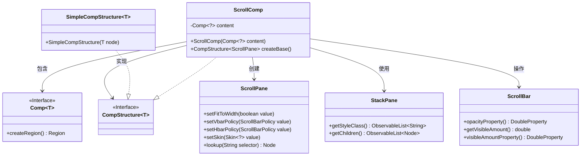
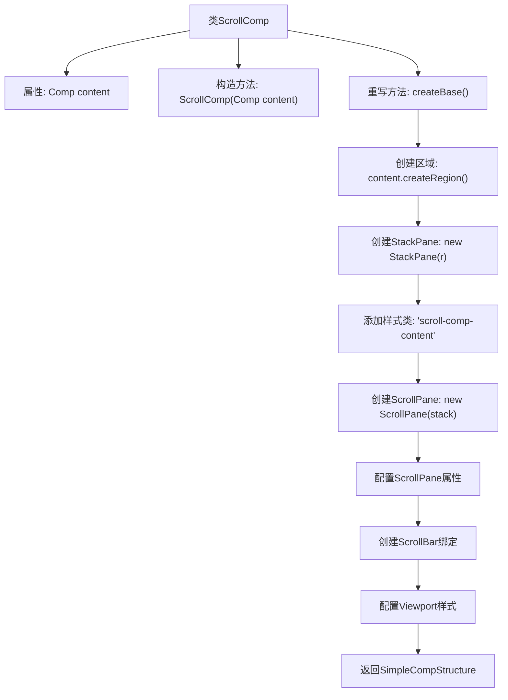

# 基础信息

|      |      |
|------|------|
| 名称 | ScrollComp |
| 编码语言 | .java |
| 代码路径 | xpipe/app/src/main/java/io/xpipe/app/comp/base/ScrollComp.java |
| 包名 | io.xpipe.app.comp.base |
| 依赖项 | ['io.xpipe.app.comp.Comp', 'io.xpipe.app.comp.CompStructure', 'io.xpipe.app.comp.SimpleCompStructure', 'javafx.beans.binding.Bindings', 'javafx.scene.control.ScrollBar', 'javafx.scene.control.ScrollPane', 'javafx.scene.control.skin.ScrollPaneSkin', 'javafx.scene.layout.StackPane'] |
| 概述说明 | 滚动组件类，包含内容区域和垂直滚动条控制逻辑。 |

# 说明

这段代码定义了一个名为ScrollComp的组件类，继承自Comp泛型类。该类包含一个content成员变量，通过构造函数初始化。createBase方法创建了一个带滚动功能的界面结构：将content包装在StackPane中，再放入ScrollPane。ScrollPane设置为自动适应宽度，垂直滚动条始终显示，水平滚动条隐藏。通过绑定垂直滚动条的可见性属性，实现根据内容长度动态显示滚动条。最后为视口内的子元素添加样式类，并返回包含ScrollPane的简单组件结构。

# 类列表 Class Summary

| 名称   | 类型  | 说明 |
|-------|------|-------------|
| ScrollComp | class | 滚动组件类，包含内容区域和垂直滚动条控制逻辑。 |

## 类 ScrollComp

|      |      |
|------|------|
| 访问范围 | public |
| 类型 | class |
| 名称 | ScrollComp |
| 说明 | 滚动组件类，包含内容区域和垂直滚动条控制逻辑。 |

### UML类图

这段代码展示了一个可滚动组件`ScrollComp`的实现，它继承自泛型类`Comp`并实现了`CompStructure<ScrollPane>`接口。主要功能是创建一个带有自定义滚动条行为的ScrollPane容器，包含内容组件并设置各种样式和策略。通过绑定滚动条的可见性来控制透明度，同时处理了滚动条精度问题。类图中清晰地展示了组件间的依赖关系和接口实现。

### 内部方法调用关系图

这段代码是ScrollComp类的实现，继承自Comp泛型类，主要用于创建带滚动功能的UI组件。流程图展示了从构造函数初始化内容组件，到创建基础布局结构的完整过程，包括创建StackPane容器、配置ScrollPane滚动策略、绑定垂直滚动条透明度逻辑，以及最终返回封装好的组件结构。整个过程体现了对JavaFX组件树的精细控制和样式定制能力。

### 字段列表 Field List

| 名称  | 类型  | 说明 |
|-------|-------|------|
| content | Comp<?> | 私有不可变组件内容 |

### 方法列表 Method List

| 名称  | 类型  | 说明 |
|-------|-------|------|
| createBase | CompStructure<ScrollPane> | 创建带垂直滚动条的滚动面板，内容区域可自适应宽度，滚动条根据可见内容动态显示。 |

