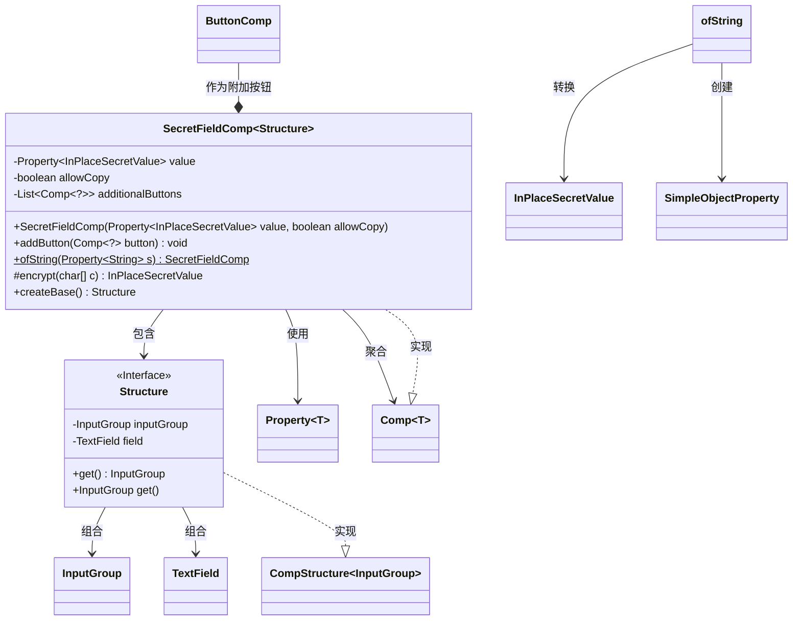
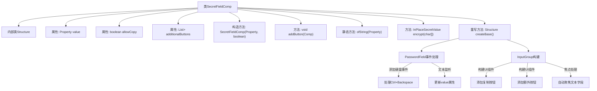
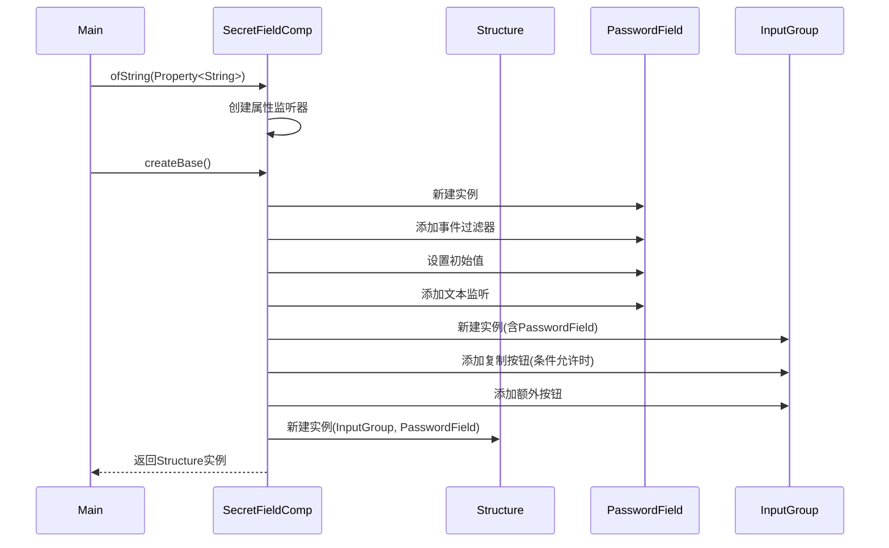

# 基础信息

|      |      |
|------|------|
| 名称 | SecretFieldComp |
| 编码语言 | .java |
| 代码路径 | xpipe/app/src/main/java/io/xpipe/app/comp/base/SecretFieldComp.java |
| 包名 | io.xpipe.app.comp.base |
| 依赖项 | ['io.xpipe.app.comp.Comp', 'io.xpipe.app.comp.CompStructure', 'io.xpipe.app.util.ClipboardHelper', 'io.xpipe.app.util.PlatformThread', 'io.xpipe.core.util.InPlaceSecretValue', 'javafx.beans.property.Property', 'javafx.beans.property.SimpleObjectProperty', 'javafx.scene.control.PasswordField', 'javafx.scene.control.TextField', 'javafx.scene.input.KeyCode', 'javafx.scene.input.KeyEvent', 'javafx.scene.layout.HBox', 'javafx.scene.layout.Priority', 'atlantafx.base.layout.InputGroup', 'lombok.AllArgsConstructor', 'lombok.Getter', 'org.kordamp.ikonli.javafx.FontIcon', 'java.util.ArrayList', 'java.util.List', 'java.util.Objects'] |
| 概述说明 | SecretFieldComp组件：处理密码输入，支持复制和自定义按钮。 |

# 说明

SecretFieldComp是一个用于处理敏感输入字段的组件类，继承自Comp泛型类。其内部类Structure实现了CompStructure接口，包含InputGroup和TextField字段。主类通过Property<InPlaceSecretValue>管理加密值，支持复制功能，并允许添加额外按钮。核心功能包括：创建密码输入框、实现文本与加密值的双向绑定、处理特殊快捷键（Ctrl+Backspace）、自动同步界面与数据层。组件提供ofString方法简化字符串属性转换，包含复制按钮的可选配置，并通过InputGroup组织布局。所有值变更都通过PlatformThread确保线程安全，并自动处理焦点切换。

# 类列表 Class Summary

| 名称   | 类型  | 说明 |
|-------|------|-------------|
| SecretFieldComp | class | 密码输入组件，支持复制功能，可添加额外按钮，监听文本变化并加密处理。 |

## 类 SecretFieldComp

|      |      |
|------|------|
| 访问范围 | public |
| 类型 | class |
| 名称 | SecretFieldComp |
| 说明 | 密码输入组件，支持复制功能，可添加额外按钮，监听文本变化并加密处理。 |

### UML类图

这段代码描述了一个密码输入组件`SecretFieldComp`，它继承自泛型类`Comp`，使用`Structure`作为模板参数。主要功能包括：1) 通过`PasswordField`实现安全输入；2) 支持值绑定和加密；3) 可配置复制按钮；4) 允许添加额外功能按钮。组件通过`Property`实现双向数据绑定，使用`InPlaceSecretValue`处理敏感数据，并通过事件监听实现控件联动。结构类`Structure`封装了输入框组和文本字段，实现了组件基础架构。

### 内部方法调用关系图

这段代码实现了一个安全密码输入组件SecretFieldComp，主要功能包括：1) 通过PasswordField实现安全输入；2) 支持Ctrl+Backspace快捷删除；3) 自动同步文本与加密值；4) 可选的密码复制功能；5) 支持添加额外功能按钮。组件采用MVVM架构，通过Property实现数据绑定，并使用PlatformThread保证线程安全。createBase()方法负责构建完整的UI结构，包含事件处理和值同步逻辑。

### 字段列表 Field List

| 名称  | 类型  | 说明 |
|-------|-------|------|
| allowCopy | boolean | 私有布尔变量allowCopy控制复制权限。 |
| additionalButtons = new ArrayList<>() | List<Comp<?>> | 私有列表存储额外按钮组件。 |
| value | Property<InPlaceSecretValue> | 私有属性，类型为Property<InPlaceSecretValue>，变量名value。 |

### 方法列表 Method List

| 名称  | 类型  | 说明 |
|-------|-------|------|
| ofString | SecretFieldComp | 静态方法`ofString`将字符串属性转换为秘密字段组件，双向同步值变更。 |
| encrypt | InPlaceSecretValue | 加密字符数组并返回保护值。 |
| addButton | void | 添加按钮到额外按钮列表。 |
| createBase | Structure | 创建密码输入框，支持Ctrl+Backspace删除文本，实时加密输入，可复制密码，包含额外按钮。 |

