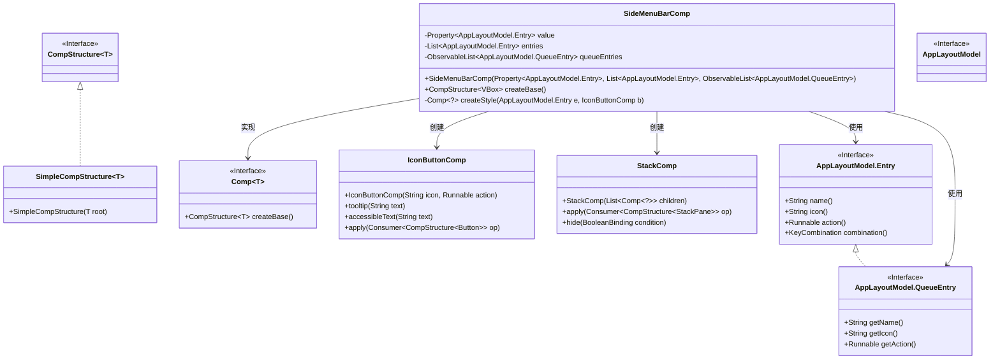
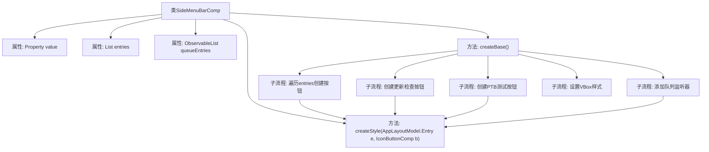
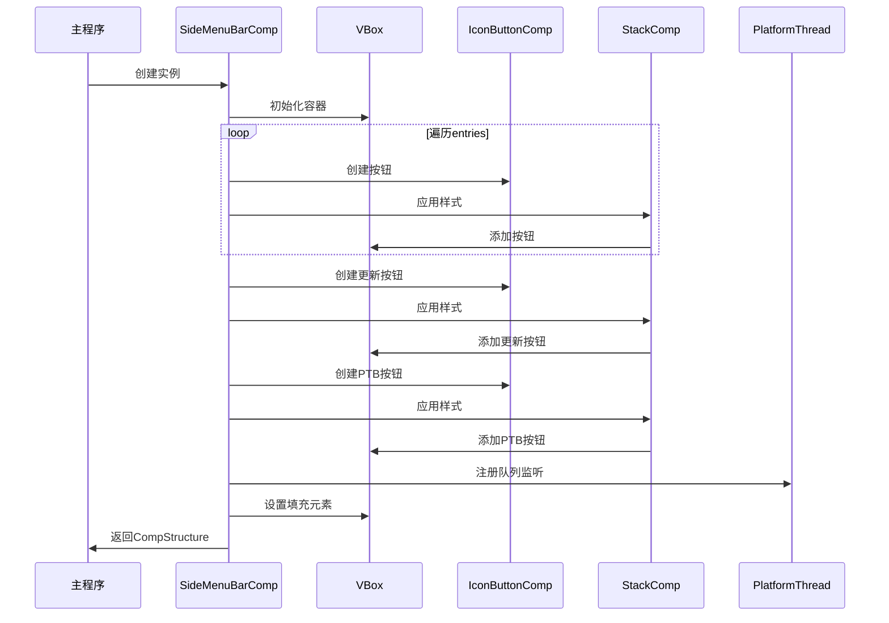

# 基础信息

|      |      |
|------|------|
| 名称 | SideMenuBarComp |
| 编码语言 | .java |
| 代码路径 | xpipe/app/src/main/java/io/xpipe/app/comp/base/SideMenuBarComp.java |
| 包名 | io.xpipe.app.comp.base |
| 依赖项 | ['io.xpipe.app.comp.Comp', 'io.xpipe.app.comp.CompStructure', 'io.xpipe.app.comp.SimpleCompStructure', 'io.xpipe.app.core.AppDistributionType', 'io.xpipe.app.core.AppFontSizes', 'io.xpipe.app.core.AppLayoutModel', 'io.xpipe.app.core.AppProperties', 'io.xpipe.app.update.UpdateAvailableDialog', 'io.xpipe.app.util.Hyperlinks', 'io.xpipe.app.util.PlatformThread', 'javafx.application.Platform', 'javafx.beans.binding.Bindings', 'javafx.beans.property.Property', 'javafx.collections.ListChangeListener', 'javafx.collections.ObservableList', 'javafx.css.PseudoClass', 'javafx.geometry.Insets', 'javafx.geometry.Pos', 'javafx.scene.control.Button', 'javafx.scene.layout', 'javafx.scene.paint.Color', 'lombok.AllArgsConstructor', 'java.util.List'] |
| 概述说明 | 侧边栏组件类，含菜单项、更新按钮和队列管理功能。 |

# 说明

SideMenuBarComp是一个JavaFX组件，继承自Comp类，用于创建侧边栏菜单。它包含三个主要属性：value表示当前选中的菜单项，entries是菜单项列表，queueEntries是队列条目列表。组件创建了一个垂直布局的VBox，包含多个带图标的按钮，每个按钮对应一个菜单项，点击时执行相应操作或更新选中状态。按钮样式根据选中状态和悬停状态动态变化，使用不同背景色和边框。组件还包含一个更新按钮和一个测试版入口按钮（非测试环境显示），以及一个队列按钮区域，动态显示队列条目。底部有一个填充区域确保布局扩展。组件通过绑定和监听实现动态样式更新和交互响应。

# 类列表 Class Summary

| 名称   | 类型  | 说明 |
|-------|------|-------------|
| SideMenuBarComp | class | 侧边栏组件类，含菜单项、更新按钮和队列管理功能。 |

## 类 SideMenuBarComp

|      |      |
|------|------|
| 访问范围 | @AllArgsConstructor;public |
| 类型 | class |
| 名称 | SideMenuBarComp |
| 说明 | 侧边栏组件类，含菜单项、更新按钮和队列管理功能。 |

### UML类图

该代码实现了一个侧边栏菜单组件(SideMenuBarComp)，继承自泛型Comp类，用于构建基于VBox的动态菜单结构。主要功能包括：1) 根据entries列表生成可交互的图标按钮；2) 支持队列条目(queueEntries)的动态更新；3) 实现选中状态样式控制。通过IconButtonComp和StackComp组合构建UI元素，并与AppLayoutModel交互处理用户操作。createStyle方法实现了复杂的动态样式绑定逻辑，包括悬停/选中状态的颜色变化。

### 内部方法调用关系图

这段代码实现了一个侧边菜单栏组件，主要功能包括：1) 根据配置项动态生成菜单按钮；2) 实现更新检查功能按钮；3) 支持PTB测试版本入口；4) 维护动态队列按钮列表。核心流程通过createBase()方法组织，使用VBox作为容器，每个按钮都经过createStyle()方法进行样式处理，包含选中状态、悬停效果等交互逻辑。代码采用响应式设计，通过属性绑定和监听器实现UI动态更新。

### 字段列表 Field List

| 名称  | 类型  | 说明 |
|-------|-------|------|
| entries | List<AppLayoutModel.Entry> | 私有终态应用布局条目列表。 |
| queueEntries | ObservableList<AppLayoutModel.QueueEntry> | 私有队列条目列表。 |
| value | Property<AppLayoutModel.Entry> | 私有属性，类型为Property<AppLayoutModel.Entry>，名为value。 |

### 方法列表 Method List

| 名称  | 类型  | 说明 |
|-------|-------|------|
| createStyle | Comp<?> | 创建样式方法，设置按钮选中状态及边框背景效果。 |
| createBase | CompStructure<VBox> | 创建垂直布局侧边栏，包含图标按钮、更新检测和队列管理功能。 |

