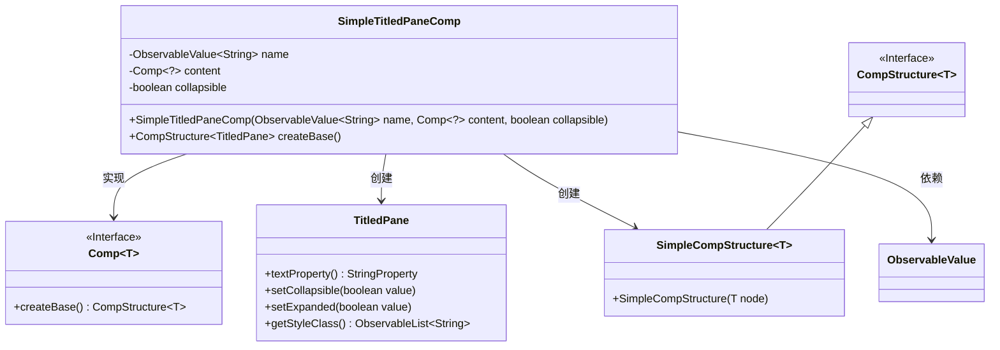
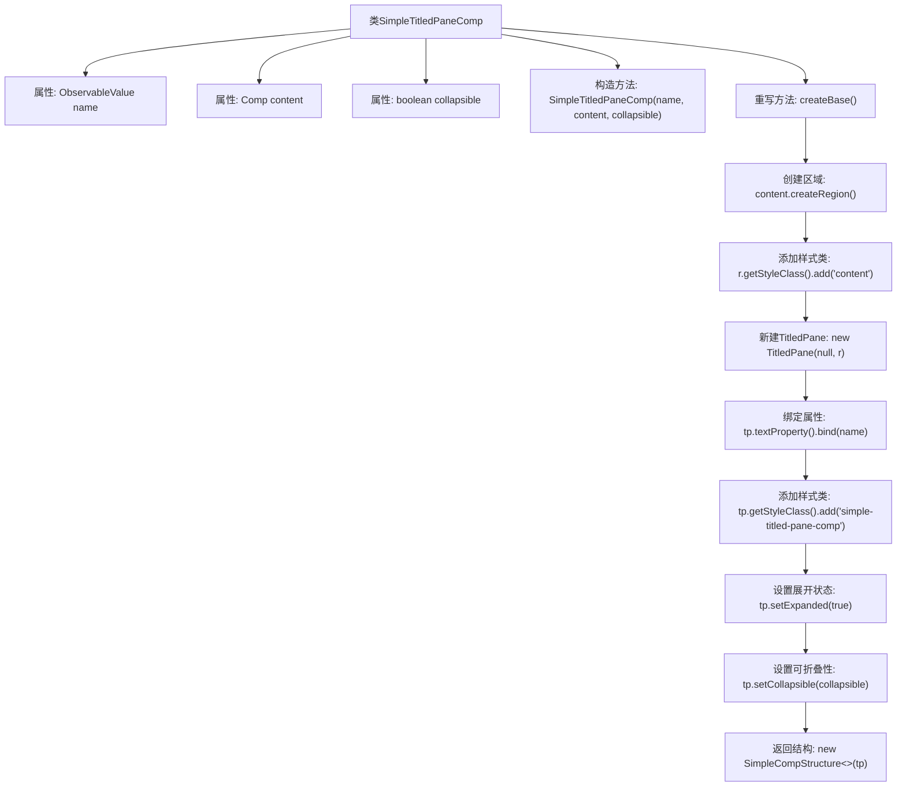

# 基础信息

|      |      |
|------|------|
| 名称 | SimpleTitledPaneComp |
| 编码语言 | .java |
| 代码路径 | xpipe/app/src/main/java/io/xpipe/app/comp/base/SimpleTitledPaneComp.java |
| 包名 | io.xpipe.app.comp.base |
| 依赖项 | ['io.xpipe.app.comp.Comp', 'io.xpipe.app.comp.CompStructure', 'io.xpipe.app.comp.SimpleCompStructure', 'javafx.beans.value.ObservableValue', 'javafx.scene.control.TitledPane'] |
| 概述说明 | 可折叠标题面板组件，绑定名称和内容，支持样式控制。 |

# 说明

这是一个名为SimpleTitledPaneComp的Java类，继承自Comp泛型类。该类用于创建可折叠的标题面板组件，包含三个主要属性：name（可观察的字符串值，用于绑定面板标题）、content（子组件）和collapsible（布尔值，控制面板是否可折叠）。在createBase方法中，它创建了一个TitledPane实例，将content组件作为其内容区域，并绑定name属性作为标题文本。面板默认展开，样式类设为"simple-titled-pane-comp"，内容区域添加"content"样式类。最终返回包含TitledPane的SimpleCompStructure实例。

# 类列表 Class Summary

| 名称   | 类型  | 说明 |
|-------|------|-------------|
| SimpleTitledPaneComp | class | 可折叠标题面板组件，绑定名称和内容，支持样式控制。 |

## 类 SimpleTitledPaneComp

|      |      |
|------|------|
| 访问范围 | public |
| 类型 | class |
| 名称 | SimpleTitledPaneComp |
| 说明 | 可折叠标题面板组件，绑定名称和内容，支持样式控制。 |

### UML类图

这段代码定义了一个可折叠标题面板组件`SimpleTitledPaneComp`，它继承自泛型类`Comp`并实现了创建`TitledPane`的功能。类图展示了核心结构：`SimpleTitledPaneComp`通过组合`ObservableValue`和`Comp`来构建可绑定的标题内容，最终生成包含样式控制的`TitledPane`实例，并使用`SimpleCompStructure`进行包装。整个设计遵循了组件化思想，通过泛型接口`Comp`和`CompStructure`实现松耦合，支持动态标题绑定和折叠控制功能。

### 内部方法调用关系图

这段代码定义了一个可折叠标题面板组件类SimpleTitledPaneComp，继承自泛型Comp类。流程图展示了从类结构到核心方法createBase()的完整执行流程：首先初始化三个成员变量，然后在createBase()中创建内容区域、配置样式，构建TitledPane控件并设置文本绑定、样式类和展开状态，最后返回封装好的组件结构。整个过程体现了该组件将动态标题和可折叠内容区域封装为可重用UI单元的设计思路。

### 字段列表 Field List

| 名称  | 类型  | 说明 |
|-------|-------|------|
| content | Comp<?> | 私有Comp<?>类型变量content |
| name | ObservableValue<String> | 私有不可变字符串可观察值name |
| collapsible | boolean | 私有布尔变量collapsible，表示是否可折叠。 |

### 方法列表 Method List

| 名称  | 类型  | 说明 |
|-------|-------|------|
| createBase | CompStructure<TitledPane> | 重写createBase方法，创建带绑定标题和样式的可折叠TitledPane组件。 |

