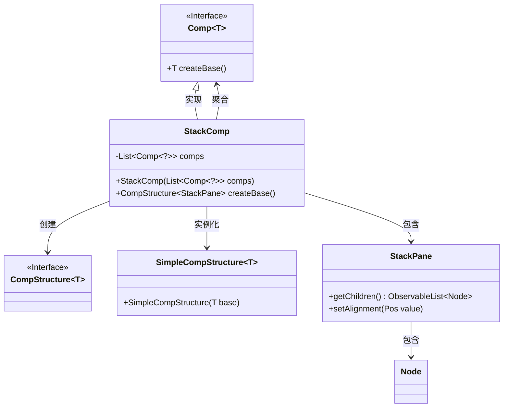
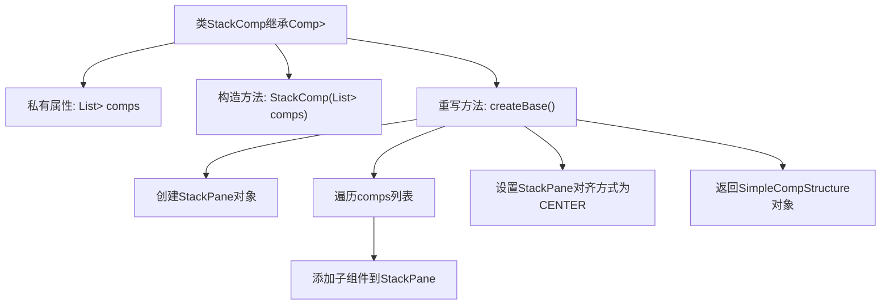

# 基础信息

|      |      |
|------|------|
| 名称 | StackComp |
| 编码语言 | .java |
| 代码路径 | xpipe/app/src/main/java/io/xpipe/app/comp/base/StackComp.java |
| 包名 | io.xpipe.app.comp.base |
| 依赖项 | ['io.xpipe.app.comp.Comp', 'io.xpipe.app.comp.CompStructure', 'io.xpipe.app.comp.SimpleCompStructure', 'javafx.geometry.Pos', 'javafx.scene.layout.StackPane', 'java.util.List'] |
| 概述说明 | 堆叠组件类，包含子组件列表，创建居中堆叠布局。 |

# 说明

这是一个名为StackComp的Java类，继承自Comp泛型类，泛型类型为CompStructure<StackPane>。该类包含一个不可变的comp列表作为成员变量，通过构造函数初始化。主要功能是重写createBase方法，创建一个StackPane面板，将所有comp的显示区域添加到面板中，并设置面板内容居中对齐，最后返回一个包含该面板的SimpleCompStructure实例。

# 类列表 Class Summary

| 名称   | 类型  | 说明 |
|-------|------|-------------|
| StackComp | class | 堆栈组件类，包含子组件列表，创建居中堆栈面板。 |

## 类 StackComp

|      |      |
|------|------|
| 访问范围 | public |
| 类型 | class |
| 名称 | StackComp |
| 说明 | 堆栈组件类，包含子组件列表，创建居中堆栈面板。 |

### UML类图

这段类图展示了StackComp类及其相关组件的关系。StackComp是一个实现了泛型接口Comp的具体类，专门用于处理StackPane类型的组件结构。它通过聚合多个Comp<?>对象来构建界面，使用SimpleCompStructure包装StackPane，并管理子节点的布局。图中清晰地显示了泛型接口的实现关系、类之间的依赖和组合关系，以及核心的JavaFX控件交互方式。

### 内部方法调用关系图

这段代码描述了一个StackComp类，它继承自泛型类Comp，用于管理堆叠布局的UI组件。流程图展示了从构造方法初始化组件列表，到createBase()方法创建StackPane容器、遍历添加子组件、设置对齐方式并返回包装结构的完整流程。核心是通过组合模式将多个Comp组件按堆叠方式布局，最终生成一个居中对齐的复合UI结构。

### 字段列表 Field List

| 名称  | 类型  | 说明 |
|-------|-------|------|
| comps | List<Comp<?>> | 私有组件列表 |

### 方法列表 Method List

| 名称  | 类型  | 说明 |
|-------|-------|------|
| createBase | CompStructure<StackPane> | 重写createBase方法，创建居中堆叠面板并添加子组件。 |

