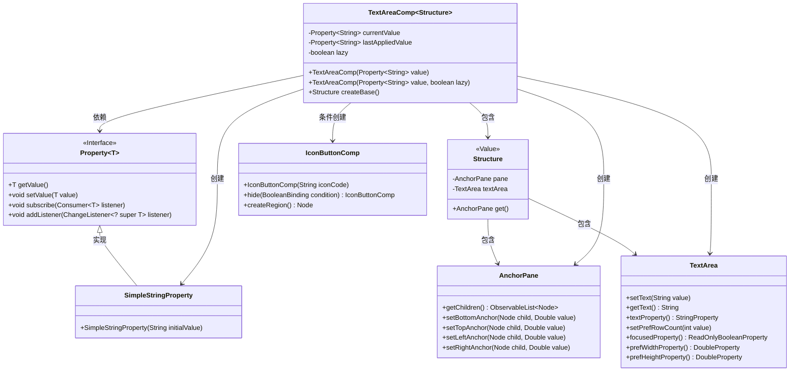
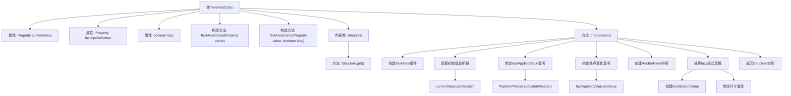

# 基础信息

|      |      |
|------|------|
| 名称 | TextAreaComp |
| 编码语言 | .java |
| 代码路径 | xpipe/app/src/main/java/io/xpipe/app/comp/base/TextAreaComp.java |
| 包名 | io.xpipe.app.comp.base |
| 依赖项 | ['io.xpipe.app.comp.Comp', 'io.xpipe.app.comp.CompStructure', 'io.xpipe.app.util.PlatformThread', 'javafx.beans.binding.Bindings', 'javafx.beans.property.Property', 'javafx.beans.property.SimpleStringProperty', 'javafx.scene.control.TextArea', 'javafx.scene.layout.AnchorPane', 'lombok.Builder', 'lombok.Value', 'java.util.Objects'] |
| 概述说明 | 文本区域组件类，含值属性和懒加载功能，支持双向绑定和布局控制。 |

# 说明

该代码定义了一个TextAreaComp类，继承自Comp类，用于创建文本区域组件。类中包含两个属性：currentValue和lastAppliedValue，分别表示当前值和最后应用的值，以及一个布尔值lazy控制是否延迟更新。构造函数接收一个Property<String>参数，并可选择是否启用延迟模式。组件创建时会初始化文本区域，设置默认行数，并添加文本变化监听器。当焦点丢失时，会将当前值同步到lastAppliedValue。如果启用延迟模式，会添加一个确认按钮，仅在值不同时显示。组件布局使用AnchorPane，确保文本区域填满整个空间。最终返回包含面板和文本区域的结构对象。

# 类列表 Class Summary

| 名称   | 类型  | 说明 |
|-------|------|-------------|
| TextAreaComp | class | 文本区域组件类，支持懒加载和值同步。 |

## 类 TextAreaComp

|      |      |
|------|------|
| 访问范围 | public |
| 类型 | class |
| 名称 | TextAreaComp |
| 说明 | 文本区域组件类，支持懒加载和值同步。 |

### UML类图

该代码实现了一个可复用的文本区域组件TextAreaComp，继承自泛型Comp类。核心功能包括：双向数据绑定（通过Property接口）、懒提交模式（lazy标志）、值变化监听和UI同步机制。Structure内部类使用Lombok注解构建UI结构，包含AnchorPane布局和TextArea控件。当启用lazy模式时，会添加提交按钮，仅在值修改时显示。流程图展示了组件与JavaFX控件、属性绑定之间的复杂交互关系。

### 内部方法调用关系图

该流程图展示了TextAreaComp类的核心结构和逻辑流程。类包含三个主要属性(currentValue、lastAppliedValue和lazy)，两个重载构造函数，以及关键的createBase方法实现。createBase方法负责创建文本区域组件，设置各种值变更监听器，处理焦点变化事件，构建布局容器，并根据lazy模式决定是否添加确认按钮。内部类Structure用于封装UI组件结构，提供统一的访问接口。整个设计实现了双向数据绑定和延迟提交功能，特别关注了值同步时的线程安全和性能优化。

### 字段列表 Field List

| 名称  | 类型  | 说明 |
|-------|-------|------|
| lastAppliedValue | Property<String> | 私有字符串属性lastAppliedValue |
| currentValue | Property<String> | 私有字符串属性当前值 |
| lazy | boolean | 私有布尔变量lazy，表示是否延迟加载。 |

### 方法列表 Method List

| 名称  | 类型  | 说明 |
|-------|-------|------|
| createBase | Structure | 创建文本区域，绑定值变化监听，懒加载时添加确认按钮，返回布局结构。 |

