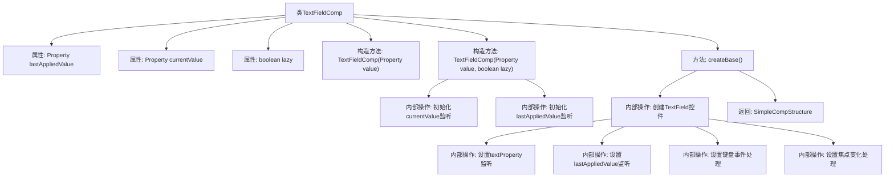

# 基础信息

|      |      |
|------|------|
| 名称 | TextFieldComp |
| 编码语言 | .java |
| 代码路径 | xpipe/app/src/main/java/io/xpipe/app/comp/base/TextFieldComp.java |
| 包名 | io.xpipe.app.comp.base |
| 依赖项 | ['io.xpipe.app.comp.Comp', 'io.xpipe.app.comp.CompStructure', 'io.xpipe.app.comp.SimpleCompStructure', 'io.xpipe.app.util.PlatformThread', 'javafx.beans.property.Property', 'javafx.beans.property.SimpleStringProperty', 'javafx.scene.control.TextField', 'javafx.scene.input.KeyCode', 'java.util.Objects'] |
| 概述说明 | 文本框组件类，支持懒更新和值同步，继承Comp基类。 |

# 说明

TextFieldComp是一个继承自Comp的组件类，用于管理文本输入框的状态和行为。它包含两个属性：lastAppliedValue和currentValue，分别存储最后应用的值和当前输入的值。lazy参数控制值更新的时机，非lazy模式下输入值实时同步，lazy模式下需按回车或失去焦点才同步。组件创建时会绑定值变更监听器，确保双向数据同步，并处理焦点变化和回车键事件。最终返回包含TextField的简单组件结构。

# 类列表 Class Summary

| 名称   | 类型  | 说明 |
|-------|------|-------------|
| TextFieldComp | class | 文本框组件类，支持懒更新和双向数据绑定。 |


## 类 TextFieldComp

|      |      |
|------|------|
| 访问范围 | public |
| 类型 | class |
| 名称 | TextFieldComp |
| 说明 | 文本框组件类，支持懒更新和双向数据绑定。 |


### UML类图

```mermaid
classDiagram
    class Property~T~ {
        <<Interface>>
        +T getValue()
        +void setValue(T value)
        +void addListener(ChangeListener~T~ listener)
    }

    class SimpleStringProperty {
        +SimpleStringProperty(String initialValue)
    }

    class Comp~T~ {
        <<Interface>>
        +T createBase()
    }

    class CompStructure~T~ {
        <<Interface>>
    }

    class SimpleCompStructure~T~ {
        +SimpleCompStructure(T node)
    }

    class TextFieldComp {
        -Property~String~ lastAppliedValue
        -Property~String~ currentValue
        -boolean lazy
        +TextFieldComp(Property~String~ value)
        +TextFieldComp(Property~String~ value, boolean lazy)
        +CompStructure~TextField~ createBase()
    }

    class TextField {
        +StringProperty textProperty()
        +String getText()
        +void setText(String value)
        +void setOnKeyPressed(EventHandler~KeyEvent~ value)
        +ObjectProperty~EventHandler~KeyEvent~~ onKeyPressedProperty()
        +BooleanProperty focusedProperty()
    }

    class PlatformThread {
        <<Utility>>
        +static void runLaterIfNeeded(Runnable runnable)
    }

    Property~String~ <|-- SimpleStringProperty
    Comp~CompStructure~TextField~~ <|-- TextFieldComp
    CompStructure~TextField~ <|-- SimpleCompStructure~TextField~
    TextFieldComp --> Property~String~ : "双向绑定"
    TextFieldComp --> SimpleStringProperty : "创建"
    TextFieldComp --> TextField : "封装控制"
    TextFieldComp --> PlatformThread : "调用"
    SimpleCompStructure~TextField~ --> TextField : "包装"
```

类图描述：该图展示了一个文本字段组件(TextFieldComp)的类结构，它继承自泛型Comp接口并实现CompStructure接口。核心功能是通过Property接口实现双向数据绑定，包含lastAppliedValue和currentValue两个属性，支持懒更新模式(lazy)。当用户输入或焦点变化时，通过监听器同步数据，使用PlatformThread确保线程安全更新UI。TextField作为基础控件被SimpleCompStructure包装返回，整个设计体现了观察者模式和响应式编程思想。


### 内部方法调用关系图



这段代码实现了一个可响应的文本输入框组件TextFieldComp，继承自Comp类。主要功能包括：1) 通过lastAppliedValue和currentValue两个属性管理文本状态；2) 支持懒加载模式(lazy)，可控制值同步时机；3) 实现键盘事件处理(回车确认/转移焦点)；4) 自动同步控件值与属性值；5) 通过PlatformThread.runLaterIfNeeded确保线程安全。组件在值变化、焦点变化和回车事件时会触发相应的值同步逻辑，同时避免不必要的重复设置。

### 字段列表 Field List

| 名称  | 类型  | 说明 |
|-------|-------|------|
| lazy | boolean | 私有布尔变量lazy |
| currentValue | Property<String> | 私有字符串属性currentValue |
| lastAppliedValue | Property<String> | 私有字符串属性lastAppliedValue |

### 方法列表 Method List

| 名称  | 类型  | 说明 |
|-------|-------|------|
| createBase | CompStructure<TextField> | 重写方法创建文本框，监听文本变化和焦点事件，处理回车键和懒更新逻辑。 |


