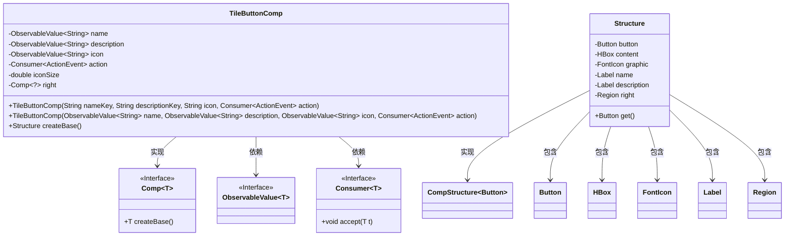
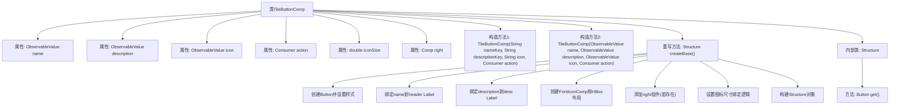

# 基础信息

|      |      |
|------|------|
| 名称 | TileButtonComp |
| 编码语言 | .java |
| 代码路径 | xpipe/app/src/main/java/io/xpipe/app/comp/base/TileButtonComp.java |
| 包名 | io.xpipe.app.comp.base |
| 依赖项 | ['io.xpipe.app.comp.Comp', 'io.xpipe.app.comp.CompStructure', 'io.xpipe.app.core.AppFontSizes', 'io.xpipe.app.core.AppI18n', 'io.xpipe.app.util.PlatformThread', 'javafx.beans.binding.Bindings', 'javafx.beans.property.SimpleStringProperty', 'javafx.beans.value.ObservableValue', 'javafx.event.ActionEvent', 'javafx.scene.control.Button', 'javafx.scene.control.Label', 'javafx.scene.layout.HBox', 'javafx.scene.layout.Region', 'javafx.scene.layout.VBox', 'atlantafx.base.controls.Spacer', None, 'org.kordamp.ikonli.javafx.FontIcon', 'java.util.function.Consumer'] |
| 概述说明 | TileButtonComp类：带图标、名称、描述的按钮组件，支持自定义右侧内容和点击事件。 |

# 说明

TileButtonComp是一个自定义UI组件类，继承自Comp泛型类，用于创建带图标的按钮。主要特性包括：通过ObservableValue绑定名称、描述和图标；支持设置图标大小和右侧组件；包含点击事件处理。内部Structure类封装了按钮、布局容器、图标和文本标签等元素。组件构建时自动处理文本绑定、图标尺寸调整和布局排列，采用HBox和VBox组合实现图文混排效果。

# 类列表 Class Summary

| 名称   | 类型  | 说明 |
|-------|------|-------------|
| TileButtonComp | class | TileButtonComp是一个可自定义的按钮组件，包含名称、描述、图标和右侧区域，支持动态绑定和事件处理。 |

## 类 TileButtonComp

|      |      |
|------|------|
| 访问范围 | @Getter;public |
| 类型 | class |
| 名称 | TileButtonComp |
| 说明 | TileButtonComp是一个可自定义的按钮组件，包含名称、描述、图标和右侧区域，支持动态绑定和事件处理。 |

### UML类图

类图描述：TileButtonComp是一个自定义UI组件类，继承自泛型接口Comp<Structure>，用于创建带图标和文本的按钮。它包含可观察的name、description和icon属性，以及一个action回调函数。内部类Structure实现了CompStructure<Button>接口，封装了按钮、布局容器和子组件。通过createBase()方法构建完整的UI结构，支持动态数据绑定和响应式布局。组件间通过JavaFX的ObservableValue和Consumer接口实现数据流交互。

### 内部方法调用关系图

流程图描述：该流程图展示了TileButtonComp类的完整结构，包含两个构造方法和核心的createBase()方法实现。createBase()方法详细描述了UI组件的创建过程：初始化按钮控件、绑定国际化文本、构建图标和文本布局、处理右侧可选组件，最后通过建造者模式生成Structure对象。内部类Structure定义了所有UI组件的持有结构，并实现了CompStructure接口的get()方法。

### 字段列表 Field List

| 名称  | 类型  | 说明 |
|-------|-------|------|
| name | ObservableValue<String> | 私有不可变字符串观察值name |
| description | ObservableValue<String> | 私有不可变字符串描述观察值 |
| icon | ObservableValue<String> | 私有不可变字符串图标观察值 |
| action | Consumer<ActionEvent> | 私有最终动作事件消费者。 |
| iconSize = 0.55 | double | Setter方法设置iconSize默认值为0.55。 |
| right | Comp<?> | 设置私有变量right，类型为Comp<?>。 |

### 方法列表 Method List

| 名称  | 类型  | 说明 |
|-------|-------|------|
| createBase | Structure | 创建带按钮的UI组件，包含图标、标题、描述和右侧区域，绑定尺寸和事件。 |

