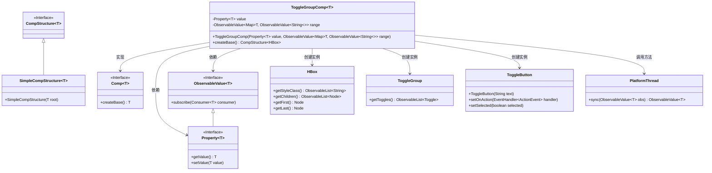
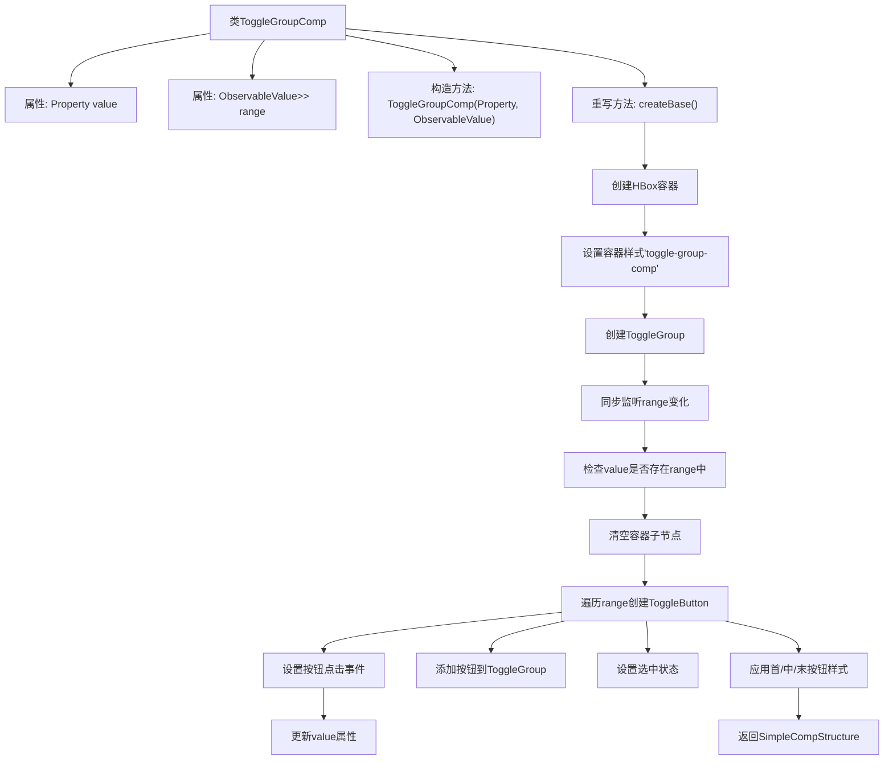

# 基础信息

|      |      |
|------|------|
| 名称 | ToggleGroupComp |
| 编码语言 | .java |
| 代码路径 | xpipe/app/src/main/java/io/xpipe/app/comp/base/ToggleGroupComp.java |
| 包名 | io.xpipe.app.comp.base |
| 依赖项 | ['io.xpipe.app.comp.Comp', 'io.xpipe.app.comp.CompStructure', 'io.xpipe.app.comp.SimpleCompStructure', 'io.xpipe.app.util.PlatformThread', 'javafx.beans.property.Property', 'javafx.beans.value.ObservableValue', 'javafx.scene.control.ToggleButton', 'javafx.scene.control.ToggleGroup', 'javafx.scene.layout.HBox', 'atlantafx.base.theme.Styles', 'java.util.Map'] |
| 概述说明 | 这是一个JavaFX的ToggleGroupComp类，用于创建水平排列的切换按钮组，支持动态更新选项和样式管理。 |

# 说明

ToggleGroupComp是一个泛型组件类，继承自Comp类，用于创建水平排列的切换按钮组。它包含一个value属性和一个range可观察值，分别存储当前选中值和可选值映射。组件创建时会同步range值，动态生成对应按钮，并处理按钮点击事件以更新value。按钮选中状态与value同步，并根据位置应用不同样式类（左、中、右）。组件结构基于HBox布局容器实现。

# 类列表 Class Summary

| 名称   | 类型  | 说明 |
|-------|------|-------------|
| ToggleGroupComp | class | 切换按钮组组件，基于属性值和动态范围创建水平布局的按钮组，支持选中状态切换和样式控制。 |

## 类 ToggleGroupComp

|      |      |
|------|------|
| 访问范围 | public |
| 类型 | class |
| 名称 | ToggleGroupComp |
| 说明 | 切换按钮组组件，基于属性值和动态范围创建水平布局的按钮组，支持选中状态切换和样式控制。 |

### UML类图

该代码实现了一个泛型切换按钮组组件，核心功能是通过`ToggleGroupComp`动态生成水平排列的`ToggleButton`，并管理其选中状态与数据绑定。类图展示了其与JavaFX控件（HBox/ToggleButton）、响应式编程接口（Property/ObservableValue）以及自定义结构（Comp/CompStructure）的交互关系，通过PlatformThread实现线程安全的数据同步，支持泛型参数T来适应不同类型的选择值。

### 内部方法调用关系图

这段代码实现了一个泛型切换按钮组组件，核心功能是通过HBox容器动态生成一组ToggleButton。流程图展示了从类结构定义到具体实现的完整过程：初始化时创建容器和按钮组，监听数据源变化时动态更新按钮，处理按钮点击事件时切换选中状态，并智能应用首/中/末按钮的圆角样式，最终返回封装好的组件结构。整个过程实现了数据驱动UI更新的响应式编程模式。

### 字段列表 Field List

| 名称  | 类型  | 说明 |
|-------|-------|------|
| range | ObservableValue<Map<T, ObservableValue<String>>> | 私有最终可观察值，类型为Map<T, 可观察值<String>>。 |
| value | Property<T> | 私有属性value，类型为Property<T>。 |

### 方法列表 Method List

| 名称  | 类型  | 说明 |
|-------|-------|------|
| createBase | CompStructure<HBox> | 创建HBox切换按钮组，同步更新选中状态并设置样式。 |

