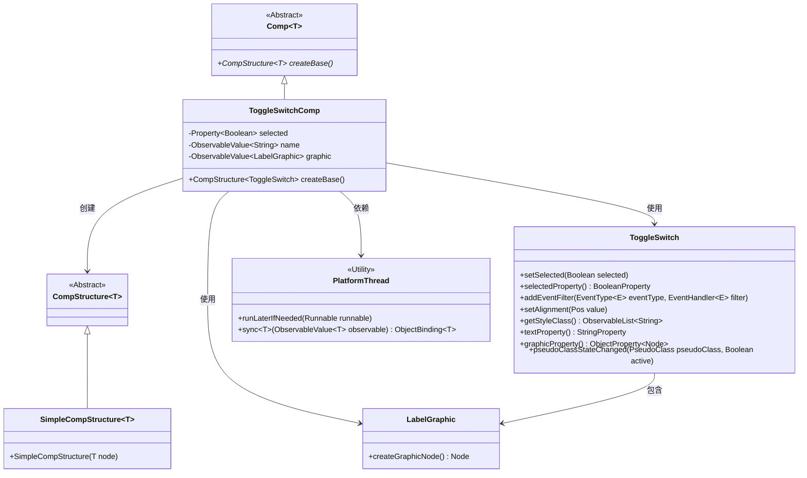
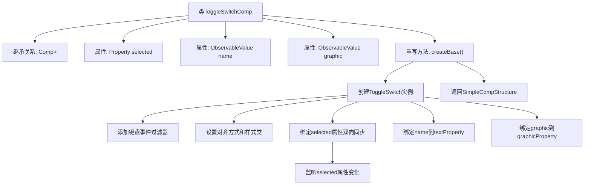

# 基础信息

|      |      |
|------|------|
| 名称 | ToggleSwitchComp |
| 编码语言 | .java |
| 代码路径 | xpipe/app/src/main/java/io/xpipe/app/comp/base/ToggleSwitchComp.java |
| 包名 | io.xpipe.app.comp.base |
| 依赖项 | ['io.xpipe.app.comp.Comp', 'io.xpipe.app.comp.CompStructure', 'io.xpipe.app.comp.SimpleCompStructure', 'io.xpipe.app.util.LabelGraphic', 'io.xpipe.app.util.PlatformThread', 'javafx.beans.property.Property', 'javafx.beans.value.ObservableValue', 'javafx.css.PseudoClass', 'javafx.geometry.Pos', 'javafx.scene.input.KeyCode', 'javafx.scene.input.KeyEvent', 'atlantafx.base.controls.ToggleSwitch', 'lombok.EqualsAndHashCode', 'lombok.Value'] |
| 概述说明 | 切换开关组件类，含选中状态、名称和图形属性，支持键盘操作和状态同步。 |

# 说明

ToggleSwitchComp是一个继承自Comp的组件类，用于创建开关切换控件。它包含三个主要属性：selected表示开关状态，name和graphic分别表示名称和图形标签。在createBase方法中，它初始化了一个ToggleSwitch实例，并设置了键盘事件处理（空格或回车键切换状态）、默认值绑定、状态同步监听器。当name或graphic属性存在时，会同步绑定到控件的文本和图形属性上。最后返回一个包含ToggleSwitch实例的SimpleCompStructure对象。

# 类列表 Class Summary

| 名称   | 类型  | 说明 |
|-------|------|-------------|
| ToggleSwitchComp | class | 切换开关组件类，含选中状态、名称和图形属性，支持键盘操作和样式绑定。 |

## 类 ToggleSwitchComp

|      |      |
|------|------|
| 访问范围 | @Value;@EqualsAndHashCode(callSuper = true);public |
| 类型 | class |
| 名称 | ToggleSwitchComp |
| 说明 | 切换开关组件类，含选中状态、名称和图形属性，支持键盘操作和样式绑定。 |

### UML类图

类图描述：该图展示了ToggleSwitchComp类继承自泛型抽象类Comp，并实现了createBase()方法创建ToggleSwitch组件结构。ToggleSwitchComp通过Property和ObservableValue管理状态，与ToggleSwitch交互实现开关功能，同时依赖PlatformThread进行线程安全操作，并使用LabelGraphic创建图形节点。整体结构体现了组件化设计模式，通过抽象类定义框架，具体类实现功能扩展。

### 内部方法调用关系图

这段代码描述了一个ToggleSwitchComp类，继承自泛型Comp类，用于创建可切换的开关组件。主要流程包括：创建基础ToggleSwitch实例，设置键盘事件响应（空格/回车切换状态），初始化样式和布局，实现selected属性的双向数据绑定，以及可选地绑定文本标签和图形图标。最后将配置好的组件包装成SimpleCompStructure返回。整个过程体现了UI组件与数据属性的实时同步机制，并处理了线程安全的UI更新问题。

### 字段列表 Field List

| 名称  | 类型  | 说明 |
|-------|-------|------|
| selected | Property<Boolean> | 布尔属性selected |
| name | ObservableValue<String> | 可观察字符串变量name |
| graphic | ObservableValue<LabelGraphic> | 可观察的标签图形对象。 |

### 方法列表 Method List

| 名称  | 类型  | 说明 |
|-------|-------|------|
| createBase | CompStructure<ToggleSwitch> | 创建ToggleSwitch组件，绑定事件、样式和属性，支持键盘交互和动态更新。 |

