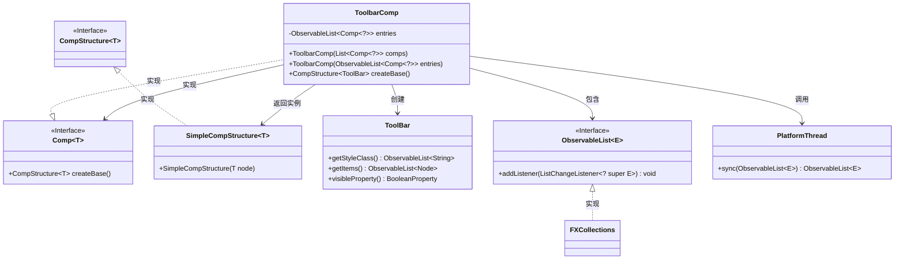
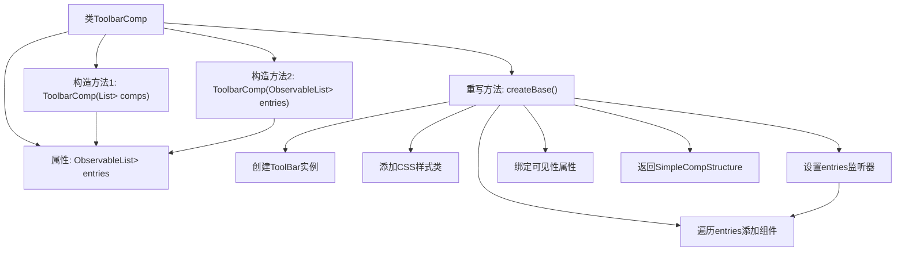

# 基础信息

|      |      |
|------|------|
| 名称 | ToolbarComp |
| 编码语言 | .java |
| 代码路径 | xpipe/app/src/main/java/io/xpipe/app/comp/base/ToolbarComp.java |
| 包名 | io.xpipe.app.comp.base |
| 依赖项 | ['io.xpipe.app.comp.Comp', 'io.xpipe.app.comp.CompStructure', 'io.xpipe.app.comp.SimpleCompStructure', 'io.xpipe.app.util.PlatformThread', 'javafx.beans.binding.Bindings', 'javafx.collections.FXCollections', 'javafx.collections.ListChangeListener', 'javafx.collections.ObservableList', 'javafx.scene.control.ToolBar', 'java.util.List'] |
| 概述说明 | 工具栏组件类，继承Comp，管理条目列表，动态更新UI。 |

# 说明

这是一个名为ToolbarComp的Java类，继承自Comp泛型类，用于创建工具栏组件。类包含一个可观察的组件列表entries，提供两种构造方法：一种接收普通List并转换为可观察列表，另一种直接接收ObservableList并通过线程同步处理。核心方法createBase()创建ToolBar实例，设置样式类为"horizontal-comp"，并实现entries列表变化监听器，自动同步更新工具栏项。初始化时遍历entries添加所有组件区域，并将工具栏可见性绑定到entries非空状态。最终返回包含ToolBar的简单组件结构。

# 类列表 Class Summary

| 名称   | 类型  | 说明 |
|-------|------|-------------|
| ToolbarComp | class | 工具栏组件类，继承Comp，管理条目列表，动态更新UI。 |

## 类 ToolbarComp

|      |      |
|------|------|
| 访问范围 | public |
| 类型 | class |
| 名称 | ToolbarComp |
| 说明 | 工具栏组件类，继承Comp，管理条目列表，动态更新UI。 |

### UML类图

这段代码定义了一个`ToolbarComp`类，继承自泛型接口`Comp`，用于创建和管理工具栏组件。该类包含一个`ObservableList`类型的条目列表，提供两种构造方法初始化条目，并通过`createBase()`方法创建工具栏基础结构。方法内部使用JavaFX的`ToolBar`控件，动态响应条目变化并绑定可见性。类图中清晰地展示了与`Comp`接口的继承关系、对`ObservableList`的依赖以及对`ToolBar`和`SimpleCompStructure`的创建关系。

### 内部方法调用关系图

这段代码描述了一个ToolbarComp类，继承自Comp类，用于创建和管理工具栏组件。类中包含两个构造方法：一个接收普通List，另一个接收ObservableList来初始化entries属性。核心方法是createBase()，它创建ToolBar实例，设置样式，添加entries变化监听器，遍历entries创建UI组件，并绑定工具栏可见性与entries非空状态的关系。整个过程体现了响应式UI组件的构建模式，当entries变化时自动更新工具栏内容。

### 字段列表 Field List

| 名称  | 类型  | 说明 |
|-------|-------|------|
| entries | ObservableList<Comp<?>> | 私有可观察列表存储Comp泛型对象条目。 |

### 方法列表 Method List

| 名称  | 类型  | 说明 |
|-------|-------|------|
| createBase | CompStructure<ToolBar> | 重写方法创建工具栏，动态更新条目并绑定可见性。 |

