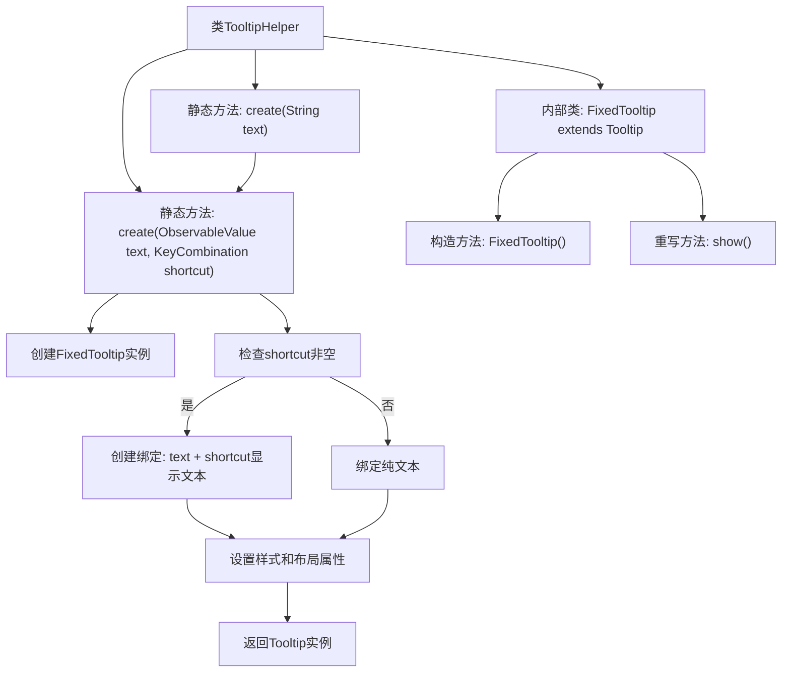

# 基础信息

|      |      |
|------|------|
| 名称 | TooltipHelper |
| 编码语言 | .java |
| 代码路径 | xpipe/app/src/main/java/io/xpipe/app/comp/base/TooltipHelper.java |
| 包名 | io.xpipe.app.comp.base |
| 依赖项 | ['io.xpipe.app.core.AppFontSizes', 'io.xpipe.app.core.AppI18n', 'io.xpipe.app.util.PlatformThread', 'javafx.beans.binding.Bindings', 'javafx.beans.property.SimpleStringProperty', 'javafx.beans.value.ObservableValue', 'javafx.scene.control.Tooltip', 'javafx.scene.input.KeyCombination', 'javafx.stage.Window'] |
| 概述说明 | TooltipHelper类提供创建带快捷键提示的自定义Tooltip方法，支持文本绑定和样式设置。 |

# 说明

TooltipHelper类提供创建工具提示的静态方法。包含两个create方法：一个接收纯文本，另一个接收可观察字符串和快捷键组合。工具提示内容支持动态绑定，若存在快捷键则显示组合键信息。FixedTooltip子类重写show方法，仅在所属窗口聚焦时显示。工具提示样式预设为自动换行、最大宽度400像素，并添加fancy-tooltip样式类。字体大小通过AppFontSizes设置基础值。

# 类列表 Class Summary

| 名称   | 类型  | 说明 |
|-------|------|-------------|
| TooltipHelper | class | TooltipHelper类提供创建Tooltip的方法，支持文本和快捷键绑定，自定义样式和显示逻辑。 |


## 类 TooltipHelper

|      |      |
|------|------|
| 访问范围 | public |
| 类型 | class |
| 名称 | TooltipHelper |
| 说明 | TooltipHelper类提供创建Tooltip的方法，支持文本和快捷键绑定，自定义样式和显示逻辑。 |


### UML类图

```mermaid
classDiagram
    class TooltipHelper {
        +Tooltip create(String text)$
        +Tooltip create(ObservableValue~String~ text, KeyCombination shortcut)$
    }

    class FixedTooltip {
        +FixedTooltip()
        #show() void
    }

    class Tooltip {
        <<Tooltip原生类>>
    }

    class ObservableValue~T~ {
        <<Interface>>
    }

    class KeyCombination {
        <<KeyCombination原生类>>
    }

    TooltipHelper --> FixedTooltip : 创建实例
    TooltipHelper --> ObservableValue~String~ : 使用文本值
    TooltipHelper --> KeyCombination : 使用快捷键
    FixedTooltip --|> Tooltip : 继承
    FixedTooltip --> Window : 检查窗口焦点

    // 工具类通过工厂方法创建增强型Tooltip
    // FixedTooltip在父窗口获得焦点时才显示提示
    // 支持动态文本绑定和快捷键显示功能
```

类图描述：该图展示了一个工具提示辅助系统，核心是TooltipHelper工具类，它提供两种工厂方法创建增强型Tooltip。FixedTooltip作为Tooltip的子类，增加了焦点控制显示逻辑。系统涉及ObservableValue接口实现动态文本绑定，KeyCombination处理快捷键显示。通过PlatformThread实现线程安全的属性绑定，最终生成具有特定样式和功能的自定义提示框。


### 内部方法调用关系图



这段代码实现了一个工具类TooltipHelper，主要用于创建带有增强功能的Tooltip控件。核心功能包括：支持动态文本绑定、快捷键提示显示、线程安全的UI更新、以及智能显示控制（仅在所属窗口获得焦点时显示）。通过内部类FixedTooltip扩展了原生Tooltip的行为，并提供了样式预设和布局约束，最终生成具有统一风格且功能丰富的提示框组件。整个流程包含条件分支处理，根据是否传入快捷键参数来构建不同的文本绑定策略。

### 字段列表 Field List

| 名称  | 类型  | 说明 |
|-------|-------|------|

### 方法列表 Method List

| 名称  | 类型  | 说明 |
|-------|-------|------|
| create | Tooltip | 创建带快捷键提示的自定义Tooltip，绑定文本和样式，宽度400像素。 |
| create | Tooltip | 静态方法创建Tooltip，参数为字符串text，调用内部方法生成简单属性对象。 |


